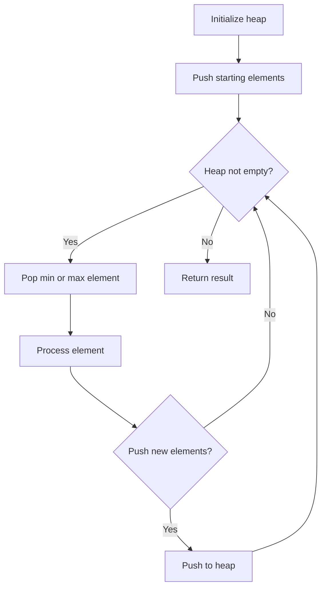
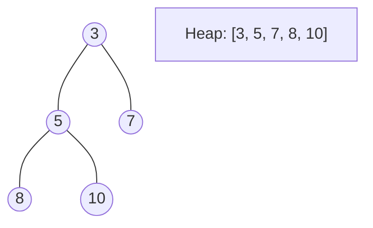
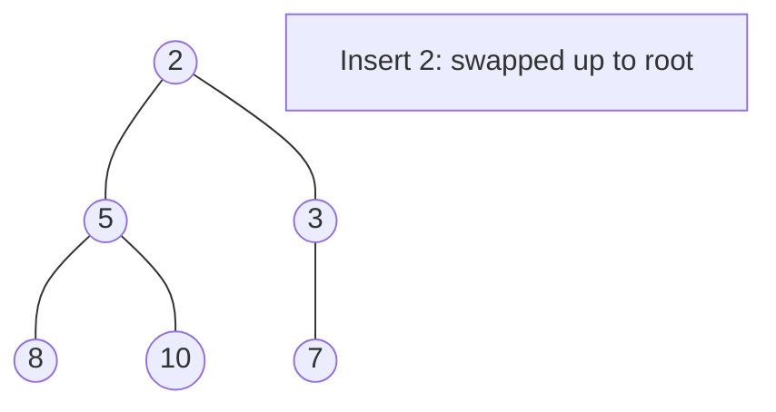
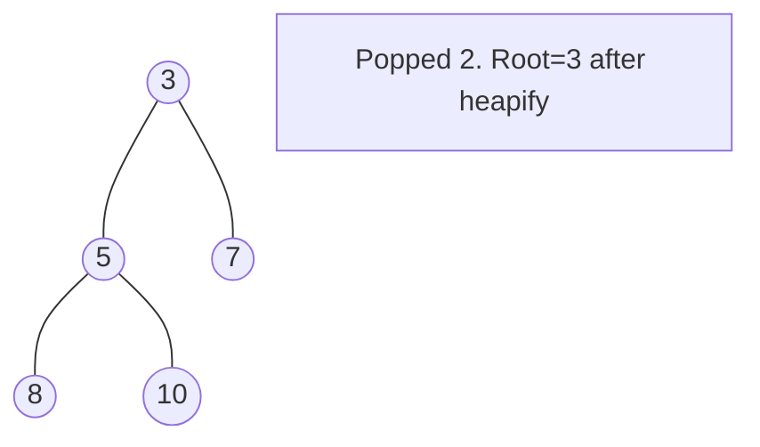

# Problem 1439: Find the Kth Smallest Sum of a Matrix With Sorted Rows

**Difficulty:** Hard  
**Tags:** Array, Binary Search, Heap (Priority Queue), Matrix  
**Pattern:** Heap / Priority Queue  
**Link:** [leetcode.com/problems/find-the-kth-smallest-sum-of-a-matrix-with-sorted-rows](https://leetcode.com/problems/find-the-kth-smallest-sum-of-a-matrix-with-sorted-rows/)

## Description

You are given an `m x n` matrix `mat` that has its rows sorted in non-decreasing order and an integer `k`.

You are allowed to choose **exactly one element** from each row to form an array.

Return *the *`k^th`* smallest array sum among all possible arrays*.

 

Example 1:

```

**Input:** mat = [[1,3,11],[2,4,6]], k = 5
**Output:** 7
**Explanation:** Choosing one element from each row, the first k smallest sum are:
[1,2], [1,4], [3,2], [3,4], [1,6]. Where the 5th sum is 7.

```

Example 2:

```

**Input:** mat = [[1,3,11],[2,4,6]], k = 9
**Output:** 17

```

Example 3:

```

**Input:** mat = [[1,10,10],[1,4,5],[2,3,6]], k = 7
**Output:** 9
**Explanation:** Choosing one element from each row, the first k smallest sum are:
[1,1,2], [1,1,3], [1,4,2], [1,4,3], [1,1,6], [1,5,2], [1,5,3]. Where the 7th sum is 9.  

```

 

**Constraints:**

	- `m == mat.length`
	- `n == mat.length[i]`
	- `1 <= m, n <= 40`
	- `1 <= mat[i][j] <= 5000`
	- `1 <= k <= min(200, n^m)`
	- `mat[i]` is a non-decreasing array.

## Approach: Heap / Priority Queue

Use a min-heap or max-heap to efficiently access the smallest/largest element. Push elements and pop the top to process in priority order.

## Pseudocode

```
1. Initialize heap (min or max)
2. Push initial elements onto heap
3. While heap not empty and condition:
   a. Pop top element (min or max)
   b. Process element
   c. Push new elements if needed
4. Return result
```

## Algorithm Flow



## Visual State Transitions

**Heap Operations (Min-Heap):**

**Frame 1: Initial heap**


**Frame 2: Insert 2 - bubble up**


**Frame 3: Pop minimum (2) - heapify down**



## Complexity Analysis

- **Time:** O(n log n)
- **Space:** O(n)

## Solution (Python3)

```python
class Solution:
    def kthSmallest(self, mat: List[List[int]], k: int) -> int:
        # Heap/Priority Queue - O(n log k) time
        import heapq
        if not mat:
            return 0
        # Min heap (negate for max heap)
        heap = []
        for val in mat:
            heapq.heappush(heap, val)
            if len(heap) > (k if isinstance(k, int) else len(mat)):
                heapq.heappop(heap)
        return heap[0] if heap else 0
```

## Solution (C++)

```cpp
#include <queue>
#include <string>
#include <vector>
using namespace std;

class Solution {
public:
    int kthSmallest(vector<vector<int>>& mat, int k) {
        // Heap/Priority Queue - O(n log k) time
        priority_queue<int, vector<int>, greater<int>> pq;
        for (int val : mat) {
            pq.push(val);
            if ((int)pq.size() > k)
                pq.pop();
        }
        return pq.empty() ? 0 : pq.top();
    }
};
```
