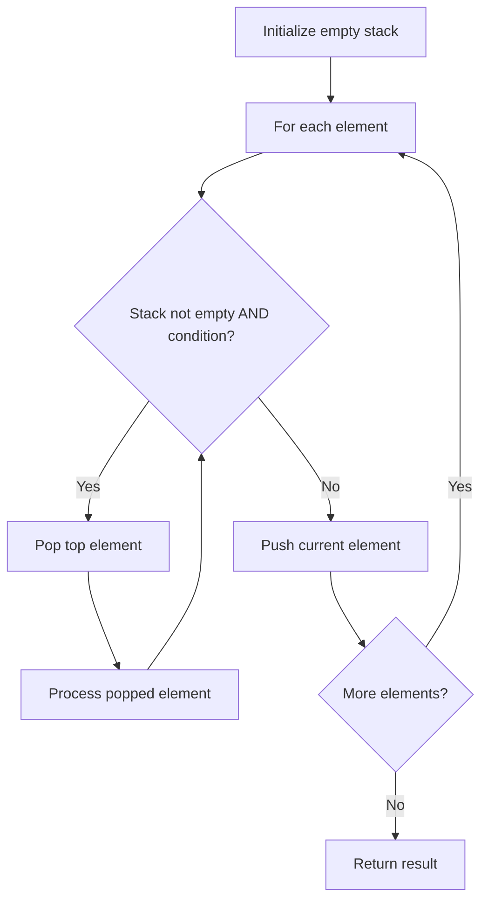

# Problem 1441: Build an Array With Stack Operations

**Difficulty:** Medium  
**Tags:** Array, Stack, Simulation  
**Pattern:** Stack  
**Link:** [leetcode.com/problems/build-an-array-with-stack-operations](https://leetcode.com/problems/build-an-array-with-stack-operations/)

## Description

You are given an integer array `target` and an integer `n`.

You have an empty stack with the two following operations:

	- **`"Push"`**: pushes an integer to the top of the stack.
	- **`"Pop"`**: removes the integer on the top of the stack.

You also have a stream of the integers in the range `[1, n]`.

Use the two stack operations to make the numbers in the stack (from the bottom to the top) equal to `target`. You should follow the following rules:

	- If the stream of the integers is not empty, pick the next integer from the stream and push it to the top of the stack.
	- If the stack is not empty, pop the integer at the top of the stack.
	- If, at any moment, the elements in the stack (from the bottom to the top) are equal to `target`, do not read new integers from the stream and do not do more operations on the stack.

Return *the stack operations needed to build *`target` following the mentioned rules. If there are multiple valid answers, return **any of them**.

 

Example 1:

```

**Input:** target = [1,3], n = 3
**Output:** ["Push","Push","Pop","Push"]
**Explanation:** Initially the stack s is empty. The last element is the top of the stack.
Read 1 from the stream and push it to the stack. s = [1].
Read 2 from the stream and push it to the stack. s = [1,2].
Pop the integer on the top of the stack. s = [1].
Read 3 from the stream and push it to the stack. s = [1,3].

```

Example 2:

```

**Input:** target = [1,2,3], n = 3
**Output:** ["Push","Push","Push"]
**Explanation:** Initially the stack s is empty. The last element is the top of the stack.
Read 1 from the stream and push it to the stack. s = [1].
Read 2 from the stream and push it to the stack. s = [1,2].
Read 3 from the stream and push it to the stack. s = [1,2,3].

```

Example 3:

```

**Input:** target = [1,2], n = 4
**Output:** ["Push","Push"]
**Explanation:** Initially the stack s is empty. The last element is the top of the stack.
Read 1 from the stream and push it to the stack. s = [1].
Read 2 from the stream and push it to the stack. s = [1,2].
Since the stack (from the bottom to the top) is equal to target, we stop the stack operations.
The answers that read integer 3 from the stream are not accepted.

```

 

**Constraints:**

	- `1 <= target.length <= 100`
	- `1 <= n <= 100`
	- `1 <= target[i] <= n`
	- `target` is strictly increasing.

## Approach: Stack

Use a stack (LIFO) to process elements. Push elements when they might be needed later; pop when a matching or resolving condition is found. Common uses: parentheses matching, expression evaluation, next greater element.

## Pseudocode

```
1. Initialize empty stack
2. For each element:
   a. While stack is not empty and condition met:
      - Pop and process top element
   b. Push current element onto stack
3. Process remaining elements in stack if needed
4. Return result
```

## Algorithm Flow



## Complexity Analysis

- **Time:** O(n)
- **Space:** O(n)

## Solution (Python3)

```python
class Solution:
    def buildArray(self, target: List[int], n: int) -> List[str]:
        # Stack-based approach - O(n) time
        stack = []
        for ch in target:
            if stack and self._matches(stack[-1], ch):
                stack.pop()
            else:
                stack.append(ch)
        return len(stack) == 0 if isinstance([], bool) else stack

    def _matches(self, a, b):
        pairs = {'(': ')', '[': ']', '{': '}'}
        return pairs.get(a) == b
```

## Solution (C++)

```cpp
#include <stack>
#include <string>
#include <unordered_map>
#include <vector>
using namespace std;

class Solution {
public:
    vector<string> buildArray(vector<int>& target, int n) {
        // Stack-based approach - O(n) time
        stack<char> st;
        unordered_map<char, char> pairs = {{'(', ')'}, {'[', ']'}, {'{', '}'}};
        for (char ch : target) {
            if (!st.empty() && pairs.count(st.top()) && pairs[st.top()] == ch) {
                st.pop();
            } else {
                st.push(ch);
            }
        }
        return st.empty();
    }
};
```
