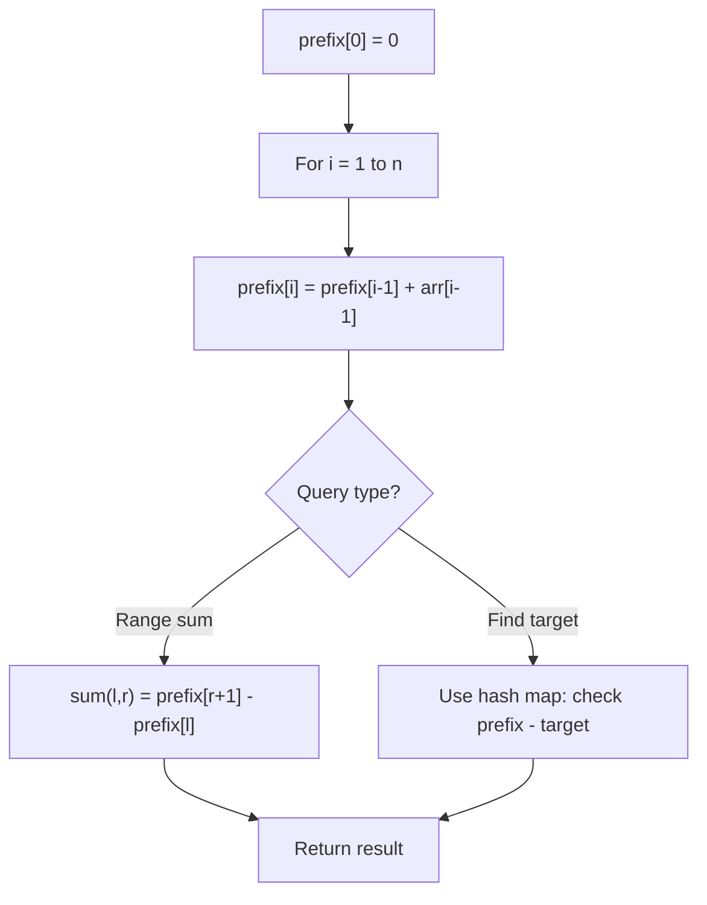

# Problem 1442: Count Triplets That Can Form Two Arrays of Equal XOR

**Difficulty:** Medium  
**Tags:** Array, Hash Table, Math, Bit Manipulation, Prefix Sum  
**Pattern:** Prefix Sum  
**Link:** [leetcode.com/problems/count-triplets-that-can-form-two-arrays-of-equal-xor](https://leetcode.com/problems/count-triplets-that-can-form-two-arrays-of-equal-xor/)

## Description

Given an array of integers `arr`.

We want to select three indices `i`, `j` and `k` where `(0 <= i < j <= k < arr.length)`.

Let's define `a` and `b` as follows:

	- `a = arr[i] ^ arr[i + 1] ^ ... ^ arr[j - 1]`
	- `b = arr[j] ^ arr[j + 1] ^ ... ^ arr[k]`

Note that **^** denotes the **bitwise-xor** operation.

Return *the number of triplets* (`i`, `j` and `k`) Where `a == b`.

 

Example 1:

```

**Input:** arr = [2,3,1,6,7]
**Output:** 4
**Explanation:** The triplets are (0,1,2), (0,2,2), (2,3,4) and (2,4,4)

```

Example 2:

```

**Input:** arr = [1,1,1,1,1]
**Output:** 10

```

 

**Constraints:**

	- `1 <= arr.length <= 300`
	- `1 <= arr[i] <= 10^8`

## Approach: Prefix Sum

Build a prefix sum array where prefix[i] = sum of elements 0..i-1. Any subarray sum [l..r] = prefix[r+1] - prefix[l]. Combine with hash map for O(n) subarray sum queries.

## Pseudocode

```
1. Build prefix sum array: prefix[0]=0, prefix[i]=prefix[i-1]+arr[i-1]
2. Use prefix sums to answer queries:
   - Subarray sum [l..r] = prefix[r+1] - prefix[l]
   - Or use hash map to find prefix[j]-prefix[i] == target
3. Return result
```

## Algorithm Flow



## Complexity Analysis

- **Time:** O(n)
- **Space:** O(n)

## Solution (Python3)

```python
class Solution:
    def countTriplets(self, arr: List[int]) -> int:
        # Prefix sum approach - O(n) time, O(n) space
        prefix = {0: -1}
        curr_sum = 0
        result = 0
        target = arr if isinstance(arr, int) else 0
        for i, val in enumerate(arr):
            curr_sum += val
            if curr_sum - target in prefix:
                result = max(result, i - prefix[curr_sum - target])
            if curr_sum not in prefix:
                prefix[curr_sum] = i
        return result
```

## Solution (C++)

```cpp
#include <algorithm>
#include <string>
#include <unordered_map>
#include <vector>
using namespace std;

class Solution {
public:
    int countTriplets(vector<int>& arr) {
        // Prefix sum approach - O(n) time, O(n) space
        unordered_map<int, int> prefix;
        prefix[0] = -1;
        int curr_sum = 0, result = 0;
        int target = arr;
        for (int i = 0; i < (int)arr.size(); i++) {
            curr_sum += arr[i];
            if (prefix.count(curr_sum - target)) {
                result = max(result, i - prefix[curr_sum - target]);
            }
            if (!prefix.count(curr_sum)) {
                prefix[curr_sum] = i;
            }
        }
        return result;
    }
};
```
