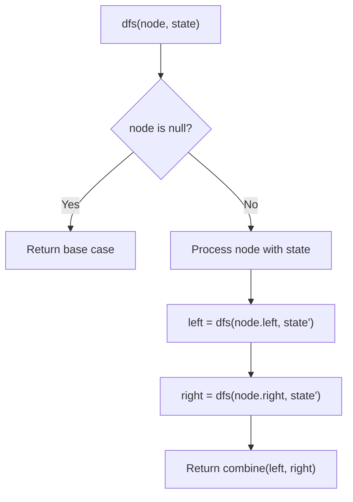
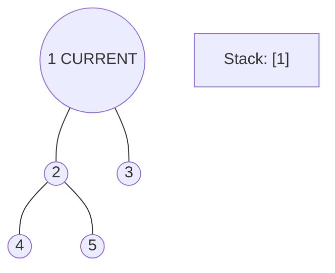
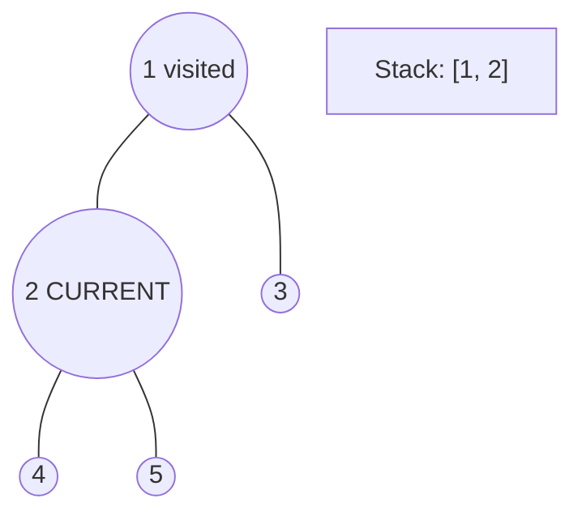
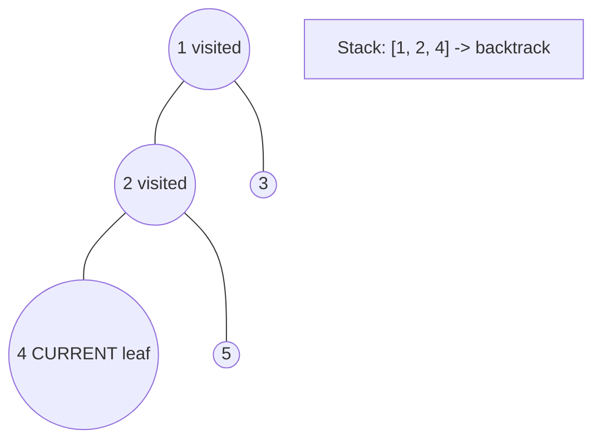
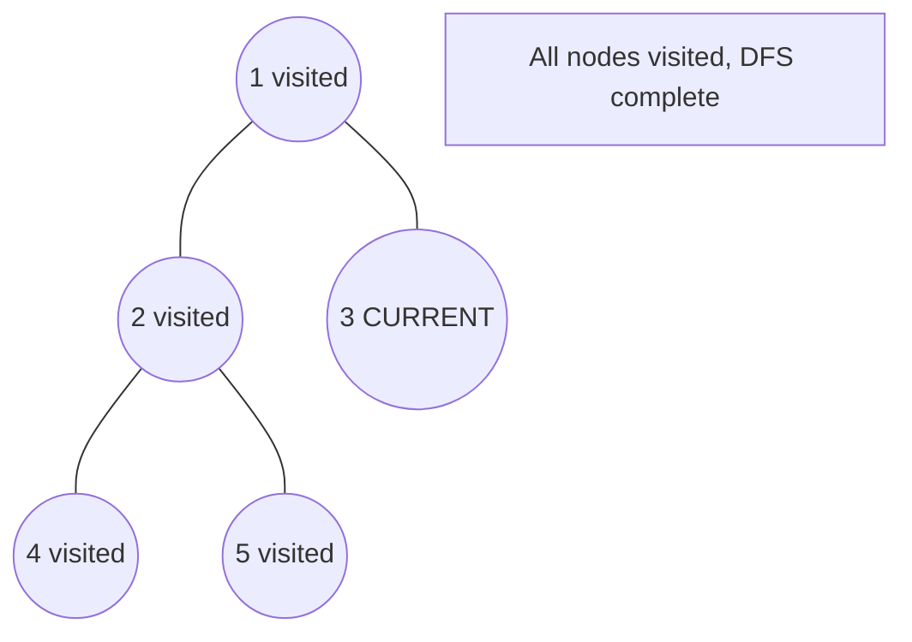

# Problem 1443: Minimum Time to Collect All Apples in a Tree

**Difficulty:** Medium  
**Tags:** Hash Table, Tree, Depth-First Search, Breadth-First Search  
**Pattern:** DFS Tree Traversal  
**Link:** [leetcode.com/problems/minimum-time-to-collect-all-apples-in-a-tree](https://leetcode.com/problems/minimum-time-to-collect-all-apples-in-a-tree/)

## Description

Given an undirected tree consisting of `n` vertices numbered from `0` to `n-1`, which has some apples in their vertices. You spend 1 second to walk over one edge of the tree. *Return the minimum time in seconds you have to spend to collect all apples in the tree, starting at **vertex 0** and coming back to this vertex.*

The edges of the undirected tree are given in the array `edges`, where `edges[i] = [ai, bi]` means that exists an edge connecting the vertices `ai` and `bi`. Additionally, there is a boolean array `hasApple`, where `hasApple[i] = true` means that vertex `i` has an apple; otherwise, it does not have any apple.

 

Example 1:

```

**Input:** n = 7, edges = [[0,1],[0,2],[1,4],[1,5],[2,3],[2,6]], hasApple = [false,false,true,false,true,true,false]
**Output:** 8 
**Explanation:** The figure above represents the given tree where red vertices have an apple. One optimal path to collect all apples is shown by the green arrows.  

```

Example 2:

```

**Input:** n = 7, edges = [[0,1],[0,2],[1,4],[1,5],[2,3],[2,6]], hasApple = [false,false,true,false,false,true,false]
**Output:** 6
**Explanation:** The figure above represents the given tree where red vertices have an apple. One optimal path to collect all apples is shown by the green arrows.  

```

Example 3:

```

**Input:** n = 7, edges = [[0,1],[0,2],[1,4],[1,5],[2,3],[2,6]], hasApple = [false,false,false,false,false,false,false]
**Output:** 0

```

 

**Constraints:**

	- `1 <= n <= 10^5`
	- `edges.length == n - 1`
	- `edges[i].length == 2`
	- `0 <= ai < bi <= n - 1`
	- `hasApple.length == n`

## Approach: DFS Tree Traversal

Perform depth-first search on the tree. Recurse on left and right subtrees, combining results bottom-up. Track state (path, depth, sum) during traversal.

## Pseudocode

```
1. Define dfs(node, state):
   a. Base case: if null, return default
   b. Process node with current state
   c. left_result = dfs(node.left, updated_state)
   d. right_result = dfs(node.right, updated_state)
   e. Return combine(left_result, right_result)
2. Return dfs(root, initial_state)
```

## Algorithm Flow



## Visual State Transitions

**DFS Tree Traversal Step-by-Step:**

**Frame 1: Start at root**


**Frame 2: Go left - visit node 2**


**Frame 3: Go left - visit node 4 (leaf)**


**Frame 4: Backtrack, visit node 5, then node 3**



## Complexity Analysis

- **Time:** O(n)
- **Space:** O(h)

## Solution (Python3)

```python
class Solution:
    def minTime(self, n: int, edges: List[List[int]], hasApple: List[bool]) -> int:
        # DFS on binary tree - O(n) time, O(h) space
        def dfs(node):
            if not node:
                return 0
            left = dfs(node.left)
            right = dfs(node.right)
            return 1 + max(left, right)
        
        result = dfs(n)
        return result
```

## Solution (C++)

```cpp
#include <algorithm>
#include <functional>
#include <string>
#include <vector>
using namespace std;

class Solution {
public:
    int minTime(int n, vector<vector<int>>& edges, vector<bool>& hasApple) {
        // DFS on binary tree - O(n) time, O(h) space
        function<int(TreeNode*)> dfs = [&](TreeNode* node) -> int {
            if (!node) return 0;
            int left = dfs(node->left);
            int right = dfs(node->right);
            return 1 + max(left, right);
        };
        return dfs(n);
    }
};
```
