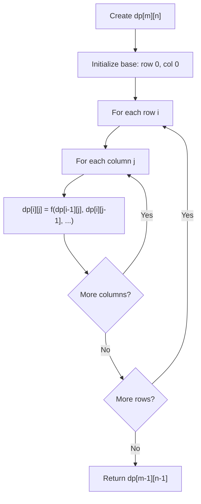
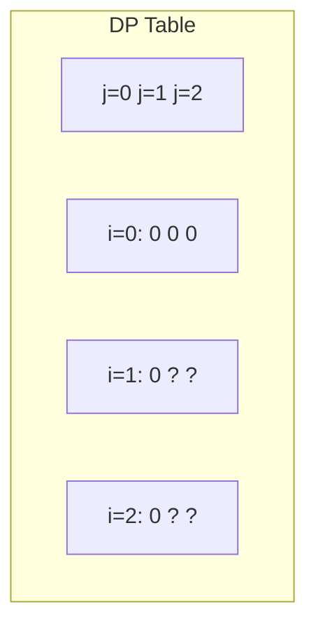
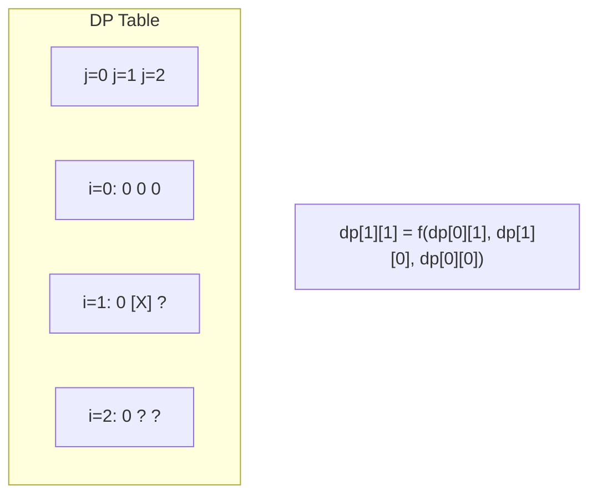
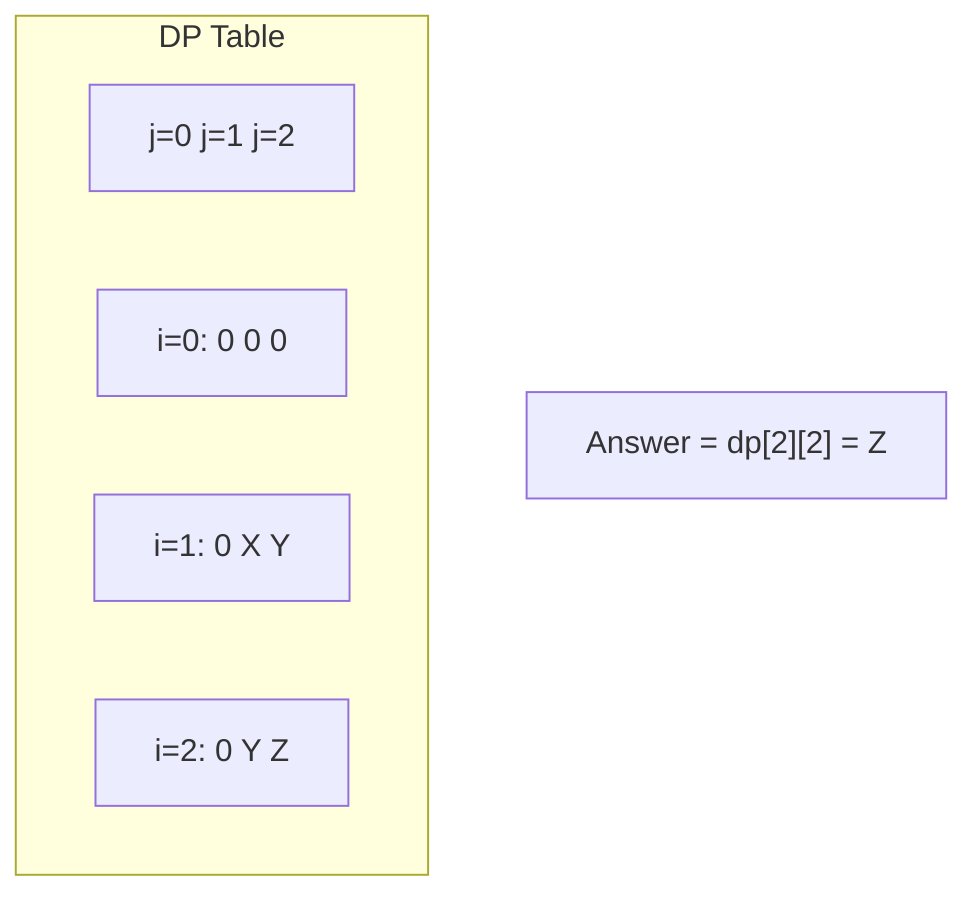

# Problem 1444: Number of Ways of Cutting a Pizza

**Difficulty:** Hard  
**Tags:** Array, Dynamic Programming, Memoization, Matrix, Prefix Sum  
**Pattern:** Dynamic Programming (2D Grid/Matrix)  
**Link:** [leetcode.com/problems/number-of-ways-of-cutting-a-pizza](https://leetcode.com/problems/number-of-ways-of-cutting-a-pizza/)

## Description

Given a rectangular pizza represented as a `rows x cols` matrix containing the following characters: `'A'` (an apple) and `'.'` (empty cell) and given the integer `k`. You have to cut the pizza into `k` pieces using `k-1` cuts. 

For each cut you choose the direction: vertical or horizontal, then you choose a cut position at the cell boundary and cut the pizza into two pieces. If you cut the pizza vertically, give the left part of the pizza to a person. If you cut the pizza horizontally, give the upper part of the pizza to a person. Give the last piece of pizza to the last person.

*Return the number of ways of cutting the pizza such that each piece contains **at least** one apple. *Since the answer can be a huge number, return this modulo 10^9 + 7.

 

Example 1:

****

```

**Input:** pizza = ["A..","AAA","..."], k = 3
**Output:** 3 
**Explanation:** The figure above shows the three ways to cut the pizza. Note that pieces must contain at least one apple.

```

Example 2:

```

**Input:** pizza = ["A..","AA.","..."], k = 3
**Output:** 1

```

Example 3:

```

**Input:** pizza = ["A..","A..","..."], k = 1
**Output:** 1

```

 

**Constraints:**

	- `1 <= rows, cols <= 50`
	- `rows == pizza.length`
	- `cols == pizza[i].length`
	- `1 <= k <= 10`
	- `pizza` consists of characters `'A'` and `'.'` only.

## Approach: Dynamic Programming (2D Grid/Matrix)

Use a 2D DP table where dp[i][j] represents the optimal value for the subproblem defined by rows 0..i and columns 0..j. Fill row by row or column by column.

## Pseudocode

```
1. Create dp[m][n] table
2. Initialize base cases (first row, first column)
3. For i from 1 to m-1:
   For j from 1 to n-1:
     dp[i][j] = recurrence(dp[i-1][j], dp[i][j-1], dp[i-1][j-1])
4. Return dp[m-1][n-1]
```

## Algorithm Flow



## Visual State Transitions

**2D DP Table Build:**

**Frame 1: Initialize borders**


**Frame 2: Fill cell by cell**


**Frame 3: Table complete**



## Complexity Analysis

- **Time:** O(m * n)
- **Space:** O(m * n)

## Solution (Python3)

```python
class Solution:
    def ways(self, pizza: List[str], k: int) -> int:
        # Dynamic programming (2D) - O(m*n) time and space
        if not pizza:
            return 0
        m, n = len(pizza), len(pizza[0])
        dp = [[0] * (n + 1) for _ in range(m + 1)]
        for i in range(1, m + 1):
            for j in range(1, n + 1):
                dp[i][j] = max(dp[i-1][j], dp[i][j-1])
                # Add problem-specific transition
        return dp[m][n]
```

## Solution (C++)

```cpp
#include <algorithm>
#include <string>
#include <vector>
using namespace std;

class Solution {
public:
    int ways(vector<string>& pizza, int k) {
        // Dynamic programming (2D) - O(m*n) time and space
        if (pizza.empty()) return 0;
        int m = pizza.size(), n = pizza[0].size();
        vector<vector<int>> dp(m + 1, vector<int>(n + 1, 0));
        for (int i = 1; i <= m; i++) {
            for (int j = 1; j <= n; j++) {
                dp[i][j] = max(dp[i-1][j], dp[i][j-1]);
            }
        }
        return dp[m][n];
    }
};
```
