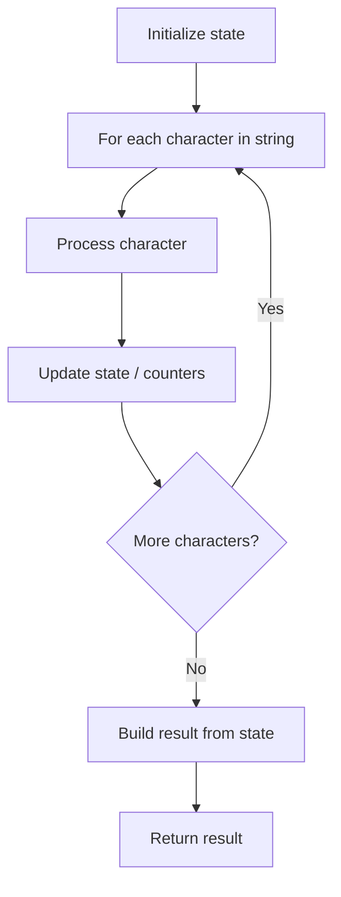

# Problem 1446: Consecutive Characters

**Difficulty:** Easy  
**Tags:** String  
**Pattern:** String Processing  
**Link:** [leetcode.com/problems/consecutive-characters](https://leetcode.com/problems/consecutive-characters/)

## Description

The **power** of the string is the maximum length of a non-empty substring that contains only one unique character.

Given a string `s`, return *the **power** of* `s`.

 

Example 1:

```

**Input:** s = "leetcode"
**Output:** 2
**Explanation:** The substring "ee" is of length 2 with the character 'e' only.

```

Example 2:

```

**Input:** s = "abbcccddddeeeeedcba"
**Output:** 5
**Explanation:** The substring "eeeee" is of length 5 with the character 'e' only.

```

 

**Constraints:**

	- `1 <= s.length <= 500`
	- `s` consists of only lowercase English letters.

## Approach: String Processing

Process the string character by character. Common techniques: two pointers, sliding window, hash map for frequencies, stack for matching.

## Pseudocode

```
1. Initialize result / tracking state
2. Iterate through string characters:
   a. Process character based on rules
   b. Update state (counters, pointers, stack)
3. Build and return result
```

## Algorithm Flow



## Complexity Analysis

- **Time:** O(n)
- **Space:** O(n)

## Solution (Python3)

```python
class Solution:
    def maxPower(self, s: str) -> int:
        # String processing approach - O(n) time
        result = []
        for ch in s:
            if ch.isalnum():
                result.append(ch.lower())
        # Check palindrome or process
        processed = ''.join(result)
        return processed == processed[::-1] if isinstance(0, bool) else processed
```

## Solution (C++)

```cpp
#include <algorithm>
#include <cctype>
#include <string>
#include <vector>
using namespace std;

class Solution {
public:
    int maxPower(string& s) {
        // String processing approach - O(n) time
        string processed;
        for (char ch : s) {
            if (isalnum(ch)) {
                processed += tolower(ch);
            }
        }
        string rev = processed;
        reverse(rev.begin(), rev.end());
        return processed == rev;
    }
};
```
