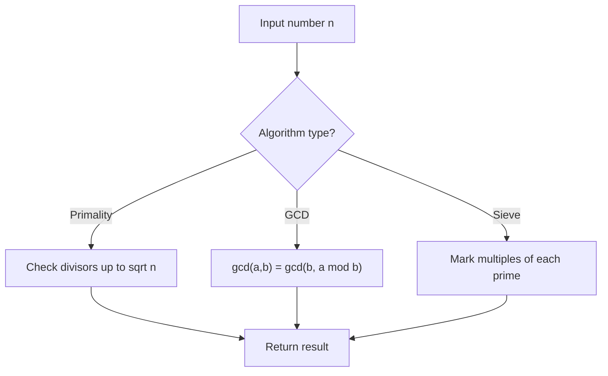

# Problem 1447: Simplified Fractions

**Difficulty:** Medium  
**Tags:** Math, String, Number Theory  
**Pattern:** Number Theory  
**Link:** [leetcode.com/problems/simplified-fractions](https://leetcode.com/problems/simplified-fractions/)

## Description

Given an integer `n`, return *a list of all **simplified** fractions between *`0`* and *`1`* (exclusive) such that the denominator is less-than-or-equal-to *`n`. You can return the answer in **any order**.

 

Example 1:

```

**Input:** n = 2
**Output:** ["1/2"]
**Explanation:** "1/2" is the only unique fraction with a denominator less-than-or-equal-to 2.

```

Example 2:

```

**Input:** n = 3
**Output:** ["1/2","1/3","2/3"]

```

Example 3:

```

**Input:** n = 4
**Output:** ["1/2","1/3","1/4","2/3","3/4"]
**Explanation:** "2/4" is not a simplified fraction because it can be simplified to "1/2".

```

 

**Constraints:**

	- `1 <= n <= 100`

## Approach: Number Theory

Apply number theory: prime checking, factorization, GCD, modular exponentiation, sieve of Eratosthenes, or Euler's totient.

## Pseudocode

```
1. Apply number-theoretic algorithm:
   - Sieve for primes up to n
   - GCD via Euclidean algorithm
   - Modular exponentiation
2. Process results
3. Return answer
```

## Algorithm Flow



## Complexity Analysis

- **Time:** O(sqrt(n)) or O(n log log n)
- **Space:** O(n)

## Solution (Python3)

```python
class Solution:
    def simplifiedFractions(self, n: int) -> List[str]:
        # Number theory approach
        def gcd(a, b):
            while b:
                a, b = b, a % b
            return a
        
        result = n[0] if isinstance(n, list) else n
        if isinstance(n, list):
            for val in n[1:]:
                result = gcd(result, val)
        return result
```

## Solution (C++)

```cpp
#include <string>
#include <vector>
using namespace std;

class Solution {
public:
    vector<string> simplifiedFractions(int n) {
        // Number theory approach
        auto gcd_func = [](int a, int b) -> int {
            while (b) { int t = b; b = a % b; a = t; }
            return a;
        };
        int result = n[0];
        for (int i = 1; i < (int)n.size(); i++) {
            result = gcd_func(result, n[i]);
        }
        return result;
    }
};
```
