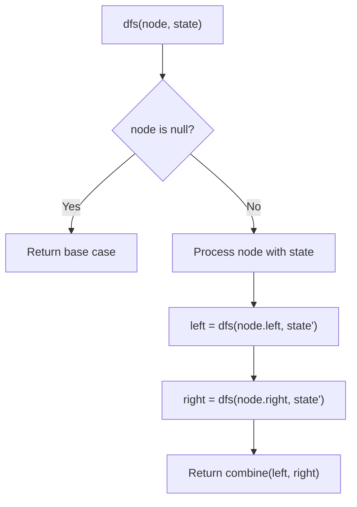
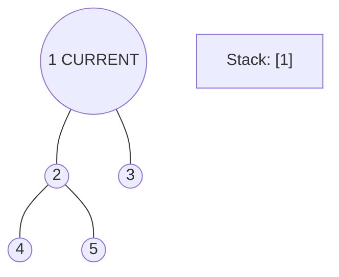
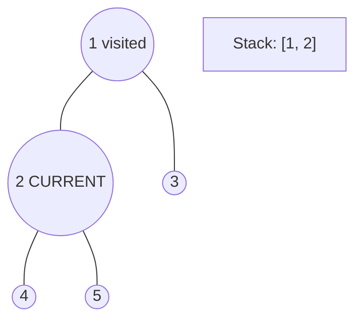
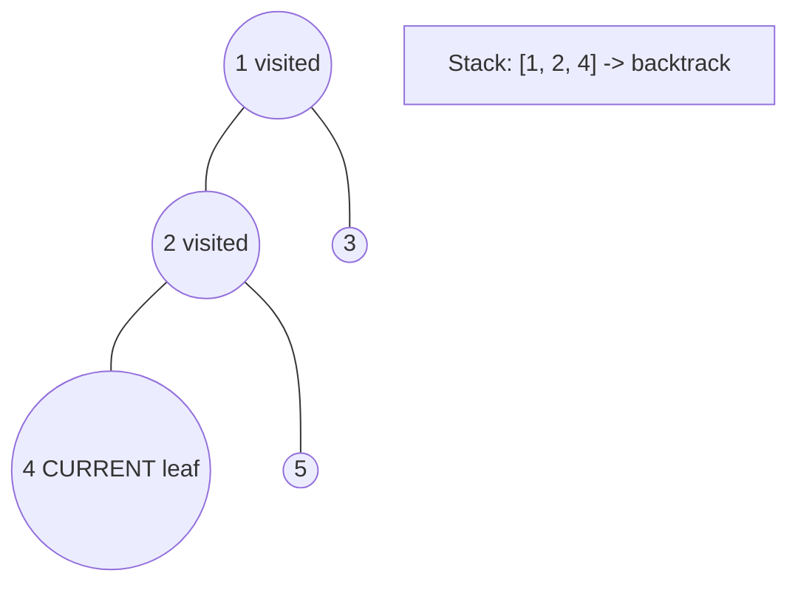
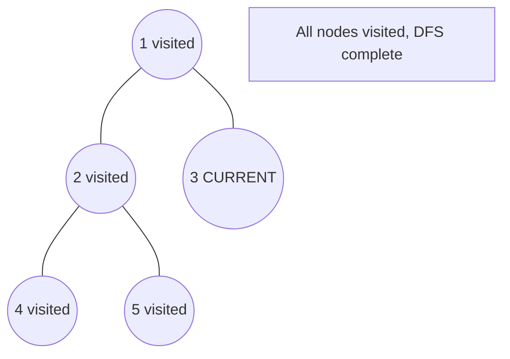

# Problem 1448: Count Good Nodes in Binary Tree

**Difficulty:** Medium  
**Tags:** Tree, Depth-First Search, Breadth-First Search, Binary Tree  
**Pattern:** Tree / DFS  
**Link:** [leetcode.com/problems/count-good-nodes-in-binary-tree](https://leetcode.com/problems/count-good-nodes-in-binary-tree/)

## Description

Given a binary tree `root`, a node *X* in the tree is named **good** if in the path from root to *X* there are no nodes with a value *greater than* X.


Return the number of **good** nodes in the binary tree.


 

Example 1:


****


```

**Input:** root = [3,1,4,3,null,1,5]
**Output:** 4
**Explanation:** Nodes in blue are **good**.
Root Node (3) is always a good node.
Node 4 -> (3,4) is the maximum value in the path starting from the root.
Node 5 -> (3,4,5) is the maximum value in the path
Node 3 -> (3,1,3) is the maximum value in the path.
```


Example 2:


****


```

**Input:** root = [3,3,null,4,2]
**Output:** 3
**Explanation:** Node 2 -> (3, 3, 2) is not good, because "3" is higher than it.
```


Example 3:


```

**Input:** root = [1]
**Output:** 1
**Explanation:** Root is considered as **good**.
```


 

**Constraints:**


	- The number of nodes in the binary tree is in the range `[1, 10^5]`.
	- Each node's value is between `[-10^4, 10^4]`.

## Approach: Tree / DFS

DFS tracking max value from root to current node. A node is 'good' if its value >= max_so_far.

## Pseudocode

```
1. Define dfs(node, state):
   a. Base case: if null, return default
   b. Process node with current state
   c. left_result = dfs(node.left, updated_state)
   d. right_result = dfs(node.right, updated_state)
   e. Return combine(left_result, right_result)
2. Return dfs(root, initial_state)
```

## Algorithm Flow



## Visual State Transitions

**DFS Tree Traversal Step-by-Step:**

**Frame 1: Start at root**


**Frame 2: Go left - visit node 2**


**Frame 3: Go left - visit node 4 (leaf)**


**Frame 4: Backtrack, visit node 5, then node 3**



## Complexity Analysis

- **Time:** O(n)
- **Space:** O(h)

## Solution (Python3)

```python
class Solution:
    def goodNodes(self, root) -> int:
        def dfs(node, max_so_far):
            if not node:
                return 0
            good = 1 if node.val >= max_so_far else 0
            new_max = max(max_so_far, node.val)
            return good + dfs(node.left, new_max) + dfs(node.right, new_max)
        return dfs(root, root.val)
```

## Solution (C++)

```cpp
#include <algorithm>
#include <functional>
#include <string>
#include <vector>
using namespace std;

class Solution {
public:
    int goodNodes(TreeNode* root) {
        // DFS on binary tree - O(n) time, O(h) space
        function<int(TreeNode*)> dfs = [&](TreeNode* node) -> int {
            if (!node) return 0;
            int left = dfs(node->left);
            int right = dfs(node->right);
            return 1 + max(left, right);
        };
        return dfs(root);
    }
};
```
