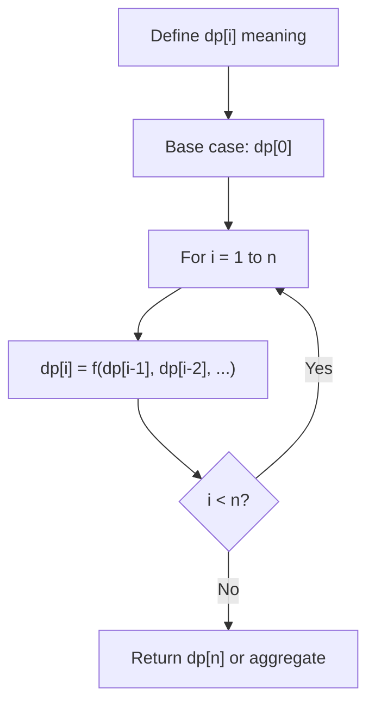
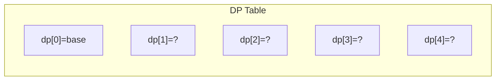
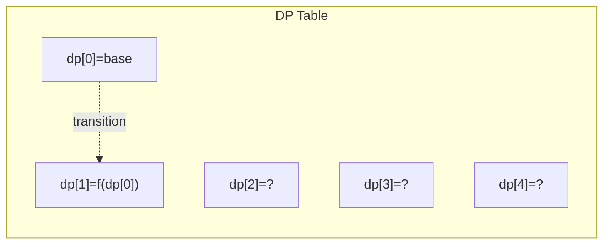
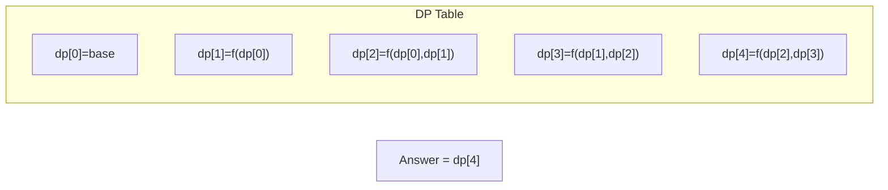

# Problem 1449: Form Largest Integer With Digits That Add up to Target

**Difficulty:** Hard  
**Tags:** Array, Dynamic Programming  
**Pattern:** Dynamic Programming (1D)  
**Link:** [leetcode.com/problems/form-largest-integer-with-digits-that-add-up-to-target](https://leetcode.com/problems/form-largest-integer-with-digits-that-add-up-to-target/)

## Description

Given an array of integers `cost` and an integer `target`, return *the **maximum** integer you can paint under the following rules*:

	- The cost of painting a digit `(i + 1)` is given by `cost[i]` (**0-indexed**).
	- The total cost used must be equal to `target`.
	- The integer does not have `0` digits.

Since the answer may be very large, return it as a string. If there is no way to paint any integer given the condition, return `"0"`.

 

Example 1:

```

**Input:** cost = [4,3,2,5,6,7,2,5,5], target = 9
**Output:** "7772"
**Explanation:** The cost to paint the digit '7' is 2, and the digit '2' is 3. Then cost("7772") = 2*3+ 3*1 = 9. You could also paint "977", but "7772" is the largest number.
**Digit    cost**
  1  ->   4
  2  ->   3
  3  ->   2
  4  ->   5
  5  ->   6
  6  ->   7
  7  ->   2
  8  ->   5
  9  ->   5

```

Example 2:

```

**Input:** cost = [7,6,5,5,5,6,8,7,8], target = 12
**Output:** "85"
**Explanation:** The cost to paint the digit '8' is 7, and the digit '5' is 5. Then cost("85") = 7 + 5 = 12.

```

Example 3:

```

**Input:** cost = [2,4,6,2,4,6,4,4,4], target = 5
**Output:** "0"
**Explanation:** It is impossible to paint any integer with total cost equal to target.

```

 

**Constraints:**

	- `cost.length == 9`
	- `1 <= cost[i], target <= 5000`

## Approach: Dynamic Programming (1D)

Break the problem into overlapping subproblems. Define dp[i] as the optimal value for the subproblem ending at or considering index i. Build the solution bottom-up, using previously computed dp values.

## Pseudocode

```
1. Define dp[i] = optimal value for subproblem i
2. Base case: dp[0] = initial value
3. For i from 1 to n:
   a. dp[i] = recurrence(dp[i-1], dp[i-2], ...)
4. Return dp[n] or max/min of dp
```

## Algorithm Flow



## Visual State Transitions

**1D Dynamic Programming Table Build:**

**Frame 1: Initialize base cases**


**Frame 2: Fill dp[1] from dp[0]**


**Frame 3: Fill remaining cells**



## Complexity Analysis

- **Time:** O(n)
- **Space:** O(n)

## Solution (Python3)

```python
class Solution:
    def largestNumber(self, cost: List[int], target: int) -> str:
        # Dynamic programming (1D) - O(n) time, O(n) space
        if not cost:
            return 0
        n = len(cost) if isinstance(cost, list) else cost
        dp = [0] * (n + 1)
        dp[0] = 1  # base case
        for i in range(1, n + 1):
            dp[i] = dp[i-1]  # transition (customize per problem)
            if i >= 2:
                dp[i] += dp[i-2]
        return dp[n]
```

## Solution (C++)

```cpp
#include <string>
#include <vector>
using namespace std;

class Solution {
public:
    string largestNumber(vector<int>& cost, int target) {
        // Dynamic programming (1D) - O(n) time, O(n) space
        int n = cost;
        if (n <= 0) return 0;
        vector<int> dp(n + 1, 0);
        dp[0] = 1;
        for (int i = 1; i <= n; i++) {
            dp[i] = dp[i-1];
            if (i >= 2) dp[i] += dp[i-2];
        }
        return dp[n];
    }
};
```
