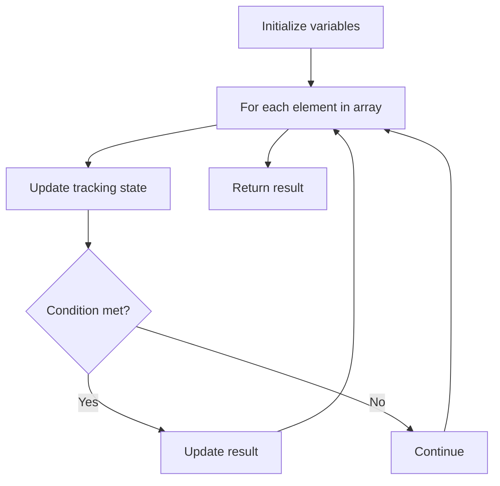

# Problem 1450: Number of Students Doing Homework at a Given Time

**Difficulty:** Easy  
**Tags:** Array  
**Pattern:** Array Processing  
**Link:** [leetcode.com/problems/number-of-students-doing-homework-at-a-given-time](https://leetcode.com/problems/number-of-students-doing-homework-at-a-given-time/)

## Description

Given two integer arrays `startTime` and `endTime` and given an integer `queryTime`.

The `ith` student started doing their homework at the time `startTime[i]` and finished it at time `endTime[i]`.

Return *the number of students* doing their homework at time `queryTime`. More formally, return the number of students where `queryTime` lays in the interval `[startTime[i], endTime[i]]` inclusive.

 

Example 1:

```

**Input:** startTime = [1,2,3], endTime = [3,2,7], queryTime = 4
**Output:** 1
**Explanation:** We have 3 students where:
The first student started doing homework at time 1 and finished at time 3 and wasn't doing anything at time 4.
The second student started doing homework at time 2 and finished at time 2 and also wasn't doing anything at time 4.
The third student started doing homework at time 3 and finished at time 7 and was the only student doing homework at time 4.

```

Example 2:

```

**Input:** startTime = [4], endTime = [4], queryTime = 4
**Output:** 1
**Explanation:** The only student was doing their homework at the queryTime.

```

 

**Constraints:**

	- `startTime.length == endTime.length`
	- `1 <= startTime.length <= 100`
	- `1 <= startTime[i] <= endTime[i] <= 1000`
	- `1 <= queryTime <= 1000`

## Approach: Array Processing

Process the array with a linear scan, tracking state variables. Look for patterns: running maximum/minimum, counting, or transformations.

## Pseudocode

```
1. Initialize tracking variables
2. Iterate through array:
   a. Update tracking state
   b. Check conditions
   c. Update result
3. Return result
```

## Algorithm Flow



## Complexity Analysis

- **Time:** O(n)
- **Space:** O(1)

## Solution (Python3)

```python
class Solution:
    def busyStudent(self, startTime: List[int], endTime: List[int], queryTime: int) -> int:
        # Array processing - O(n) time
        result = 0
        for i in range(len(startTime)):
            # Process element
            pass
        return result
```

## Solution (C++)

```cpp
#include <string>
#include <vector>
using namespace std;

class Solution {
public:
    int busyStudent(vector<int>& startTime, vector<int>& endTime, int queryTime) {
        // Array processing - O(n) time
        for (int i = 0; i < (int)startTime.size(); i++) {
            // Process element
        }
        return 0;
    }
};
```
