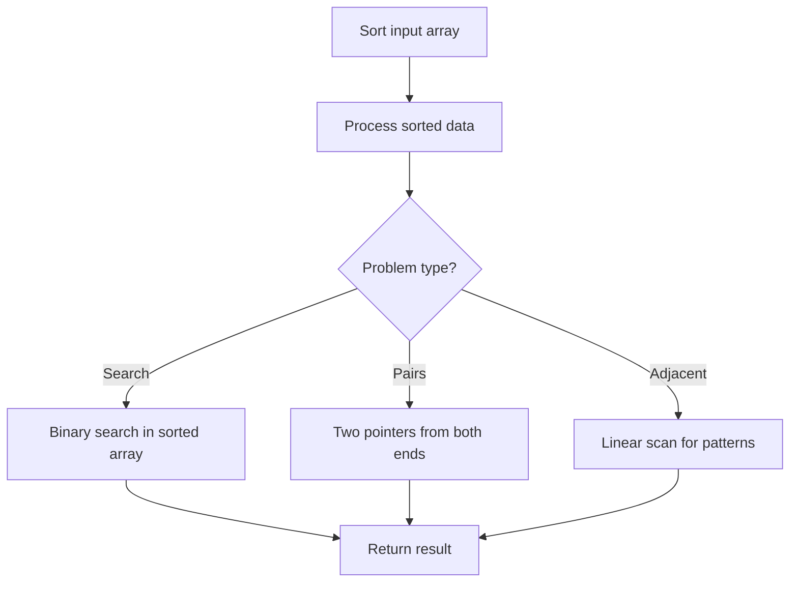

# Problem 1451: Rearrange Words in a Sentence

**Difficulty:** Medium  
**Tags:** String, Sorting  
**Pattern:** Sorting  
**Link:** [leetcode.com/problems/rearrange-words-in-a-sentence](https://leetcode.com/problems/rearrange-words-in-a-sentence/)

## Description

Given a sentence `text` (A *sentence* is a string of space-separated words) in the following format:

	- First letter is in upper case.
	- Each word in `text` are separated by a single space.

Your task is to rearrange the words in text such that all words are rearranged in an increasing order of their lengths. If two words have the same length, arrange them in their original order.

Return the new text following the format shown above.

 

Example 1:

```

**Input:** text = "Leetcode is cool"
**Output:** "Is cool leetcode"
**Explanation: **There are 3 words, "Leetcode" of length 8, "is" of length 2 and "cool" of length 4.
Output is ordered by length and the new first word starts with capital letter.

```

Example 2:

```

**Input:** text = "Keep calm and code on"
**Output:** "On and keep calm code"
**Explanation: **Output is ordered as follows:
"On" 2 letters.
"and" 3 letters.
"keep" 4 letters in case of tie order by position in original text.
"calm" 4 letters.
"code" 4 letters.

```

Example 3:

```

**Input:** text = "To be or not to be"
**Output:** "To be or to be not"

```

 

**Constraints:**

	- `text` begins with a capital letter and then contains lowercase letters and single space between words.
	- `1 <= text.length <= 10^5`

## Approach: Sorting

Sort the data to enable efficient processing. After sorting, use techniques like binary search, two pointers, or linear scan to solve the problem.

## Pseudocode

```
1. Sort the input array
2. Process sorted data:
   - Use binary search for lookups
   - Use two pointers for pair finding
   - Scan for adjacent patterns
3. Return result
```

## Algorithm Flow



## Complexity Analysis

- **Time:** O(n log n)
- **Space:** O(n)

## Solution (Python3)

```python
class Solution:
    def arrangeWords(self, text: str) -> str:
        # Sort-based approach - O(n log n) time
        text.sort(key=lambda x: x[0] if isinstance(x, (list, tuple)) else x)
        result = [text[0]]
        for i in range(1, len(text)):
            curr = text[i]
            if isinstance(curr, (list, tuple)) and isinstance(result[-1], (list, tuple)):
                if curr[0] <= result[-1][1]:
                    result[-1] = [result[-1][0], max(result[-1][1], curr[1])]
                else:
                    result.append(curr)
            else:
                result.append(curr)
        return result
```

## Solution (C++)

```cpp
#include <algorithm>
#include <string>
#include <vector>
using namespace std;

class Solution {
public:
    string arrangeWords(string& text) {
        // Sort-based approach - O(n log n) time
        sort(text.begin(), text.end());
        vector<vector<int>> result;
        result.push_back(text[0]);
        for (int i = 1; i < (int)text.size(); i++) {
            if (text[i][0] <= result.back()[1]) {
                result.back()[1] = max(result.back()[1], text[i][1]);
            } else {
                result.push_back(text[i]);
            }
        }
        return result;
    }
};
```
