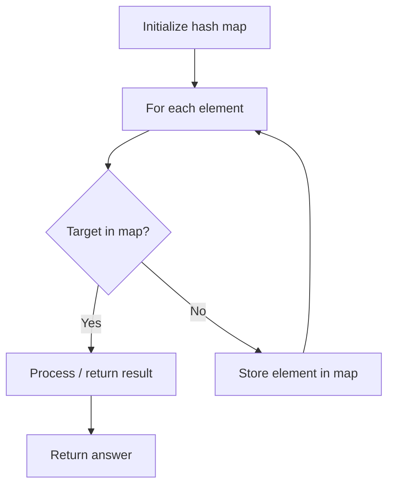

# Problem 1452: People Whose List of Favorite Companies Is Not a Subset of Another List

**Difficulty:** Medium  
**Tags:** Array, Hash Table, String  
**Pattern:** Hash Map Lookup  
**Link:** [leetcode.com/problems/people-whose-list-of-favorite-companies-is-not-a-subset-of-another-list](https://leetcode.com/problems/people-whose-list-of-favorite-companies-is-not-a-subset-of-another-list/)

## Description

Given the array `favoriteCompanies` where `favoriteCompanies[i]` is the list of favorites companies for the `ith` person (**indexed from 0**).

*Return the indices of people whose list of favorite companies is not a **subset** of any other list of favorites companies*. You must return the indices in increasing order.

 

Example 1:

```

**Input:** favoriteCompanies = [["leetcode","google","facebook"],["google","microsoft"],["google","facebook"],["google"],["amazon"]]
**Output:** [0,1,4] 
**Explanation:** 
Person with index=2 has favoriteCompanies[2]=["google","facebook"] which is a subset of favoriteCompanies[0]=["leetcode","google","facebook"] corresponding to the person with index 0. 
Person with index=3 has favoriteCompanies[3]=["google"] which is a subset of favoriteCompanies[0]=["leetcode","google","facebook"] and favoriteCompanies[1]=["google","microsoft"]. 
Other lists of favorite companies are not a subset of another list, therefore, the answer is [0,1,4].

```

Example 2:

```

**Input:** favoriteCompanies = [["leetcode","google","facebook"],["leetcode","amazon"],["facebook","google"]]
**Output:** [0,1] 
**Explanation:** In this case favoriteCompanies[2]=["facebook","google"] is a subset of favoriteCompanies[0]=["leetcode","google","facebook"], therefore, the answer is [0,1].

```

Example 3:

```

**Input:** favoriteCompanies = [["leetcode"],["google"],["facebook"],["amazon"]]
**Output:** [0,1,2,3]

```

 

**Constraints:**

	- `1 <= favoriteCompanies.length <= 100`
	- `1 <= favoriteCompanies[i].length <= 500`
	- `1 <= favoriteCompanies[i][j].length <= 20`
	- All strings in `favoriteCompanies[i]` are **distinct**.
	- All lists of favorite companies are **distinct**, that is, If we sort alphabetically each list then `favoriteCompanies[i] != favoriteCompanies[j].`
	- All strings consist of lowercase English letters only.

## Approach: Hash Map Lookup

Use a hash map (dictionary) to store elements for O(1) lookup. Iterate through the input, checking membership or counting frequencies in the map.

## Pseudocode

```
1. Initialize hash map
2. Iterate through elements:
   a. Check if target/complement exists in map
   b. If found: process result
   c. Otherwise: store element in map
3. Return result
```

## Algorithm Flow



## Complexity Analysis

- **Time:** O(n)
- **Space:** O(n)

## Solution (Python3)

```python
class Solution:
    def peopleIndexes(self, favoriteCompanies: List[List[str]]) -> List[int]:
        # Hash map approach - O(n) time, O(n) space
        seen = {}
        for i, val in enumerate(favoriteCompanies):
            complement = favoriteCompanies - val
            if complement in seen:
                return [seen[complement], i]
            seen[val] = i
        return []
```

## Solution (C++)

```cpp
#include <string>
#include <unordered_map>
#include <vector>
using namespace std;

class Solution {
public:
    vector<int> peopleIndexes(vector<vector<string>>& favoriteCompanies) {
        // Hash map approach - O(n) time, O(n) space
        unordered_map<int, int> seen;
        for (int i = 0; i < favoriteCompanies.size(); i++) {
            int complement = favoriteCompanies - favoriteCompanies[i];
            if (seen.count(complement)) {
                return {seen[complement], i};
            }
            seen[favoriteCompanies[i]] = i;
        }
        return {};
    }
};
```
