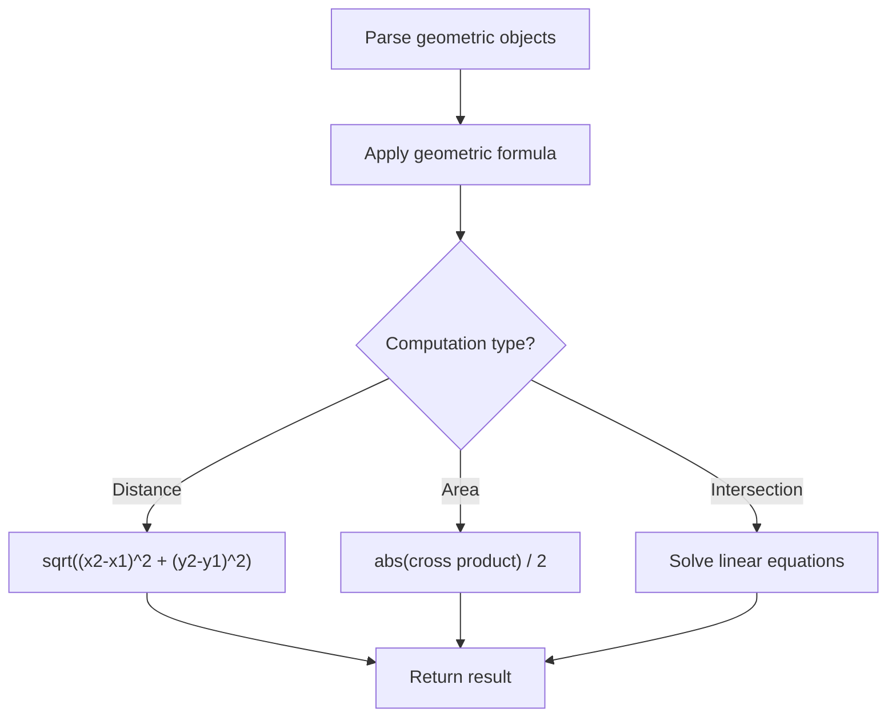

# Problem 1453: Maximum Number of Darts Inside of a Circular Dartboard

**Difficulty:** Hard  
**Tags:** Array, Math, Geometry  
**Pattern:** Geometry  
**Link:** [leetcode.com/problems/maximum-number-of-darts-inside-of-a-circular-dartboard](https://leetcode.com/problems/maximum-number-of-darts-inside-of-a-circular-dartboard/)

## Description

Alice is throwing `n` darts on a very large wall. You are given an array `darts` where `darts[i] = [xi, yi]` is the position of the `i^th` dart that Alice threw on the wall.

Bob knows the positions of the `n` darts on the wall. He wants to place a dartboard of radius `r` on the wall so that the maximum number of darts that Alice throws lie on the dartboard.

Given the integer `r`, return *the maximum number of darts that can lie on the dartboard*.

 

Example 1:

```

**Input:** darts = [[-2,0],[2,0],[0,2],[0,-2]], r = 2
**Output:** 4
**Explanation:** Circle dartboard with center in (0,0) and radius = 2 contain all points.

```

Example 2:

```

**Input:** darts = [[-3,0],[3,0],[2,6],[5,4],[0,9],[7,8]], r = 5
**Output:** 5
**Explanation:** Circle dartboard with center in (0,4) and radius = 5 contain all points except the point (7,8).

```

 

**Constraints:**

	- `1 <= darts.length <= 100`
	- `darts[i].length == 2`
	- `-10^4 <= xi, yi <= 10^4`
	- All the `darts` are unique
	- `1 <= r <= 5000`

## Approach: Geometry

Apply geometric formulas: distance, area, cross product, convex hull, line intersection. Handle floating-point precision carefully.

## Pseudocode

```
1. Parse geometric objects (points, lines, shapes)
2. Apply geometric operations:
   - Distance formula
   - Cross/dot product
   - Area computation
3. Handle precision and edge cases
4. Return result
```

## Algorithm Flow



## Complexity Analysis

- **Time:** O(n^2) or O(n log n)
- **Space:** O(n)

## Solution (Python3)

```python
class Solution:
    def numPoints(self, darts: List[List[int]], r: int) -> int:
        # Geometry approach
        import math
        result = 0
        for i in range(len(darts)):
            for j in range(i + 1, len(darts)):
                dx = darts[i][0] - darts[j][0]
                dy = darts[i][1] - darts[j][1]
                dist = math.sqrt(dx*dx + dy*dy)
                result = max(result, dist)
        return result
```

## Solution (C++)

```cpp
#include <algorithm>
#include <cmath>
#include <string>
#include <vector>
using namespace std;

class Solution {
public:
    int numPoints(vector<vector<int>>& darts, int r) {
        // Geometry approach
        double result = 0;
        for (int i = 0; i < (int)darts.size(); i++) {
            for (int j = i + 1; j < (int)darts.size(); j++) {
                double dx = darts[i][0] - darts[j][0];
                double dy = darts[i][1] - darts[j][1];
                result = max(result, sqrt(dx*dx + dy*dy));
            }
        }
        return result;
    }
};
```
