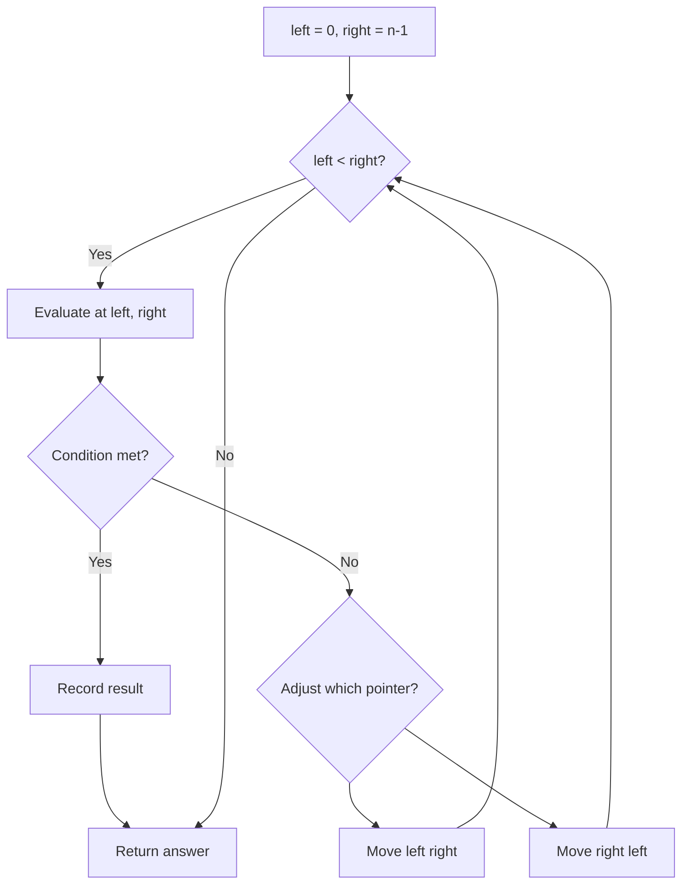
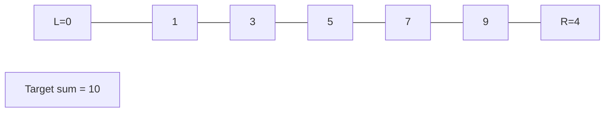
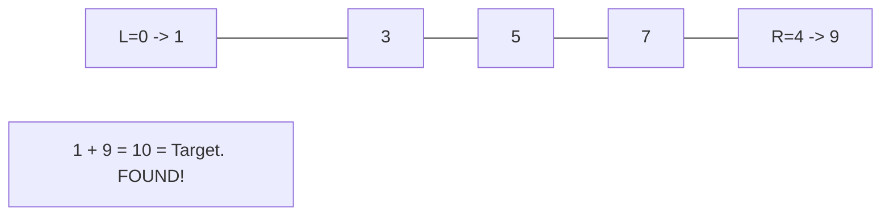

# Problem 1455: Check If a Word Occurs As a Prefix of Any Word in a Sentence

**Difficulty:** Easy  
**Tags:** Two Pointers, String, String Matching  
**Pattern:** Two Pointers  
**Link:** [leetcode.com/problems/check-if-a-word-occurs-as-a-prefix-of-any-word-in-a-sentence](https://leetcode.com/problems/check-if-a-word-occurs-as-a-prefix-of-any-word-in-a-sentence/)

## Description

Given a `sentence` that consists of some words separated by a **single space**, and a `searchWord`, check if `searchWord` is a prefix of any word in `sentence`.

Return *the index of the word in *`sentence`* (**1-indexed**) where *`searchWord`* is a prefix of this word*. If `searchWord` is a prefix of more than one word, return the index of the first word **(minimum index)**. If there is no such word return `-1`.

A **prefix** of a string `s` is any leading contiguous substring of `s`.

 

Example 1:

```

**Input:** sentence = "i love eating burger", searchWord = "burg"
**Output:** 4
**Explanation:** "burg" is prefix of "burger" which is the 4th word in the sentence.

```

Example 2:

```

**Input:** sentence = "this problem is an easy problem", searchWord = "pro"
**Output:** 2
**Explanation:** "pro" is prefix of "problem" which is the 2nd and the 6th word in the sentence, but we return 2 as it's the minimal index.

```

Example 3:

```

**Input:** sentence = "i am tired", searchWord = "you"
**Output:** -1
**Explanation:** "you" is not a prefix of any word in the sentence.

```

 

**Constraints:**

	- `1 <= sentence.length <= 100`
	- `1 <= searchWord.length <= 10`
	- `sentence` consists of lowercase English letters and spaces.
	- `searchWord` consists of lowercase English letters.

## Approach: Two Pointers

Use two pointers moving through the data structure. Depending on the problem, pointers may move toward each other (converging), in the same direction (fast/slow), or independently.

## Pseudocode

```
1. Initialize left = 0, right = n-1 (or two independent pointers)
2. While pointers haven't crossed:
   a. Evaluate condition at pointer positions
   b. Move left pointer right or right pointer left
3. Return result
```

## Algorithm Flow



## Visual State Transitions

**Two Pointer Convergence:**

**Frame 1: Initialize pointers**


**Frame 2: Sum = 1+9 = 10, found!**



## Complexity Analysis

- **Time:** O(n)
- **Space:** O(1)

## Solution (Python3)

```python
class Solution:
    def isPrefixOfWord(self, sentence: str, searchWord: str) -> int:
        # Two pointer approach - O(n) time, O(1) space
        left, right = 0, len(sentence) - 1
        while left < right:
            curr = sentence[left] + sentence[right]
            if curr == searchWord:
                return [left, right]
            elif curr < searchWord:
                left += 1
            else:
                right -= 1
        return 0
```

## Solution (C++)

```cpp
#include <string>
#include <vector>
using namespace std;

class Solution {
public:
    int isPrefixOfWord(string& sentence, string& searchWord) {
        // Two pointer approach - O(n) time, O(1) space
        int left = 0, right = sentence.size() - 1;
        while (left < right) {
            int curr = sentence[left] + sentence[right];
            if (curr == searchWord) {
                return {left, right};
            } else if (curr < searchWord) {
                left++;
            } else {
                right--;
            }
        }
        return 0;
    }
};
```
