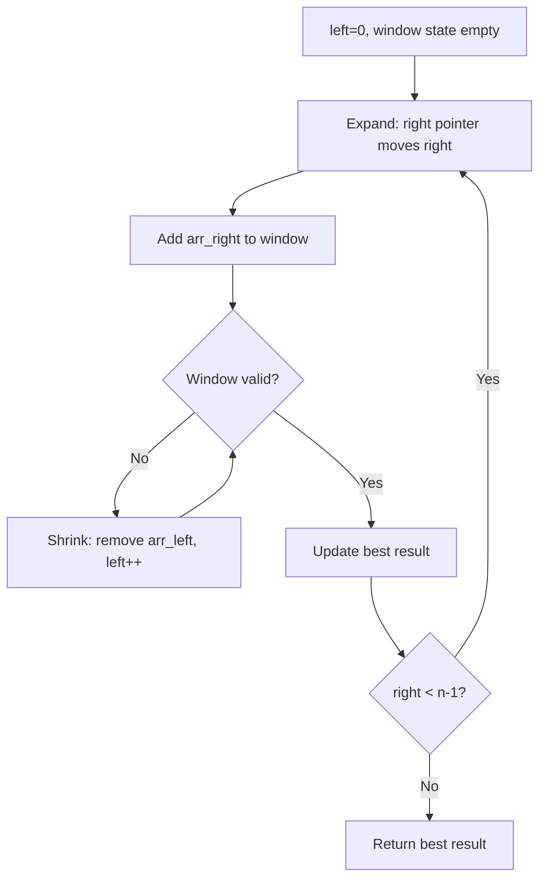
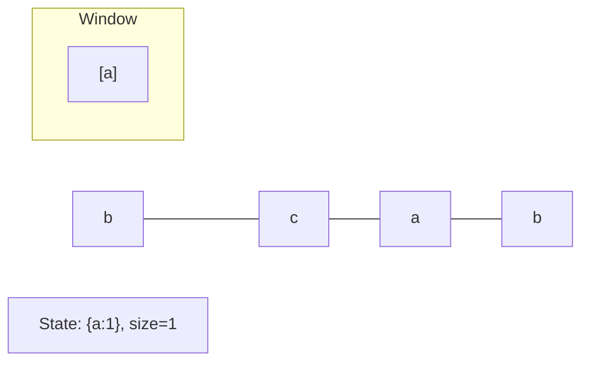
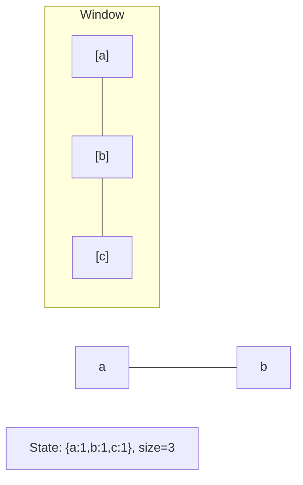
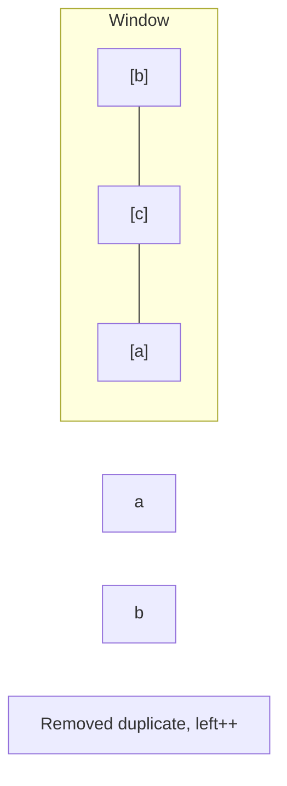
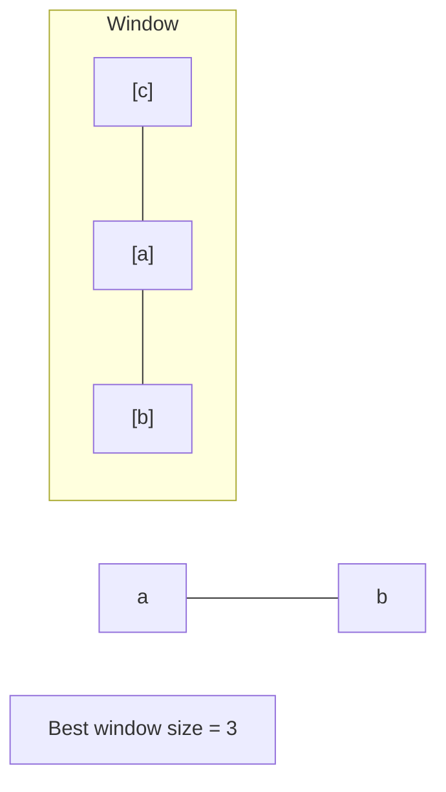

# Problem 1456: Maximum Number of Vowels in a Substring of Given Length

**Difficulty:** Medium  
**Tags:** String, Sliding Window  
**Pattern:** Sliding Window (Fixed)  
**Link:** [leetcode.com/problems/maximum-number-of-vowels-in-a-substring-of-given-length](https://leetcode.com/problems/maximum-number-of-vowels-in-a-substring-of-given-length/)

## Description

Given a string `s` and an integer `k`, return *the maximum number of vowel letters in any substring of *`s`* with length *`k`.

**Vowel letters** in English are `'a'`, `'e'`, `'i'`, `'o'`, and `'u'`.

 

Example 1:

```

**Input:** s = "abciiidef", k = 3
**Output:** 3
**Explanation:** The substring "iii" contains 3 vowel letters.

```

Example 2:

```

**Input:** s = "aeiou", k = 2
**Output:** 2
**Explanation:** Any substring of length 2 contains 2 vowels.

```

Example 3:

```

**Input:** s = "leetcode", k = 3
**Output:** 2
**Explanation:** "lee", "eet" and "ode" contain 2 vowels.

```

 

**Constraints:**

	- `1 <= s.length <= 10^5`
	- `s` consists of lowercase English letters.
	- `1 <= k <= s.length`

## Approach: Sliding Window (Fixed)

Fixed sliding window of size k. Track vowel count.

## Pseudocode

```
1. Initialize left = 0, result = initial_value
2. For right in range(n):
   a. Add element at right to window state
   b. While window is invalid:
      - Remove element at left from window state
      - left++
   c. Update result = best of (result, window size/value)
3. Return result
```

## Algorithm Flow



## Visual State Transitions

**Sliding Window Step-by-Step:**

**Frame 1: Initial window (left=0, right=0)**


**Frame 2: Expand right (right=2)**


**Frame 3: Violation - shrink left**


**Frame 4: Continue expanding**



## Complexity Analysis

- **Time:** O(n)
- **Space:** O(1)

## Solution (Python3)

```python
class Solution:
    def maxVowels(self, s: str, k: int) -> int:
        vowels = set('aeiou')
        count = sum(1 for c in s[:k] if c in vowels)
        max_count = count
        for i in range(k, len(s)):
            count += (s[i] in vowels) - (s[i-k] in vowels)
            max_count = max(max_count, count)
        return max_count
```

## Solution (C++)

```cpp
#include <algorithm>
#include <string>
#include <unordered_map>
#include <vector>
using namespace std;

class Solution {
public:
    int maxVowels(string& s, int k) {
        // Sliding window approach - O(n) time, O(k) space
        unordered_map<char, int> window;
        int left = 0, result = 0;
        for (int right = 0; right < s.size(); right++) {
            window[s[right]]++;
            while ((int)window.size() > k) {
                window[s[left]]--;
                if (window[s[left]] == 0)
                    window.erase(s[left]);
                left++;
            }
            result = max(result, right - left + 1);
        }
        return result;
    }
};
```
