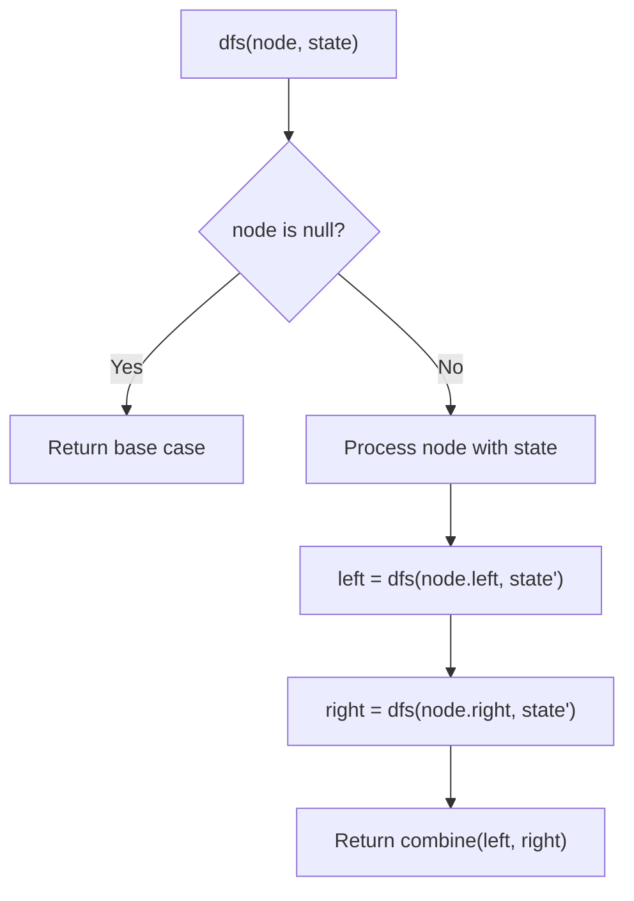
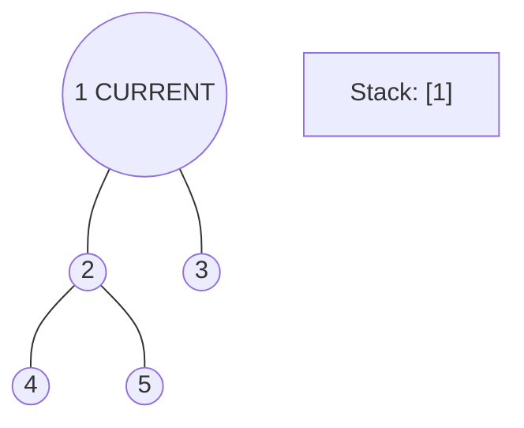
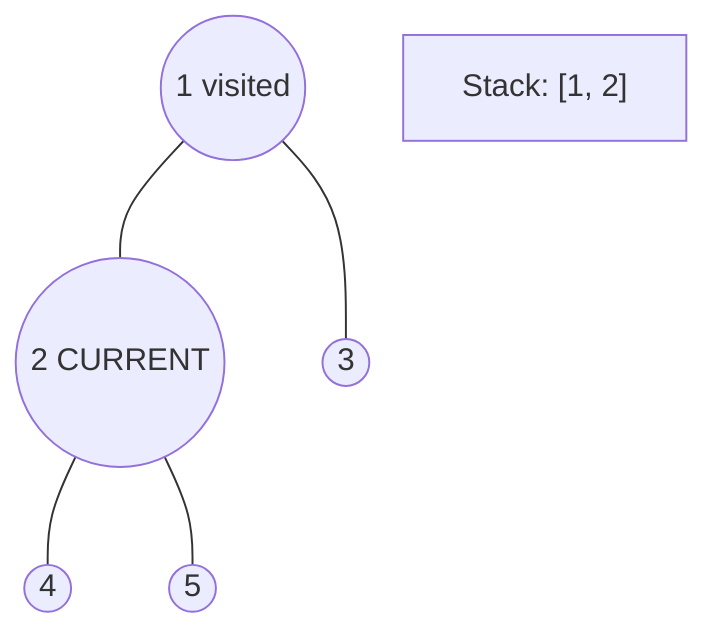
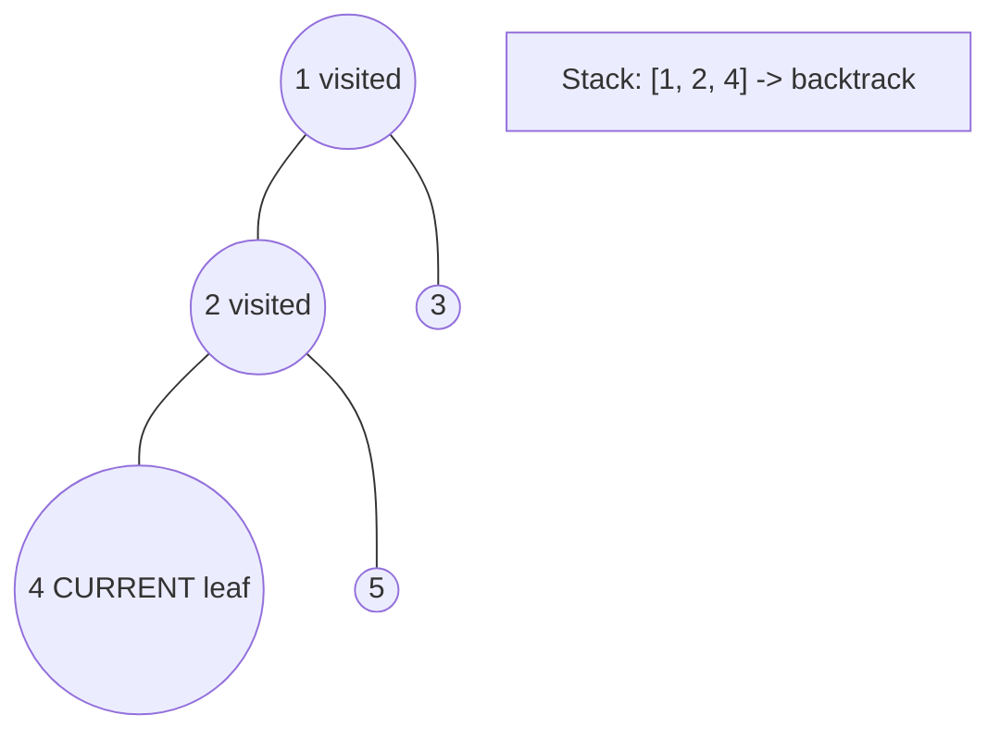
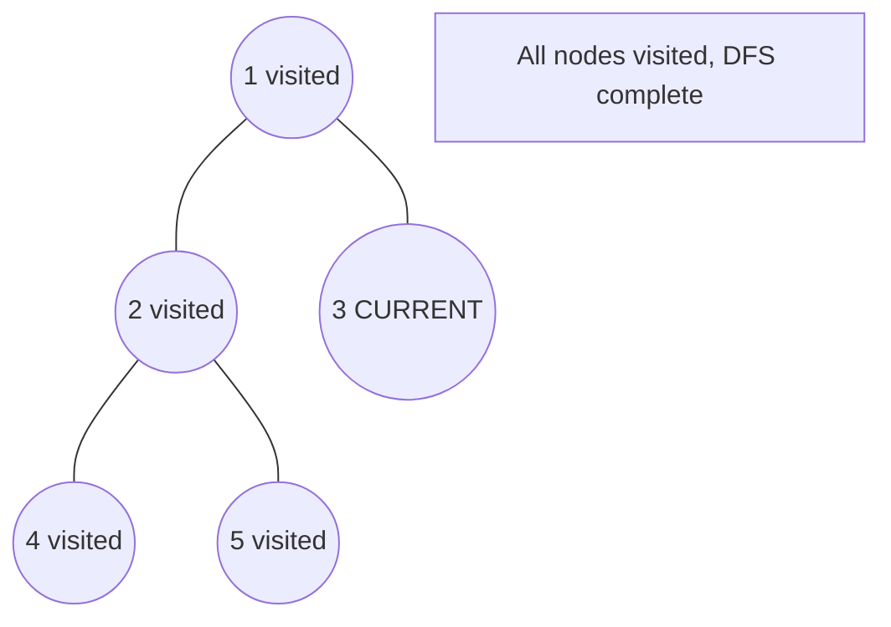

# Problem 1457: Pseudo-Palindromic Paths in a Binary Tree

**Difficulty:** Medium  
**Tags:** Bit Manipulation, Tree, Depth-First Search, Breadth-First Search, Binary Tree  
**Pattern:** DFS Tree Traversal  
**Link:** [leetcode.com/problems/pseudo-palindromic-paths-in-a-binary-tree](https://leetcode.com/problems/pseudo-palindromic-paths-in-a-binary-tree/)

## Description

Given a binary tree where node values are digits from 1 to 9. A path in the binary tree is said to be **pseudo-palindromic** if at least one permutation of the node values in the path is a palindrome.

*Return the number of **pseudo-palindromic** paths going from the root node to leaf nodes.*

 

Example 1:

```

**Input:** root = [2,3,1,3,1,null,1]
**Output:** 2 
**Explanation:** The figure above represents the given binary tree. There are three paths going from the root node to leaf nodes: the red path [2,3,3], the green path [2,1,1], and the path [2,3,1]. Among these paths only red path and green path are pseudo-palindromic paths since the red path [2,3,3] can be rearranged in [3,2,3] (palindrome) and the green path [2,1,1] can be rearranged in [1,2,1] (palindrome).

```

Example 2:

****

```

**Input:** root = [2,1,1,1,3,null,null,null,null,null,1]
**Output:** 1 
**Explanation:** The figure above represents the given binary tree. There are three paths going from the root node to leaf nodes: the green path [2,1,1], the path [2,1,3,1], and the path [2,1]. Among these paths only the green path is pseudo-palindromic since [2,1,1] can be rearranged in [1,2,1] (palindrome).

```

Example 3:

```

**Input:** root = [9]
**Output:** 1

```

 

**Constraints:**

	- The number of nodes in the tree is in the range `[1, 10^5]`.
	- `1 <= Node.val <= 9`

## Approach: DFS Tree Traversal

Perform depth-first search on the tree. Recurse on left and right subtrees, combining results bottom-up. Track state (path, depth, sum) during traversal.

## Pseudocode

```
1. Define dfs(node, state):
   a. Base case: if null, return default
   b. Process node with current state
   c. left_result = dfs(node.left, updated_state)
   d. right_result = dfs(node.right, updated_state)
   e. Return combine(left_result, right_result)
2. Return dfs(root, initial_state)
```

## Algorithm Flow



## Visual State Transitions

**DFS Tree Traversal Step-by-Step:**

**Frame 1: Start at root**


**Frame 2: Go left - visit node 2**


**Frame 3: Go left - visit node 4 (leaf)**


**Frame 4: Backtrack, visit node 5, then node 3**



## Complexity Analysis

- **Time:** O(n)
- **Space:** O(h)

## Solution (Python3)

```python
class Solution:
    def pseudoPalindromicPaths(self, root: Optional[TreeNode]) -> int:
        # DFS on binary tree - O(n) time, O(h) space
        def dfs(node):
            if not node:
                return 0
            left = dfs(node.left)
            right = dfs(node.right)
            return 1 + max(left, right)
        
        result = dfs(root)
        return result
```

## Solution (C++)

```cpp
#include <algorithm>
#include <functional>
#include <string>
#include <vector>
using namespace std;

class Solution {
public:
    int pseudoPalindromicPaths(TreeNode* root) {
        // DFS on binary tree - O(n) time, O(h) space
        function<int(TreeNode*)> dfs = [&](TreeNode* node) -> int {
            if (!node) return 0;
            int left = dfs(node->left);
            int right = dfs(node->right);
            return 1 + max(left, right);
        };
        return dfs(root);
    }
};
```
