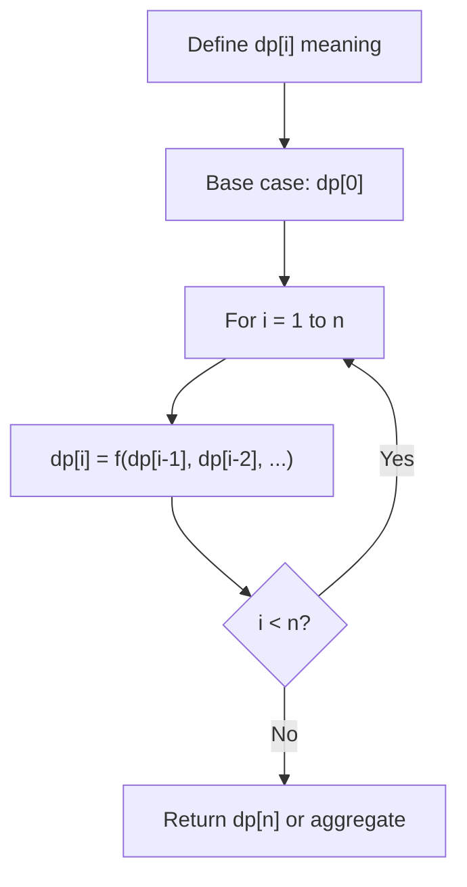
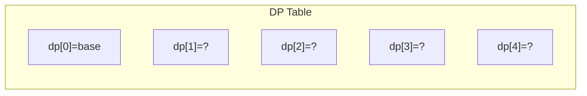
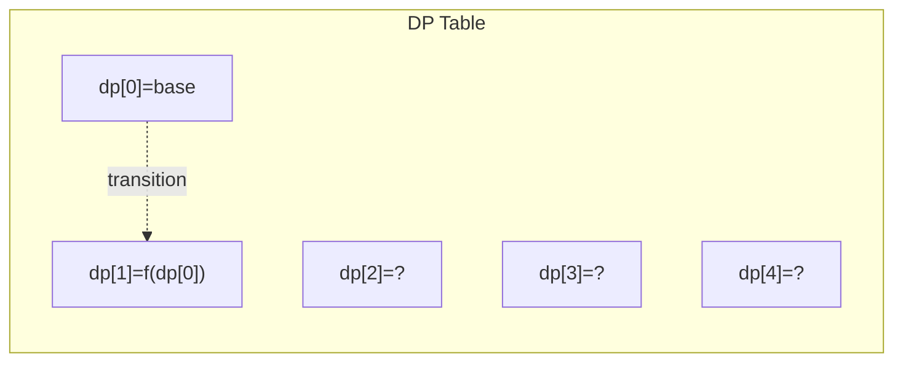
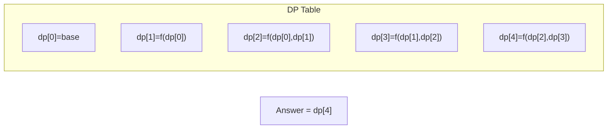

# Problem 1458: Max Dot Product of Two Subsequences

**Difficulty:** Hard  
**Tags:** Array, Dynamic Programming  
**Pattern:** Dynamic Programming (1D)  
**Link:** [leetcode.com/problems/max-dot-product-of-two-subsequences](https://leetcode.com/problems/max-dot-product-of-two-subsequences/)

## Description

Given two arrays `nums1` and `nums2`.

Return the maximum dot product between **non-empty** subsequences of nums1 and nums2 with the same length.

A subsequence of an array is a new array which is formed from the original array by deleting some (can be none) of the characters without disturbing the relative positions of the remaining characters. (ie, `[2,3,5]` is a subsequence of `[1,2,3,4,5]` while `[1,5,3]` is not).

 

Example 1:

```

**Input:** nums1 = [2,1,-2,5], nums2 = [3,0,-6]
**Output:** 18
**Explanation:** Take subsequence [2,-2] from nums1 and subsequence [3,-6] from nums2.
Their dot product is (2*3 + (-2)*(-6)) = 18.
```

Example 2:

```

**Input:** nums1 = [3,-2], nums2 = [2,-6,7]
**Output:** 21
**Explanation:** Take subsequence [3] from nums1 and subsequence [7] from nums2.
Their dot product is (3*7) = 21.
```

Example 3:

```

**Input:** nums1 = [-1,-1], nums2 = [1,1]
**Output:** -1
**Explanation: **Take subsequence [-1] from nums1 and subsequence [1] from nums2.
Their dot product is -1.
```

 

**Constraints:**

	- `1 <= nums1.length, nums2.length <= 500`
	- `-1000 <= nums1[i], nums2[i] <= 1000`

## Approach: Dynamic Programming (1D)

Break the problem into overlapping subproblems. Define dp[i] as the optimal value for the subproblem ending at or considering index i. Build the solution bottom-up, using previously computed dp values.

## Pseudocode

```
1. Define dp[i] = optimal value for subproblem i
2. Base case: dp[0] = initial value
3. For i from 1 to n:
   a. dp[i] = recurrence(dp[i-1], dp[i-2], ...)
4. Return dp[n] or max/min of dp
```

## Algorithm Flow



## Visual State Transitions

**1D Dynamic Programming Table Build:**

**Frame 1: Initialize base cases**


**Frame 2: Fill dp[1] from dp[0]**


**Frame 3: Fill remaining cells**



## Complexity Analysis

- **Time:** O(n)
- **Space:** O(n)

## Solution (Python3)

```python
class Solution:
    def maxDotProduct(self, nums1: List[int], nums2: List[int]) -> int:
        # Dynamic programming (1D) - O(n) time, O(n) space
        if not nums1:
            return 0
        n = len(nums1) if isinstance(nums1, list) else nums1
        dp = [0] * (n + 1)
        dp[0] = 1  # base case
        for i in range(1, n + 1):
            dp[i] = dp[i-1]  # transition (customize per problem)
            if i >= 2:
                dp[i] += dp[i-2]
        return dp[n]
```

## Solution (C++)

```cpp
#include <string>
#include <vector>
using namespace std;

class Solution {
public:
    int maxDotProduct(vector<int>& nums1, vector<int>& nums2) {
        // Dynamic programming (1D) - O(n) time, O(n) space
        int n = nums1;
        if (n <= 0) return 0;
        vector<int> dp(n + 1, 0);
        dp[0] = 1;
        for (int i = 1; i <= n; i++) {
            dp[i] = dp[i-1];
            if (i >= 2) dp[i] += dp[i-2];
        }
        return dp[n];
    }
};
```
