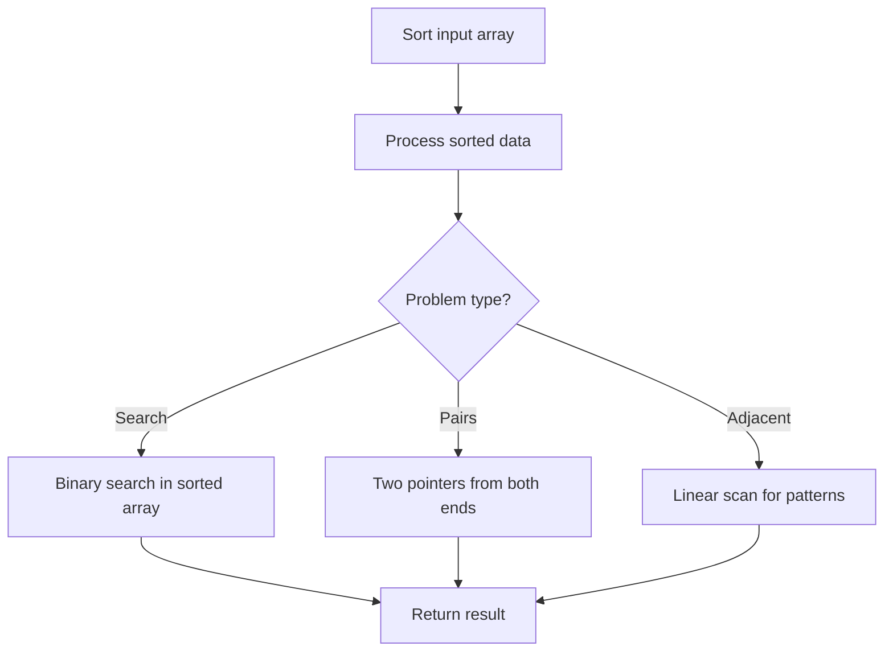

# Problem 1460: Make Two Arrays Equal by Reversing Subarrays

**Difficulty:** Easy  
**Tags:** Array, Hash Table, Sorting  
**Pattern:** Sorting  
**Link:** [leetcode.com/problems/make-two-arrays-equal-by-reversing-subarrays](https://leetcode.com/problems/make-two-arrays-equal-by-reversing-subarrays/)

## Description

You are given two integer arrays of equal length `target` and `arr`. In one step, you can select any **non-empty subarray** of `arr` and reverse it. You are allowed to make any number of steps.

Return `true` *if you can make *`arr`* equal to *`target`* or *`false`* otherwise*.

 

Example 1:

```

**Input:** target = [1,2,3,4], arr = [2,4,1,3]
**Output:** true
**Explanation:** You can follow the next steps to convert arr to target:
1- Reverse subarray [2,4,1], arr becomes [1,4,2,3]
2- Reverse subarray [4,2], arr becomes [1,2,4,3]
3- Reverse subarray [4,3], arr becomes [1,2,3,4]
There are multiple ways to convert arr to target, this is not the only way to do so.

```

Example 2:

```

**Input:** target = [7], arr = [7]
**Output:** true
**Explanation:** arr is equal to target without any reverses.

```

Example 3:

```

**Input:** target = [3,7,9], arr = [3,7,11]
**Output:** false
**Explanation:** arr does not have value 9 and it can never be converted to target.

```

 

**Constraints:**

	- `target.length == arr.length`
	- `1 <= target.length <= 1000`
	- `1 <= target[i] <= 1000`
	- `1 <= arr[i] <= 1000`

## Approach: Sorting

Sort the data to enable efficient processing. After sorting, use techniques like binary search, two pointers, or linear scan to solve the problem.

## Pseudocode

```
1. Sort the input array
2. Process sorted data:
   - Use binary search for lookups
   - Use two pointers for pair finding
   - Scan for adjacent patterns
3. Return result
```

## Algorithm Flow



## Complexity Analysis

- **Time:** O(n log n)
- **Space:** O(n)

## Solution (Python3)

```python
class Solution:
    def canBeEqual(self, target: List[int], arr: List[int]) -> bool:
        # Sort-based approach - O(n log n) time
        target.sort(key=lambda x: x[0] if isinstance(x, (list, tuple)) else x)
        result = [target[0]]
        for i in range(1, len(target)):
            curr = target[i]
            if isinstance(curr, (list, tuple)) and isinstance(result[-1], (list, tuple)):
                if curr[0] <= result[-1][1]:
                    result[-1] = [result[-1][0], max(result[-1][1], curr[1])]
                else:
                    result.append(curr)
            else:
                result.append(curr)
        return result
```

## Solution (C++)

```cpp
#include <algorithm>
#include <string>
#include <vector>
using namespace std;

class Solution {
public:
    bool canBeEqual(vector<int>& target, vector<int>& arr) {
        // Sort-based approach - O(n log n) time
        sort(target.begin(), target.end());
        vector<vector<int>> result;
        result.push_back(target[0]);
        for (int i = 1; i < (int)target.size(); i++) {
            if (target[i][0] <= result.back()[1]) {
                result.back()[1] = max(result.back()[1], target[i][1]);
            } else {
                result.push_back(target[i]);
            }
        }
        return result;
    }
};
```
