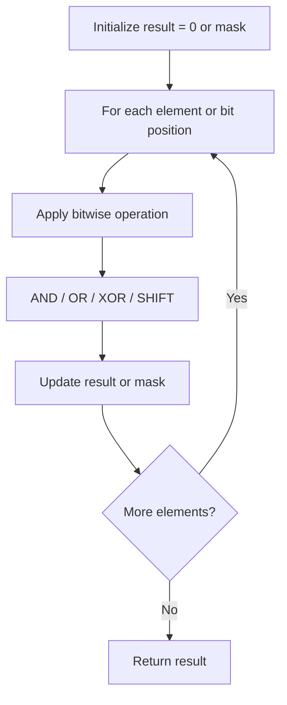

# Problem 1461: Check If a String Contains All Binary Codes of Size K

**Difficulty:** Medium  
**Tags:** Hash Table, String, Bit Manipulation, Rolling Hash, Hash Function  
**Pattern:** Bit Manipulation  
**Link:** [leetcode.com/problems/check-if-a-string-contains-all-binary-codes-of-size-k](https://leetcode.com/problems/check-if-a-string-contains-all-binary-codes-of-size-k/)

## Description

Given a binary string `s` and an integer `k`, return `true` *if every binary code of length* `k` *is a substring of* `s`. Otherwise, return `false`.

 

Example 1:

```

**Input:** s = "00110110", k = 2
**Output:** true
**Explanation:** The binary codes of length 2 are "00", "01", "10" and "11". They can be all found as substrings at indices 0, 1, 3 and 2 respectively.

```

Example 2:

```

**Input:** s = "0110", k = 1
**Output:** true
**Explanation:** The binary codes of length 1 are "0" and "1", it is clear that both exist as a substring. 

```

Example 3:

```

**Input:** s = "0110", k = 2
**Output:** false
**Explanation:** The binary code "00" is of length 2 and does not exist in the array.

```

 

**Constraints:**

	- `1 <= s.length <= 5 * 10^5`
	- `s[i]` is either `'0'` or `'1'`.
	- `1 <= k <= 20`

## Approach: Bit Manipulation

Operate on individual bits using bitwise operators (AND, OR, XOR, shift). Common tricks: x & (x-1) removes lowest set bit, x ^ x = 0, XOR all elements to find unique.

## Pseudocode

```
1. Apply bitwise operations:
   - XOR all elements to cancel paired bits
   - Use bitmask to track state
   - Shift and mask to extract/set individual bits
2. Return result
```

## Algorithm Flow



## Complexity Analysis

- **Time:** O(n) or O(log n)
- **Space:** O(1)

## Solution (Python3)

```python
class Solution:
    def hasAllCodes(self, s: str, k: int) -> bool:
        # Bit manipulation - O(n) time, O(1) space
        result = 0
        for val in s:
            result ^= val
        return result
```

## Solution (C++)

```cpp
#include <string>
#include <vector>
using namespace std;

class Solution {
public:
    bool hasAllCodes(string& s, int k) {
        // Bit manipulation - O(n) time, O(1) space
        int result = 0;
        for (int val : s) {
            result ^= val;
        }
        return result;
    }
};
```
