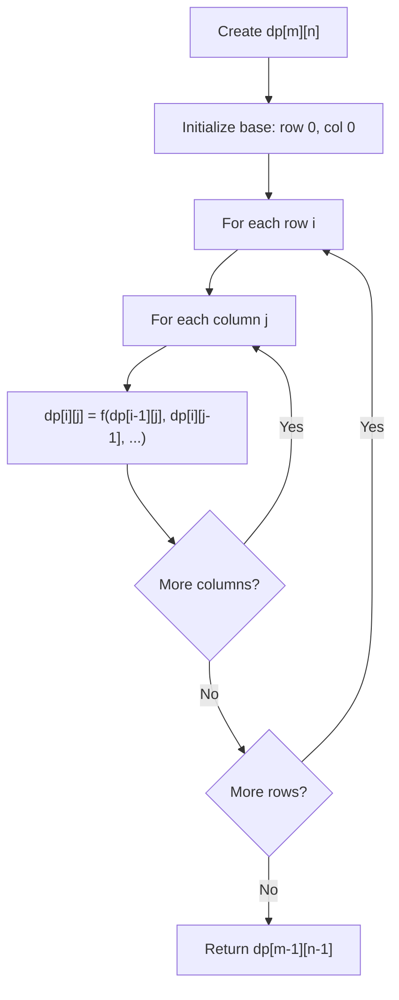
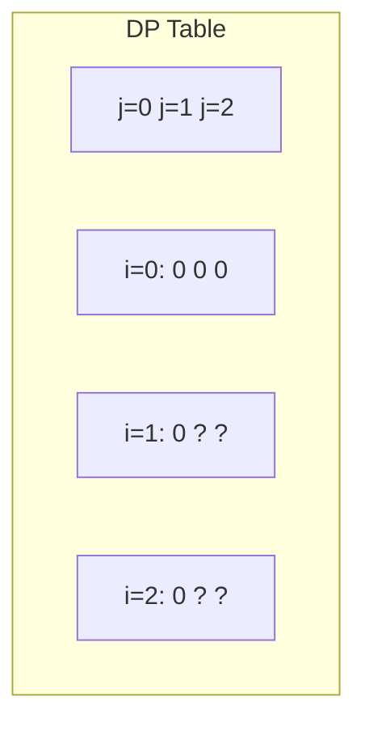
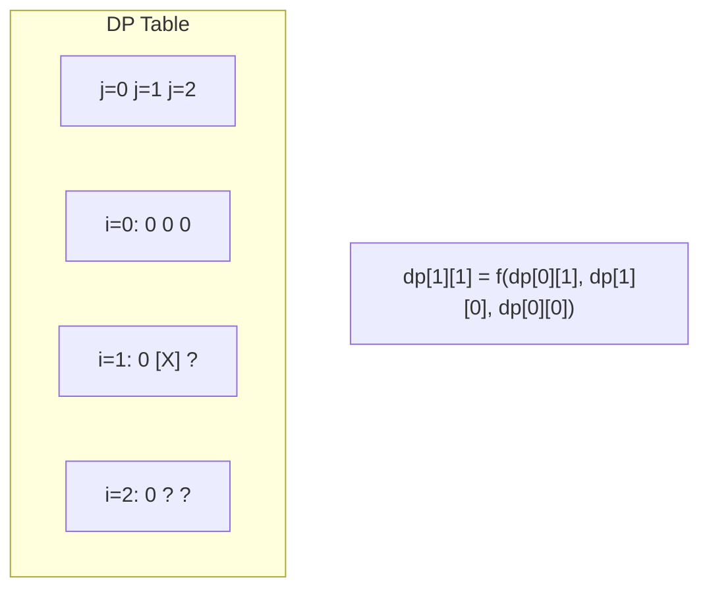
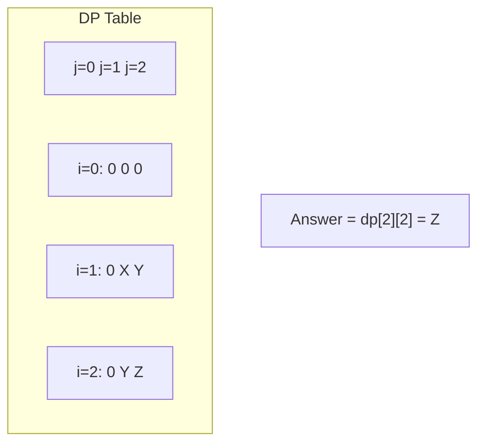

# Problem 1463: Cherry Pickup II

**Difficulty:** Hard  
**Tags:** Array, Dynamic Programming, Matrix  
**Pattern:** Dynamic Programming (2D Grid/Matrix)  
**Link:** [leetcode.com/problems/cherry-pickup-ii](https://leetcode.com/problems/cherry-pickup-ii/)

## Description

You are given a `rows x cols` matrix `grid` representing a field of cherries where `grid[i][j]` represents the number of cherries that you can collect from the `(i, j)` cell.

You have two robots that can collect cherries for you:

	- **Robot #1** is located at the **top-left corner** `(0, 0)`, and
	- **Robot #2** is located at the **top-right corner** `(0, cols - 1)`.

Return *the maximum number of cherries collection using both robots by following the rules below*:

	- From a cell `(i, j)`, robots can move to cell `(i + 1, j - 1)`, `(i + 1, j)`, or `(i + 1, j + 1)`.
	- When any robot passes through a cell, It picks up all cherries, and the cell becomes an empty cell.
	- When both robots stay in the same cell, only one takes the cherries.
	- Both robots cannot move outside of the grid at any moment.
	- Both robots should reach the bottom row in `grid`.

 

Example 1:

```

**Input:** grid = [[3,1,1],[2,5,1],[1,5,5],[2,1,1]]
**Output:** 24
**Explanation:** Path of robot #1 and #2 are described in color green and blue respectively.
Cherries taken by Robot #1, (3 + 2 + 5 + 2) = 12.
Cherries taken by Robot #2, (1 + 5 + 5 + 1) = 12.
Total of cherries: 12 + 12 = 24.

```

Example 2:

```

**Input:** grid = [[1,0,0,0,0,0,1],[2,0,0,0,0,3,0],[2,0,9,0,0,0,0],[0,3,0,5,4,0,0],[1,0,2,3,0,0,6]]
**Output:** 28
**Explanation:** Path of robot #1 and #2 are described in color green and blue respectively.
Cherries taken by Robot #1, (1 + 9 + 5 + 2) = 17.
Cherries taken by Robot #2, (1 + 3 + 4 + 3) = 11.
Total of cherries: 17 + 11 = 28.

```

 

**Constraints:**

	- `rows == grid.length`
	- `cols == grid[i].length`
	- `2 <= rows, cols <= 70`
	- `0 <= grid[i][j] <= 100`

## Approach: Dynamic Programming (2D Grid/Matrix)

Use a 2D DP table where dp[i][j] represents the optimal value for the subproblem defined by rows 0..i and columns 0..j. Fill row by row or column by column.

## Pseudocode

```
1. Create dp[m][n] table
2. Initialize base cases (first row, first column)
3. For i from 1 to m-1:
   For j from 1 to n-1:
     dp[i][j] = recurrence(dp[i-1][j], dp[i][j-1], dp[i-1][j-1])
4. Return dp[m-1][n-1]
```

## Algorithm Flow



## Visual State Transitions

**2D DP Table Build:**

**Frame 1: Initialize borders**


**Frame 2: Fill cell by cell**


**Frame 3: Table complete**



## Complexity Analysis

- **Time:** O(m * n)
- **Space:** O(m * n)

## Solution (Python3)

```python
class Solution:
    def cherryPickup(self, grid: List[List[int]]) -> int:
        # Dynamic programming (2D) - O(m*n) time and space
        if not grid:
            return 0
        m, n = len(grid), len(grid[0])
        dp = [[0] * (n + 1) for _ in range(m + 1)]
        for i in range(1, m + 1):
            for j in range(1, n + 1):
                dp[i][j] = max(dp[i-1][j], dp[i][j-1])
                # Add problem-specific transition
        return dp[m][n]
```

## Solution (C++)

```cpp
#include <algorithm>
#include <string>
#include <vector>
using namespace std;

class Solution {
public:
    int cherryPickup(vector<vector<int>>& grid) {
        // Dynamic programming (2D) - O(m*n) time and space
        if (grid.empty()) return 0;
        int m = grid.size(), n = grid[0].size();
        vector<vector<int>> dp(m + 1, vector<int>(n + 1, 0));
        for (int i = 1; i <= m; i++) {
            for (int j = 1; j <= n; j++) {
                dp[i][j] = max(dp[i-1][j], dp[i][j-1]);
            }
        }
        return dp[m][n];
    }
};
```
