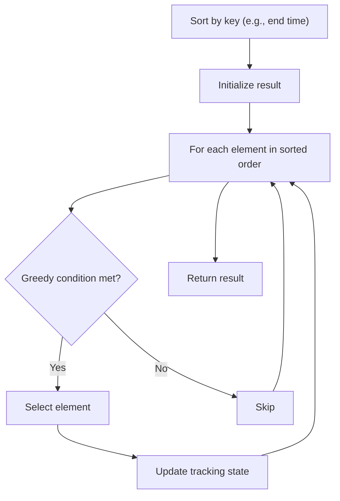

# Problem 1465: Maximum Area of a Piece of Cake After Horizontal and Vertical Cuts

**Difficulty:** Medium  
**Tags:** Array, Greedy, Sorting  
**Pattern:** Greedy with Sorting  
**Link:** [leetcode.com/problems/maximum-area-of-a-piece-of-cake-after-horizontal-and-vertical-cuts](https://leetcode.com/problems/maximum-area-of-a-piece-of-cake-after-horizontal-and-vertical-cuts/)

## Description

You are given a rectangular cake of size `h x w` and two arrays of integers `horizontalCuts` and `verticalCuts` where:

	- `horizontalCuts[i]` is the distance from the top of the rectangular cake to the `i^th` horizontal cut and similarly, and
	- `verticalCuts[j]` is the distance from the left of the rectangular cake to the `j^th` vertical cut.

Return *the maximum area of a piece of cake after you cut at each horizontal and vertical position provided in the arrays* `horizontalCuts` *and* `verticalCuts`. Since the answer can be a large number, return this **modulo** `10^9 + 7`.

 

Example 1:

```

**Input:** h = 5, w = 4, horizontalCuts = [1,2,4], verticalCuts = [1,3]
**Output:** 4 
**Explanation:** The figure above represents the given rectangular cake. Red lines are the horizontal and vertical cuts. After you cut the cake, the green piece of cake has the maximum area.

```

Example 2:

```

**Input:** h = 5, w = 4, horizontalCuts = [3,1], verticalCuts = [1]
**Output:** 6
**Explanation:** The figure above represents the given rectangular cake. Red lines are the horizontal and vertical cuts. After you cut the cake, the green and yellow pieces of cake have the maximum area.

```

Example 3:

```

**Input:** h = 5, w = 4, horizontalCuts = [3], verticalCuts = [3]
**Output:** 9

```

 

**Constraints:**

	- `2 <= h, w <= 10^9`
	- `1 <= horizontalCuts.length <= min(h - 1, 10^5)`
	- `1 <= verticalCuts.length <= min(w - 1, 10^5)`
	- `1 <= horizontalCuts[i] < h`
	- `1 <= verticalCuts[i] < w`
	- All the elements in `horizontalCuts` are distinct.
	- All the elements in `verticalCuts` are distinct.

## Approach: Greedy with Sorting

Sort the input by a key criterion, then greedily process elements in sorted order. The sorting ensures the greedy choice is always optimal.

## Pseudocode

```
1. Sort elements by key (start time, weight, etc.)
2. Initialize result, tracking variables
3. For each element in sorted order:
   a. Apply greedy selection rule
   b. Update result
4. Return result
```

## Algorithm Flow



## Complexity Analysis

- **Time:** O(n log n)
- **Space:** O(n)

## Solution (Python3)

```python
class Solution:
    def maxArea(self, h: int, w: int, horizontalCuts: List[int], verticalCuts: List[int]) -> int:
        # Sort + greedy - O(n log n) time
        h.sort()
        result = 0
        curr_end = 0
        for item in h:
            if isinstance(item, (list, tuple)):
                if item[0] >= curr_end:
                    result += 1
                    curr_end = item[1]
            else:
                result += 1
        return result
```

## Solution (C++)

```cpp
#include <algorithm>
#include <string>
#include <vector>
using namespace std;

class Solution {
public:
    int maxArea(int h, int w, vector<int>& horizontalCuts, vector<int>& verticalCuts) {
        // Sort + greedy - O(n log n) time
        sort(h.begin(), h.end());
        int result = 0, curr_end = 0;
        for (auto& item : h) {
            result++;
        }
        return result;
    }
};
```
