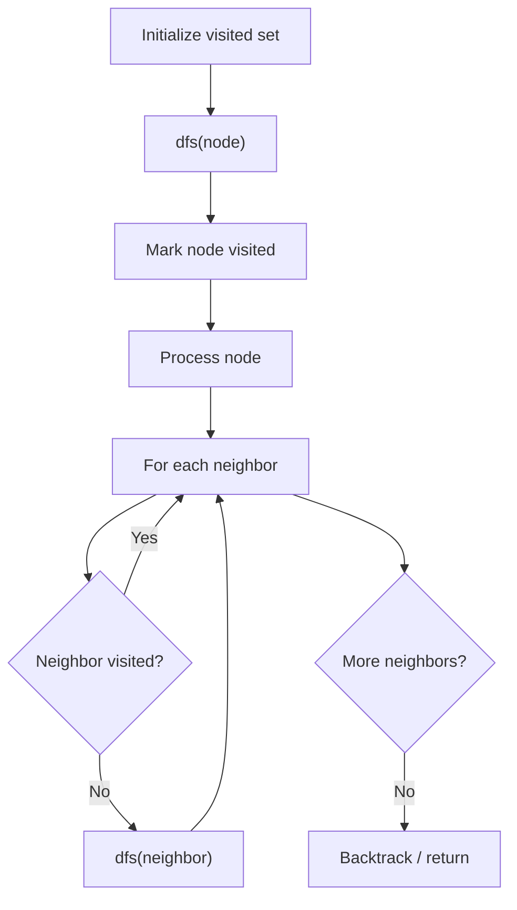

# Problem 1466: Reorder Routes to Make All Paths Lead to the City Zero

**Difficulty:** Medium  
**Tags:** Depth-First Search, Breadth-First Search, Graph Theory  
**Pattern:** DFS Graph Traversal  
**Link:** [leetcode.com/problems/reorder-routes-to-make-all-paths-lead-to-the-city-zero](https://leetcode.com/problems/reorder-routes-to-make-all-paths-lead-to-the-city-zero/)

## Description

There are `n` cities numbered from `0` to `n - 1` and `n - 1` roads such that there is only one way to travel between two different cities (this network form a tree). Last year, The ministry of transport decided to orient the roads in one direction because they are too narrow.

Roads are represented by `connections` where `connections[i] = [ai, bi]` represents a road from city `ai` to city `bi`.

This year, there will be a big event in the capital (city `0`), and many people want to travel to this city.

Your task consists of reorienting some roads such that each city can visit the city `0`. Return the **minimum** number of edges changed.

It's **guaranteed** that each city can reach city `0` after reorder.

 

Example 1:

```

**Input:** n = 6, connections = [[0,1],[1,3],[2,3],[4,0],[4,5]]
**Output:** 3
**Explanation: **Change the direction of edges show in red such that each node can reach the node 0 (capital).

```

Example 2:

```

**Input:** n = 5, connections = [[1,0],[1,2],[3,2],[3,4]]
**Output:** 2
**Explanation: **Change the direction of edges show in red such that each node can reach the node 0 (capital).

```

Example 3:

```

**Input:** n = 3, connections = [[1,0],[2,0]]
**Output:** 0

```

 

**Constraints:**

	- `2 <= n <= 5 * 10^4`
	- `connections.length == n - 1`
	- `connections[i].length == 2`
	- `0 <= ai, bi <= n - 1`
	- `ai != bi`

## Approach: DFS Graph Traversal

Explore the graph depth-first using recursion or a stack. Mark nodes as visited to avoid cycles. Process each node and explore all unvisited neighbors.

## Pseudocode

```
1. Initialize visited set
2. Define dfs(node):
   a. Mark node as visited
   b. Process node
   c. For each neighbor of node:
      - If not visited: dfs(neighbor)
3. Call dfs(start) for each unvisited node
```

## Algorithm Flow



## Complexity Analysis

- **Time:** O(V + E)
- **Space:** O(V)

## Solution (Python3)

```python
class Solution:
    def minReorder(self, n: int, connections: List[List[int]]) -> int:
        # DFS on graph - O(V+E) time
        visited = set()
        result = []
        
        def dfs(node):
            if node in visited:
                return
            visited.add(node)
            result.append(node)
            # Traverse neighbors (adjust based on adjacency representation)
        
        dfs(0)
        return result if isinstance(0, list) else len(result)
```

## Solution (C++)

```cpp
#include <functional>
#include <string>
#include <vector>
using namespace std;

class Solution {
public:
    int minReorder(int n, vector<vector<int>>& connections) {
        // DFS on graph - O(V+E) time
        vector<bool> visited(n.size(), false);
        vector<int> result;
        function<void(int)> dfs = [&](int node) {
            if (visited[node]) return;
            visited[node] = true;
            result.push_back(node);
            // Traverse neighbors
        };
        dfs(0);
        return result;
    }
};
```
