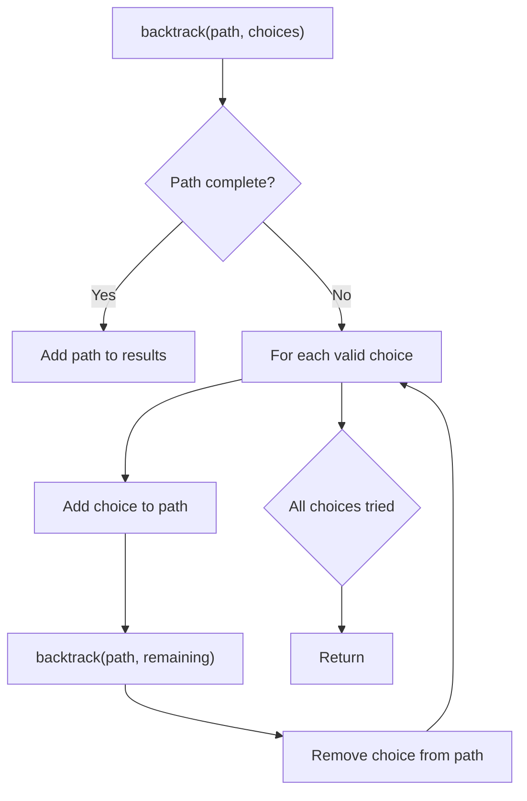
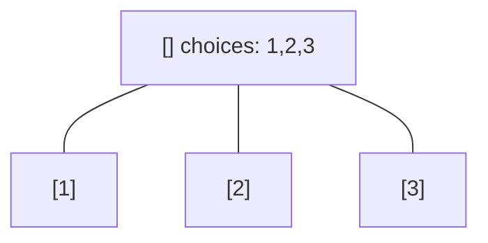
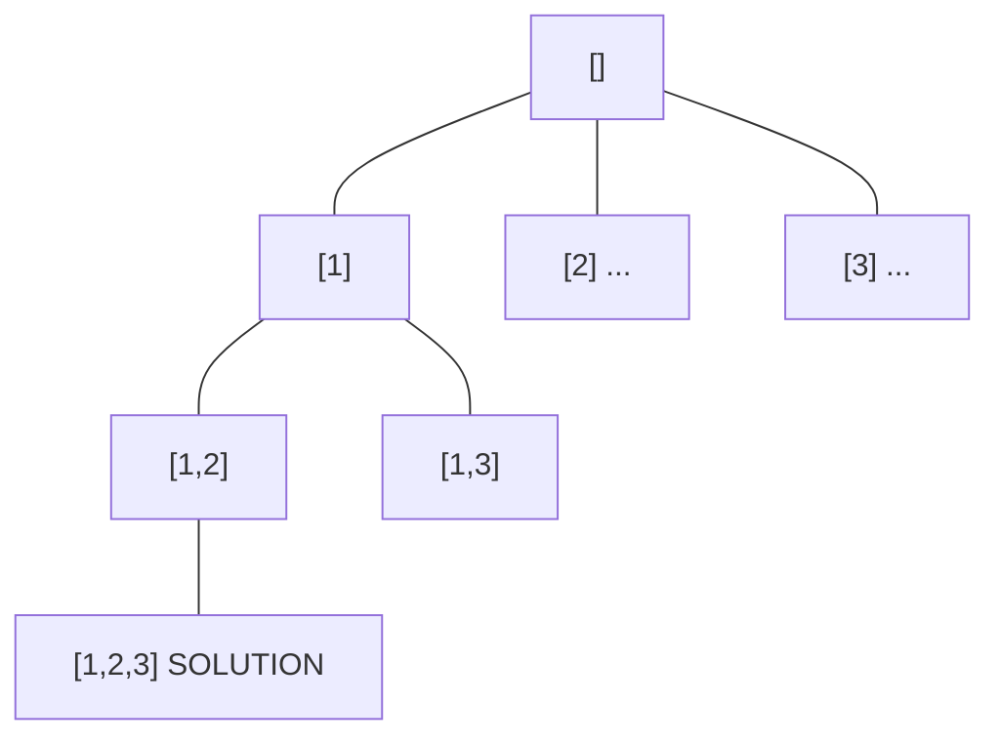
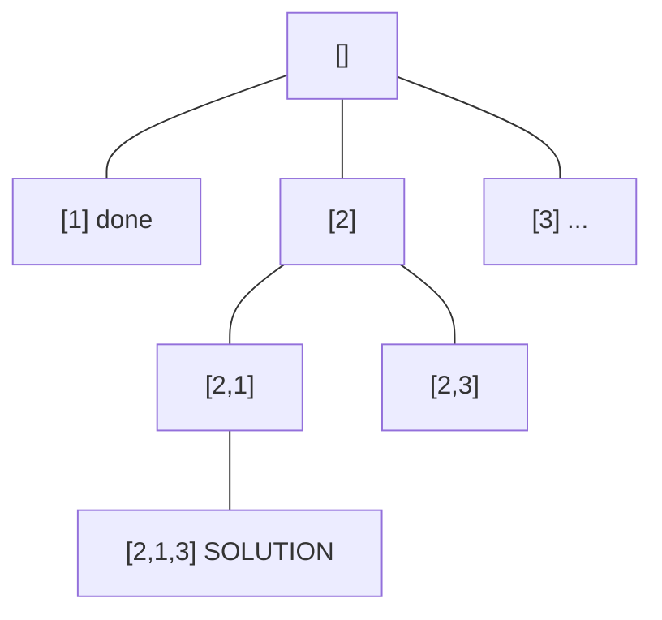
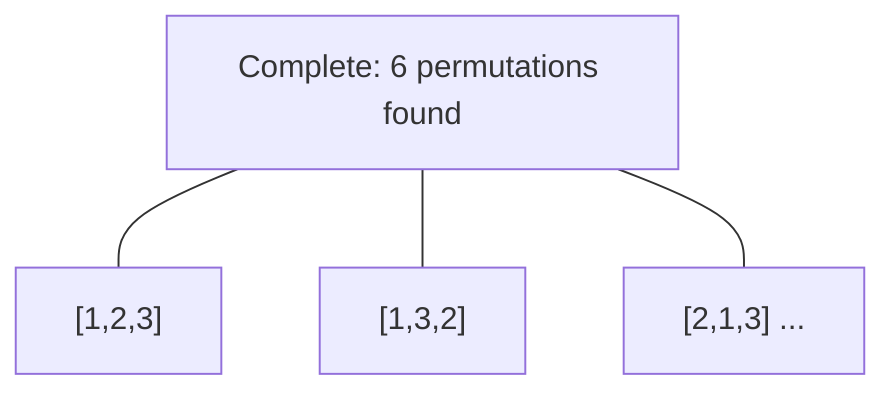

# Problem 1467: Probability of a Two Boxes Having The Same Number of Distinct Balls

**Difficulty:** Hard  
**Tags:** Array, Math, Dynamic Programming, Backtracking, Combinatorics, Probability and Statistics  
**Pattern:** Backtracking  
**Link:** [leetcode.com/problems/probability-of-a-two-boxes-having-the-same-number-of-distinct-balls](https://leetcode.com/problems/probability-of-a-two-boxes-having-the-same-number-of-distinct-balls/)

## Description

Given `2n` balls of `k` distinct colors. You will be given an integer array `balls` of size `k` where `balls[i]` is the number of balls of color `i`.

All the balls will be **shuffled uniformly at random**, then we will distribute the first `n` balls to the first box and the remaining `n` balls to the other box (Please read the explanation of the second example carefully).

Please note that the two boxes are considered different. For example, if we have two balls of colors `a` and `b`, and two boxes `[]` and `()`, then the distribution `[a] (b)` is considered different than the distribution `[b] (a) `(Please read the explanation of the first example carefully).

Return* the probability* that the two boxes have the same number of distinct balls. Answers within `10^-5` of the actual value will be accepted as correct.

 

Example 1:

```

**Input:** balls = [1,1]
**Output:** 1.00000
**Explanation:** Only 2 ways to divide the balls equally:
- A ball of color 1 to box 1 and a ball of color 2 to box 2
- A ball of color 2 to box 1 and a ball of color 1 to box 2
In both ways, the number of distinct colors in each box is equal. The probability is 2/2 = 1

```

Example 2:

```

**Input:** balls = [2,1,1]
**Output:** 0.66667
**Explanation:** We have the set of balls [1, 1, 2, 3]
This set of balls will be shuffled randomly and we may have one of the 12 distinct shuffles with equal probability (i.e. 1/12):
[1,1 / 2,3], [1,1 / 3,2], [1,2 / 1,3], [1,2 / 3,1], [1,3 / 1,2], [1,3 / 2,1], [2,1 / 1,3], [2,1 / 3,1], [2,3 / 1,1], [3,1 / 1,2], [3,1 / 2,1], [3,2 / 1,1]
After that, we add the first two balls to the first box and the second two balls to the second box.
We can see that 8 of these 12 possible random distributions have the same number of distinct colors of balls in each box.
Probability is 8/12 = 0.66667

```

Example 3:

```

**Input:** balls = [1,2,1,2]
**Output:** 0.60000
**Explanation:** The set of balls is [1, 2, 2, 3, 4, 4]. It is hard to display all the 180 possible random shuffles of this set but it is easy to check that 108 of them will have the same number of distinct colors in each box.
Probability = 108 / 180 = 0.6

```

 

**Constraints:**

	- `1 <= balls.length <= 8`
	- `1 <= balls[i] <= 6`
	- `sum(balls)` is even.

## Approach: Backtracking

Explore all possible solutions by building candidates incrementally. At each step, make a choice and recurse. If the choice leads to a dead end, undo the choice (backtrack) and try the next option.

## Pseudocode

```
1. Define backtrack(path, choices):
   a. If path is a complete solution: add to results
   b. For each choice in choices:
      - If choice is valid:
        * Add choice to path
        * backtrack(path, remaining_choices)
        * Remove choice from path (backtrack)
2. Call backtrack([], all_choices)
```

## Algorithm Flow



## Visual State Transitions

**Backtracking Decision Tree:**

**Frame 1: Root - start with empty path**


**Frame 2: Explore branch [1]**


**Frame 3: Backtrack, explore [2]**


**Frame 4: All solutions found**



## Complexity Analysis

- **Time:** O(k^n) or O(n!)
- **Space:** O(n)

## Solution (Python3)

```python
class Solution:
    def getProbability(self, balls: List[int]) -> float:
        # Backtracking - O(2^n) or O(n!) time
        result = []
        
        def backtrack(path, start):
            result.append(path[:])
            for i in range(start, len(balls)):
                path.append(balls[i])
                backtrack(path, i + 1)
                path.pop()
        
        backtrack([], 0)
        return result
```

## Solution (C++)

```cpp
#include <functional>
#include <string>
#include <vector>
using namespace std;

class Solution {
public:
    double getProbability(vector<int>& balls) {
        // Backtracking - O(2^n) or O(n!) time
        vector<vector<int>> result;
        vector<int> path;
        function<void(int)> backtrack = [&](int start) {
            result.push_back(path);
            for (int i = start; i < (int)balls.size(); i++) {
                path.push_back(balls[i]);
                backtrack(i + 1);
                path.pop_back();
            }
        };
        backtrack(0);
        return result;
    }
};
```
