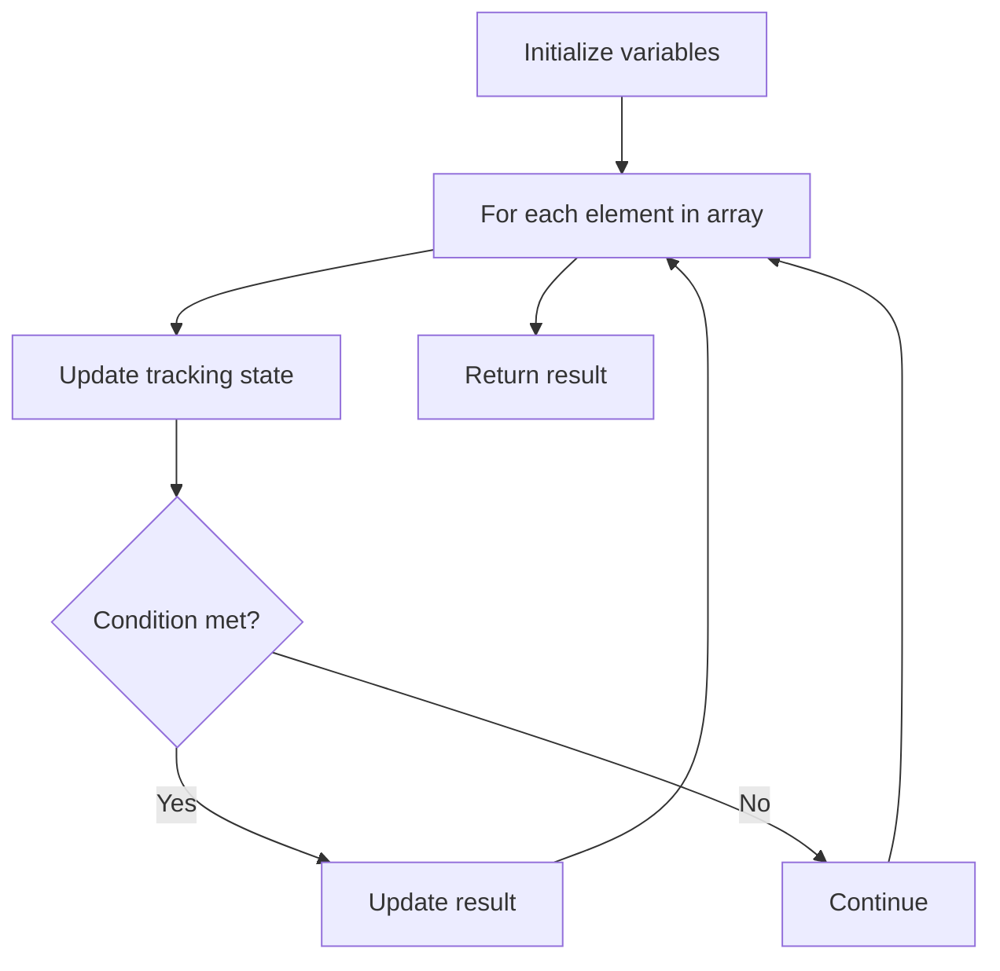

# Problem 1470: Shuffle the Array

**Difficulty:** Easy  
**Tags:** Array  
**Pattern:** Array Processing  
**Link:** [leetcode.com/problems/shuffle-the-array](https://leetcode.com/problems/shuffle-the-array/)

## Description

Given the array `nums` consisting of `2n` elements in the form `[x1,x2,...,xn,y1,y2,...,yn]`.


*Return the array in the form* `[x1,y1,x2,y2,...,xn,yn]`.


 

Example 1:


```

**Input:** nums = [2,5,1,3,4,7], n = 3
**Output:** [2,3,5,4,1,7] 
**Explanation:** Since x1=2, x2=5, x3=1, y1=3, y2=4, y3=7 then the answer is [2,3,5,4,1,7].

```


Example 2:


```

**Input:** nums = [1,2,3,4,4,3,2,1], n = 4
**Output:** [1,4,2,3,3,2,4,1]

```


Example 3:


```

**Input:** nums = [1,1,2,2], n = 2
**Output:** [1,2,1,2]

```


 

**Constraints:**


	- `1 <= n <= 500`
	- `nums.length == 2n`
	- `1 <= nums[i] <= 10^3`

## Approach: Array Processing

Process the array with a linear scan, tracking state variables. Look for patterns: running maximum/minimum, counting, or transformations.

## Pseudocode

```
1. Initialize tracking variables
2. Iterate through array:
   a. Update tracking state
   b. Check conditions
   c. Update result
3. Return result
```

## Algorithm Flow



## Complexity Analysis

- **Time:** O(n)
- **Space:** O(1)

## Solution (Python3)

```python
class Solution:
    def shuffle(self, nums: List[int], n: int) -> List[int]:
        # Array processing - O(n) time
        result = []
        for i in range(len(nums)):
            # Process element
            pass
        return result
```

## Solution (C++)

```cpp
#include <string>
#include <vector>
using namespace std;

class Solution {
public:
    vector<int> shuffle(vector<int>& nums, int n) {
        // Array processing - O(n) time
        for (int i = 0; i < (int)nums.size(); i++) {
            // Process element
        }
        return {};
    }
};
```
