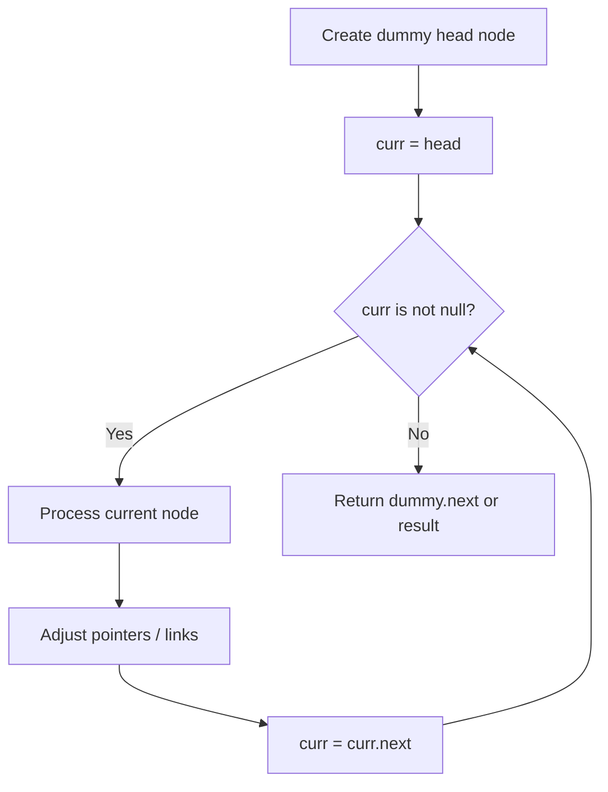
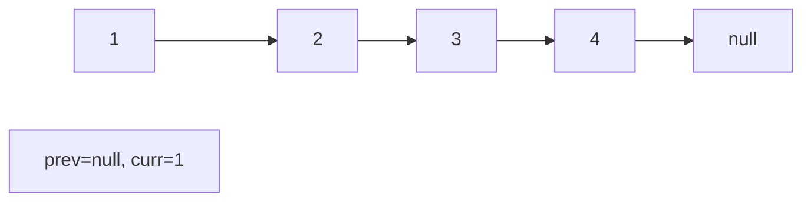
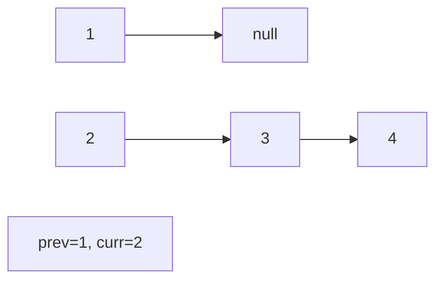
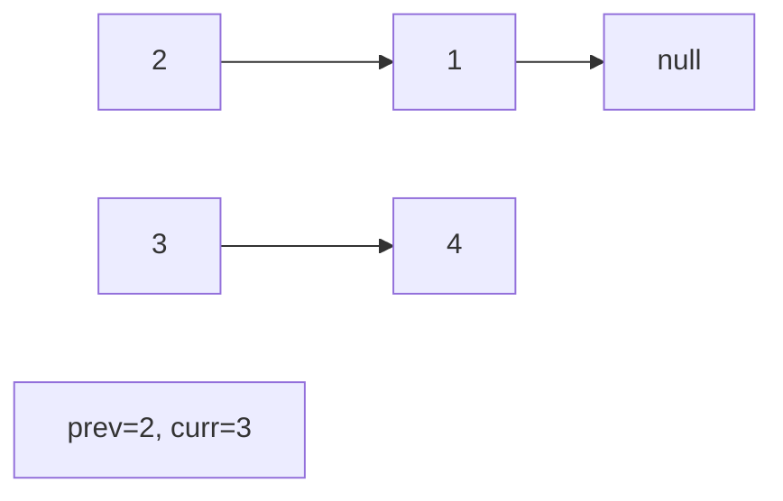
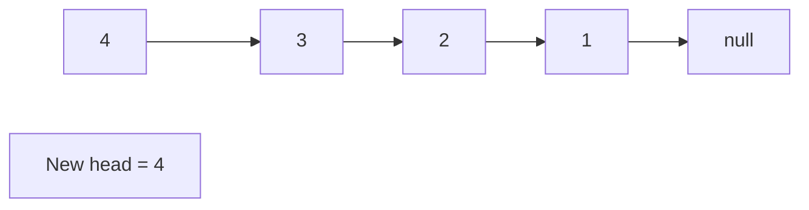

# Problem 1472: Design Browser History

**Difficulty:** Medium  
**Tags:** Array, Linked List, Stack, Design, Doubly-Linked List, Data Stream  
**Pattern:** Linked List  
**Link:** [leetcode.com/problems/design-browser-history](https://leetcode.com/problems/design-browser-history/)

## Description

You have a **browser** of one tab where you start on the `homepage` and you can visit another `url`, get back in the history number of `steps` or move forward in the history number of `steps`.

Implement the `BrowserHistory` class:

	- `BrowserHistory(string homepage)` Initializes the object with the `homepage` of the browser.
	- `void visit(string url)` Visits `url` from the current page. It clears up all the forward history.
	- `string back(int steps)` Move `steps` back in history. If you can only return `x` steps in the history and `steps > x`, you will return only `x` steps. Return the current `url` after moving back in history **at most** `steps`.
	- `string forward(int steps)` Move `steps` forward in history. If you can only forward `x` steps in the history and `steps > x`, you will forward only `x` steps. Return the current `url` after forwarding in history **at most** `steps`.

 

Example:

```

**Input:**
["BrowserHistory","visit","visit","visit","back","back","forward","visit","forward","back","back"]
[["leetcode.com"],["google.com"],["facebook.com"],["youtube.com"],[1],[1],[1],["linkedin.com"],[2],[2],[7]]
**Output:**
[null,null,null,null,"facebook.com","google.com","facebook.com",null,"linkedin.com","google.com","leetcode.com"]

**Explanation:**
BrowserHistory browserHistory = new BrowserHistory("leetcode.com");
browserHistory.visit("google.com");       // You are in "leetcode.com". Visit "google.com"
browserHistory.visit("facebook.com");     // You are in "google.com". Visit "facebook.com"
browserHistory.visit("youtube.com");      // You are in "facebook.com". Visit "youtube.com"
browserHistory.back(1);                   // You are in "youtube.com", move back to "facebook.com" return "facebook.com"
browserHistory.back(1);                   // You are in "facebook.com", move back to "google.com" return "google.com"
browserHistory.forward(1);                // You are in "google.com", move forward to "facebook.com" return "facebook.com"
browserHistory.visit("linkedin.com");     // You are in "facebook.com". Visit "linkedin.com"
browserHistory.forward(2);                // You are in "linkedin.com", you cannot move forward any steps.
browserHistory.back(2);                   // You are in "linkedin.com", move back two steps to "facebook.com" then to "google.com". return "google.com"
browserHistory.back(7);                   // You are in "google.com", you can move back only one step to "leetcode.com". return "leetcode.com"

```

 

**Constraints:**

	- `1 <= homepage.length <= 20`
	- `1 <= url.length <= 20`
	- `1 <= steps <= 100`
	- `homepage` and `url` consist of  '.' or lower case English letters.
	- At most `5000` calls will be made to `visit`, `back`, and `forward`.

## Approach: Linked List

Traverse or manipulate the linked list using pointer techniques. Common patterns: dummy head node for edge cases, fast/slow pointers for cycle detection or middle finding, in-place reversal, and merge operations.

## Pseudocode

```
1. Create dummy head if needed
2. Initialize pointer(s) at head
3. Traverse / modify list:
   a. Process current node
   b. Adjust next pointers as needed
   c. Move to next node
4. Return dummy.next or result
```

## Algorithm Flow



## Visual State Transitions

**Linked List Operation (Reverse):**

**Frame 1: Initial list**


**Frame 2: Reverse first link**


**Frame 3: Reverse second link**


**Frame 4: Fully reversed**



## Complexity Analysis

- **Time:** O(n)
- **Space:** O(1)

## Solution (Python3)

```python
class BrowserHistory:
    def __init__(self, homepage: str):
        # Initialize data structure
        self.homepage = homepage

    def visit(self, url: str) -> None:
        return None

    def back(self, steps: int) -> str:
        return ""

    def forward(self, steps: int) -> str:
        return ""

```

## Solution (C++)

```cpp
#include <string>
#include <vector>
using namespace std;

class BrowserHistory {
public:
    BrowserHistory(string& homepage) {
        // Initialize
    }

    void visit(string& url) {
        return ;
    }

    string back(int steps) {
        return "";
    }

    string forward(int steps) {
        return "";
    }

};
```
