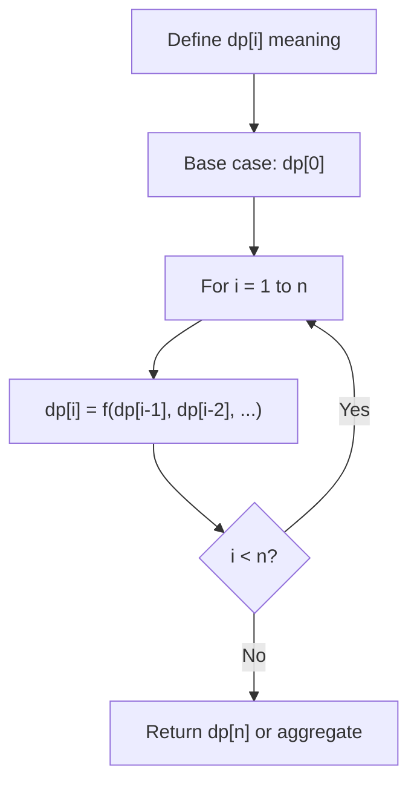
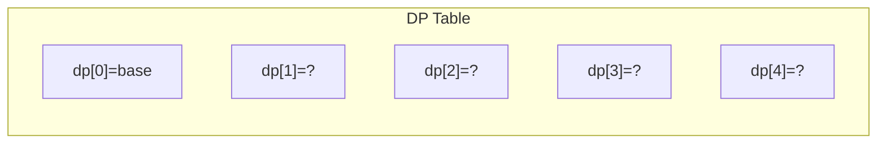
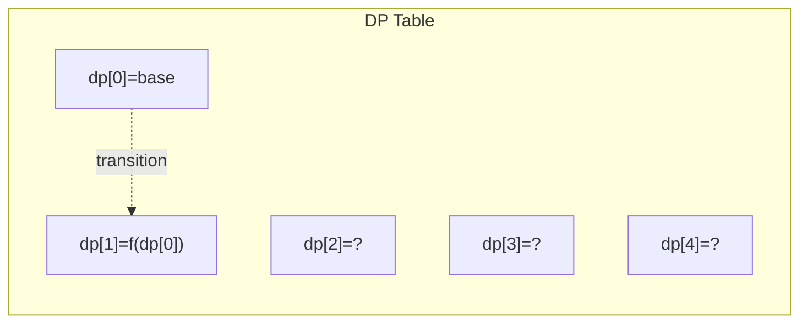
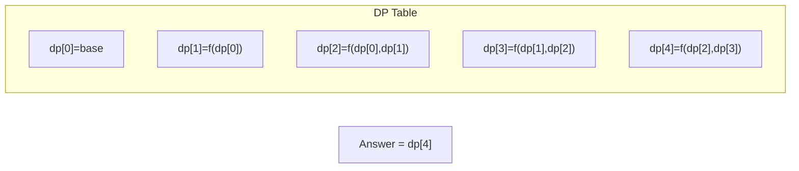

# Problem 1473: Paint House III

**Difficulty:** Hard  
**Tags:** Array, Dynamic Programming  
**Pattern:** Dynamic Programming (1D)  
**Link:** [leetcode.com/problems/paint-house-iii](https://leetcode.com/problems/paint-house-iii/)

## Description

There is a row of `m` houses in a small city, each house must be painted with one of the `n` colors (labeled from `1` to `n`), some houses that have been painted last summer should not be painted again.

A neighborhood is a maximal group of continuous houses that are painted with the same color.

	- For example: `houses = [1,2,2,3,3,2,1,1]` contains `5` neighborhoods `[{1}, {2,2}, {3,3}, {2}, {1,1}]`.

Given an array `houses`, an `m x n` matrix `cost` and an integer `target` where:

	- `houses[i]`: is the color of the house `i`, and `0` if the house is not painted yet.
	- `cost[i][j]`: is the cost of paint the house `i` with the color `j + 1`.

Return *the minimum cost of painting all the remaining houses in such a way that there are exactly* `target` *neighborhoods*. If it is not possible, return `-1`.

 

Example 1:

```

**Input:** houses = [0,0,0,0,0], cost = [[1,10],[10,1],[10,1],[1,10],[5,1]], m = 5, n = 2, target = 3
**Output:** 9
**Explanation:** Paint houses of this way [1,2,2,1,1]
This array contains target = 3 neighborhoods, [{1}, {2,2}, {1,1}].
Cost of paint all houses (1 + 1 + 1 + 1 + 5) = 9.

```

Example 2:

```

**Input:** houses = [0,2,1,2,0], cost = [[1,10],[10,1],[10,1],[1,10],[5,1]], m = 5, n = 2, target = 3
**Output:** 11
**Explanation:** Some houses are already painted, Paint the houses of this way [2,2,1,2,2]
This array contains target = 3 neighborhoods, [{2,2}, {1}, {2,2}]. 
Cost of paint the first and last house (10 + 1) = 11.

```

Example 3:

```

**Input:** houses = [3,1,2,3], cost = [[1,1,1],[1,1,1],[1,1,1],[1,1,1]], m = 4, n = 3, target = 3
**Output:** -1
**Explanation:** Houses are already painted with a total of 4 neighborhoods [{3},{1},{2},{3}] different of target = 3.

```

 

**Constraints:**

	- `m == houses.length == cost.length`
	- `n == cost[i].length`
	- `1 <= m <= 100`
	- `1 <= n <= 20`
	- `1 <= target <= m`
	- `0 <= houses[i] <= n`
	- `1 <= cost[i][j] <= 10^4`

## Approach: Dynamic Programming (1D)

Break the problem into overlapping subproblems. Define dp[i] as the optimal value for the subproblem ending at or considering index i. Build the solution bottom-up, using previously computed dp values.

## Pseudocode

```
1. Define dp[i] = optimal value for subproblem i
2. Base case: dp[0] = initial value
3. For i from 1 to n:
   a. dp[i] = recurrence(dp[i-1], dp[i-2], ...)
4. Return dp[n] or max/min of dp
```

## Algorithm Flow



## Visual State Transitions

**1D Dynamic Programming Table Build:**

**Frame 1: Initialize base cases**


**Frame 2: Fill dp[1] from dp[0]**


**Frame 3: Fill remaining cells**



## Complexity Analysis

- **Time:** O(n)
- **Space:** O(n)

## Solution (Python3)

```python
class Solution:
    def minCost(self, houses: List[int], cost: List[List[int]], m: int, n: int, target: int) -> int:
        # Dynamic programming (1D) - O(n) time, O(n) space
        if not houses:
            return 0
        n = len(houses) if isinstance(houses, list) else houses
        dp = [0] * (n + 1)
        dp[0] = 1  # base case
        for i in range(1, n + 1):
            dp[i] = dp[i-1]  # transition (customize per problem)
            if i >= 2:
                dp[i] += dp[i-2]
        return dp[n]
```

## Solution (C++)

```cpp
#include <string>
#include <vector>
using namespace std;

class Solution {
public:
    int minCost(vector<int>& houses, vector<vector<int>>& cost, int m, int n, int target) {
        // Dynamic programming (1D) - O(n) time, O(n) space
        int n = houses;
        if (n <= 0) return 0;
        vector<int> dp(n + 1, 0);
        dp[0] = 1;
        for (int i = 1; i <= n; i++) {
            dp[i] = dp[i-1];
            if (i >= 2) dp[i] += dp[i-2];
        }
        return dp[n];
    }
};
```
