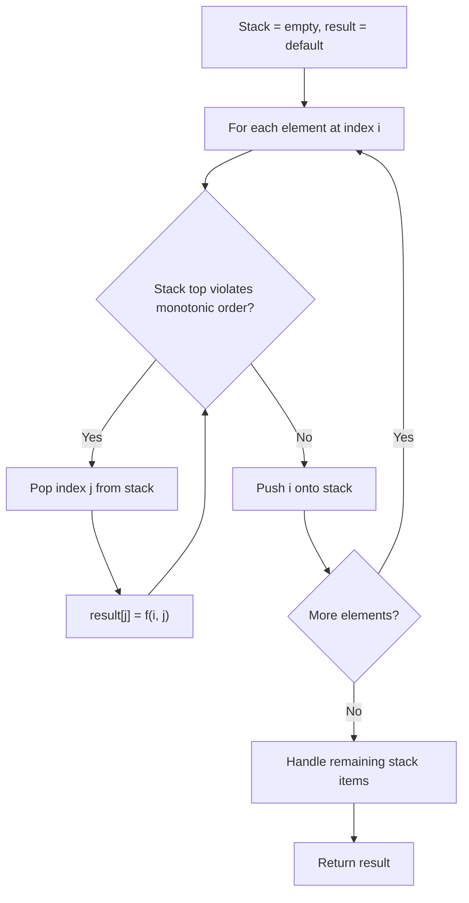
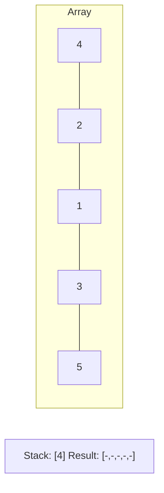
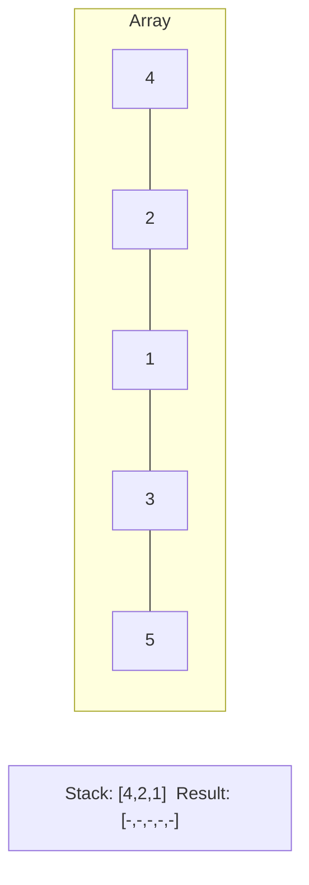
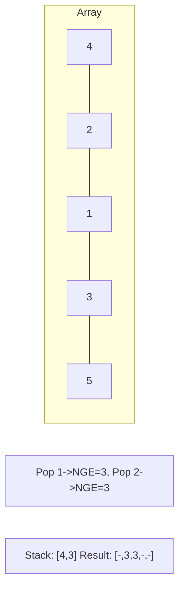
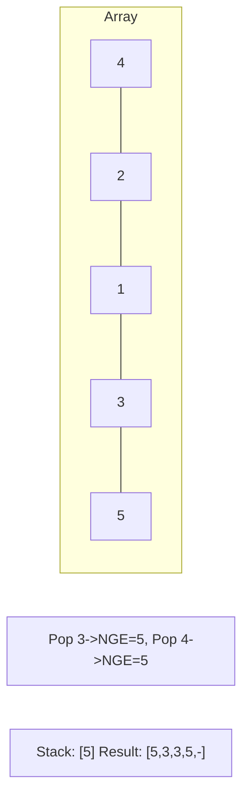

# Problem 1475: Final Prices With a Special Discount in a Shop

**Difficulty:** Easy  
**Tags:** Array, Stack, Monotonic Stack  
**Pattern:** Monotonic Stack  
**Link:** [leetcode.com/problems/final-prices-with-a-special-discount-in-a-shop](https://leetcode.com/problems/final-prices-with-a-special-discount-in-a-shop/)

## Description

You are given an integer array `prices` where `prices[i]` is the price of the `i^th` item in a shop.

There is a special discount for items in the shop. If you buy the `i^th` item, then you will receive a discount equivalent to `prices[j]` where `j` is the minimum index such that `j > i` and `prices[j] <= prices[i]`. Otherwise, you will not receive any discount at all.

Return an integer array `answer` where `answer[i]` is the final price you will pay for the `i^th` item of the shop, considering the special discount.

 

Example 1:

```

**Input:** prices = [8,4,6,2,3]
**Output:** [4,2,4,2,3]
**Explanation:** 
For item 0 with price[0]=8 you will receive a discount equivalent to prices[1]=4, therefore, the final price you will pay is 8 - 4 = 4.
For item 1 with price[1]=4 you will receive a discount equivalent to prices[3]=2, therefore, the final price you will pay is 4 - 2 = 2.
For item 2 with price[2]=6 you will receive a discount equivalent to prices[3]=2, therefore, the final price you will pay is 6 - 2 = 4.
For items 3 and 4 you will not receive any discount at all.

```

Example 2:

```

**Input:** prices = [1,2,3,4,5]
**Output:** [1,2,3,4,5]
**Explanation:** In this case, for all items, you will not receive any discount at all.

```

Example 3:

```

**Input:** prices = [10,1,1,6]
**Output:** [9,0,1,6]

```

 

**Constraints:**

	- `1 <= prices.length <= 500`
	- `1 <= prices[i] <= 1000`

## Approach: Monotonic Stack

Maintain a stack where elements are always in monotonic order (increasing or decreasing). When a new element violates the monotonic property, pop elements and compute results (e.g., next greater/smaller element, spans, areas).

## Pseudocode

```
1. Initialize empty stack, result array
2. For each element (index i):
   a. While stack not empty and arr[i] breaks monotonic order:
      - Pop index j from stack
      - result[j] = compute(i, j)
   b. Push i onto stack
3. Handle remaining elements in stack
4. Return result
```

## Algorithm Flow



## Visual State Transitions

**Monotonic Stack (Next Greater Element):**

**Frame 1: Process first elements**


**Frame 2: Push smaller elements**


**Frame 3: Element 3 pops 1 and 2**


**Frame 4: Element 5 pops all**



## Complexity Analysis

- **Time:** O(n)
- **Space:** O(n)

## Solution (Python3)

```python
class Solution:
    def finalPrices(self, prices: List[int]) -> List[int]:
        # Monotonic stack - O(n) time, O(n) space
        n = len(prices)
        result = [0] * n
        stack = []  # indices
        for i in range(n):
            while stack and prices[i] > prices[stack[-1]]:
                idx = stack.pop()
                result[idx] = i - idx
            stack.append(i)
        return result
```

## Solution (C++)

```cpp
#include <stack>
#include <string>
#include <vector>
using namespace std;

class Solution {
public:
    vector<int> finalPrices(vector<int>& prices) {
        // Monotonic stack - O(n) time, O(n) space
        int n = prices.size();
        vector<int> result(n, 0);
        stack<int> st;
        for (int i = 0; i < n; i++) {
            while (!st.empty() && prices[i] > prices[st.top()]) {
                int idx = st.top(); st.pop();
                result[idx] = i - idx;
            }
            st.push(i);
        }
        return result;
    }
};
```
