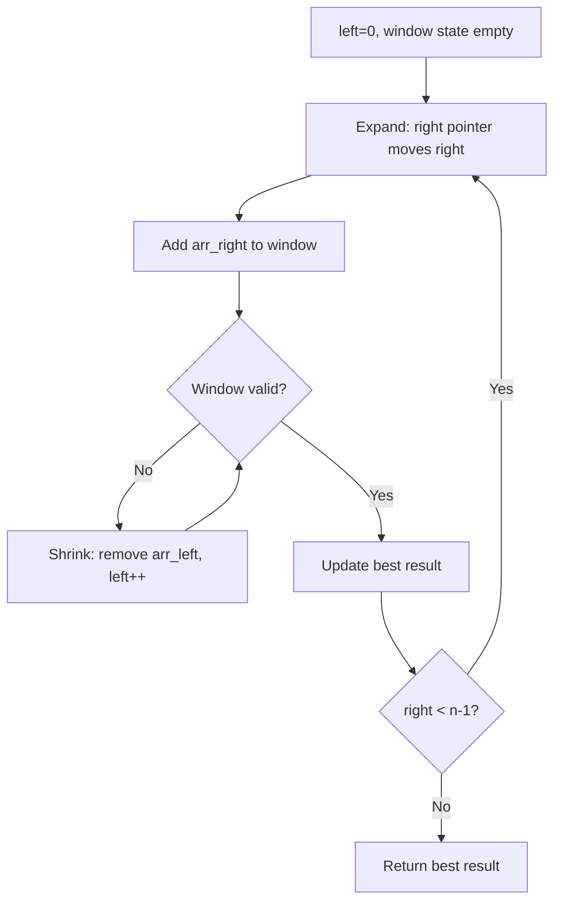
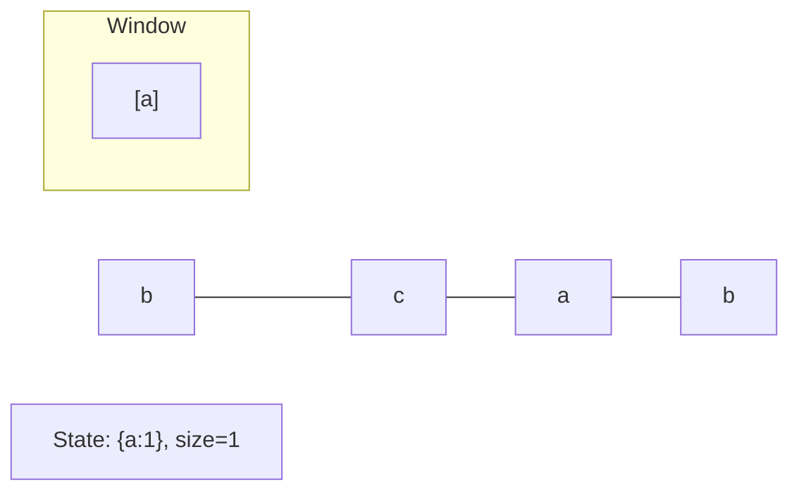
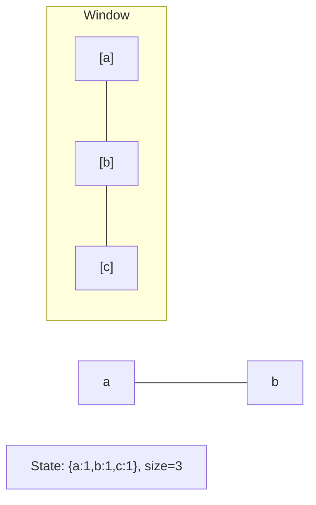
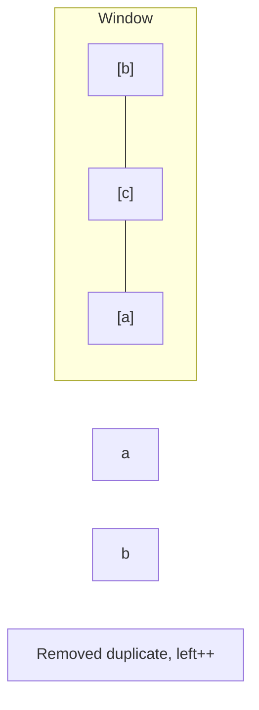
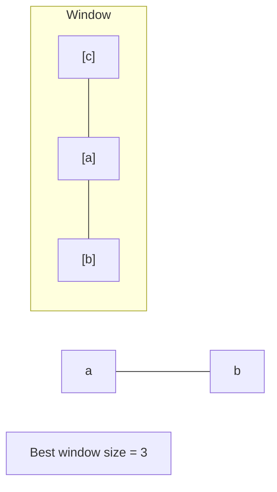

# Problem 1477: Find Two Non-overlapping Sub-arrays Each With Target Sum

**Difficulty:** Medium  
**Tags:** Array, Hash Table, Binary Search, Dynamic Programming, Sliding Window  
**Pattern:** Sliding Window  
**Link:** [leetcode.com/problems/find-two-non-overlapping-sub-arrays-each-with-target-sum](https://leetcode.com/problems/find-two-non-overlapping-sub-arrays-each-with-target-sum/)

## Description

You are given an array of integers `arr` and an integer `target`.

You have to find **two non-overlapping sub-arrays** of `arr` each with a sum equal `target`. There can be multiple answers so you have to find an answer where the sum of the lengths of the two sub-arrays is **minimum**.

Return *the minimum sum of the lengths* of the two required sub-arrays, or return `-1` if you cannot find such two sub-arrays.

 

Example 1:

```

**Input:** arr = [3,2,2,4,3], target = 3
**Output:** 2
**Explanation:** Only two sub-arrays have sum = 3 ([3] and [3]). The sum of their lengths is 2.

```

Example 2:

```

**Input:** arr = [7,3,4,7], target = 7
**Output:** 2
**Explanation:** Although we have three non-overlapping sub-arrays of sum = 7 ([7], [3,4] and [7]), but we will choose the first and third sub-arrays as the sum of their lengths is 2.

```

Example 3:

```

**Input:** arr = [4,3,2,6,2,3,4], target = 6
**Output:** -1
**Explanation:** We have only one sub-array of sum = 6.

```

 

**Constraints:**

	- `1 <= arr.length <= 10^5`
	- `1 <= arr[i] <= 1000`
	- `1 <= target <= 10^8`

## Approach: Sliding Window

Maintain a window over the data using two pointers. Expand the right boundary to include new elements, and shrink the left boundary when the window constraint is violated. Track the optimal window.

## Pseudocode

```
1. Initialize left = 0, result = initial_value
2. For right in range(n):
   a. Add element at right to window state
   b. While window is invalid:
      - Remove element at left from window state
      - left++
   c. Update result = best of (result, window size/value)
3. Return result
```

## Algorithm Flow



## Visual State Transitions

**Sliding Window Step-by-Step:**

**Frame 1: Initial window (left=0, right=0)**


**Frame 2: Expand right (right=2)**


**Frame 3: Violation - shrink left**


**Frame 4: Continue expanding**



## Complexity Analysis

- **Time:** O(n)
- **Space:** O(k)

## Solution (Python3)

```python
class Solution:
    def minSumOfLengths(self, arr: List[int], target: int) -> int:
        # Sliding window approach - O(n) time, O(k) space
        from collections import defaultdict
        window = defaultdict(int)
        left = 0
        result = 0
        for right in range(len(arr)):
            window[arr[right]] += 1
            while len(window) > (target if isinstance(target, int) else len(arr)):
                window[arr[left]] -= 1
                if window[arr[left]] == 0:
                    del window[arr[left]]
                left += 1
            result = max(result, right - left + 1)
        return result
```

## Solution (C++)

```cpp
#include <algorithm>
#include <string>
#include <unordered_map>
#include <vector>
using namespace std;

class Solution {
public:
    int minSumOfLengths(vector<int>& arr, int target) {
        // Sliding window approach - O(n) time, O(k) space
        unordered_map<char, int> window;
        int left = 0, result = 0;
        for (int right = 0; right < arr.size(); right++) {
            window[arr[right]]++;
            while ((int)window.size() > target) {
                window[arr[left]]--;
                if (window[arr[left]] == 0)
                    window.erase(arr[left]);
                left++;
            }
            result = max(result, right - left + 1);
        }
        return result;
    }
};
```
