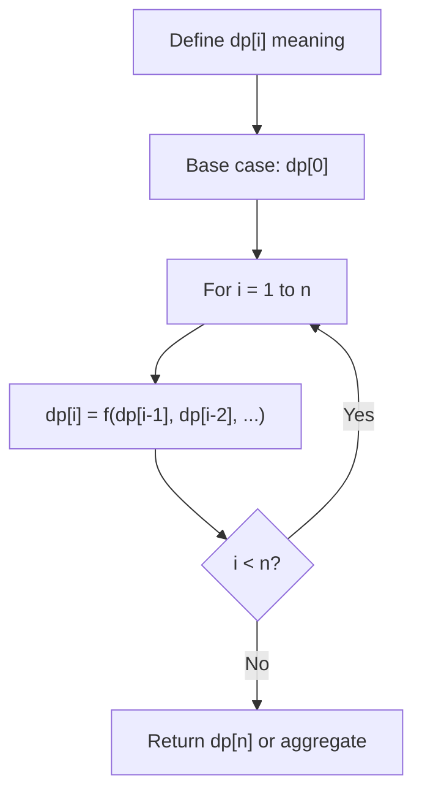
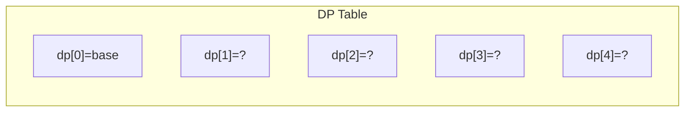
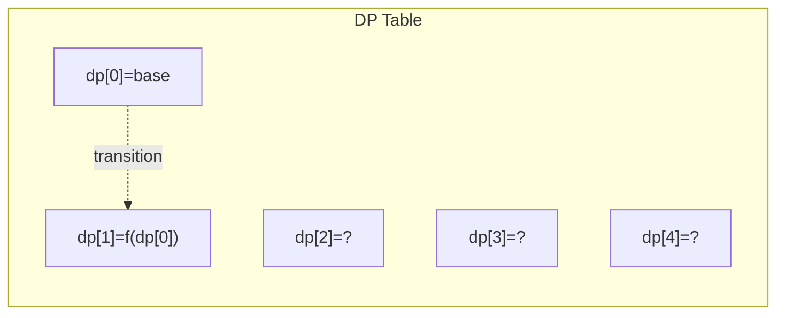
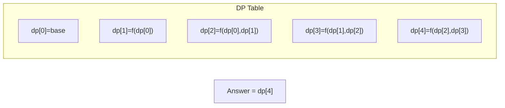

# Problem 1478: Allocate Mailboxes

**Difficulty:** Hard  
**Tags:** Array, Math, Dynamic Programming, Sorting  
**Pattern:** Dynamic Programming (1D)  
**Link:** [leetcode.com/problems/allocate-mailboxes](https://leetcode.com/problems/allocate-mailboxes/)

## Description

Given the array `houses` where `houses[i]` is the location of the `i^th` house along a street and an integer `k`, allocate `k` mailboxes in the street.

Return *the **minimum** total distance between each house and its nearest mailbox*.

The test cases are generated so that the answer fits in a 32-bit integer.

 

Example 1:

```

**Input:** houses = [1,4,8,10,20], k = 3
**Output:** 5
**Explanation:** Allocate mailboxes in position 3, 9 and 20.
Minimum total distance from each houses to nearest mailboxes is |3-1| + |4-3| + |9-8| + |10-9| + |20-20| = 5 

```

Example 2:

```

**Input:** houses = [2,3,5,12,18], k = 2
**Output:** 9
**Explanation:** Allocate mailboxes in position 3 and 14.
Minimum total distance from each houses to nearest mailboxes is |2-3| + |3-3| + |5-3| + |12-14| + |18-14| = 9.

```

 

**Constraints:**

	- `1 <= k <= houses.length <= 100`
	- `1 <= houses[i] <= 10^4`
	- All the integers of `houses` are **unique**.

## Approach: Dynamic Programming (1D)

Break the problem into overlapping subproblems. Define dp[i] as the optimal value for the subproblem ending at or considering index i. Build the solution bottom-up, using previously computed dp values.

## Pseudocode

```
1. Define dp[i] = optimal value for subproblem i
2. Base case: dp[0] = initial value
3. For i from 1 to n:
   a. dp[i] = recurrence(dp[i-1], dp[i-2], ...)
4. Return dp[n] or max/min of dp
```

## Algorithm Flow



## Visual State Transitions

**1D Dynamic Programming Table Build:**

**Frame 1: Initialize base cases**


**Frame 2: Fill dp[1] from dp[0]**


**Frame 3: Fill remaining cells**



## Complexity Analysis

- **Time:** O(n)
- **Space:** O(n)

## Solution (Python3)

```python
class Solution:
    def minDistance(self, houses: List[int], k: int) -> int:
        # Dynamic programming (1D) - O(n) time, O(n) space
        if not houses:
            return 0
        n = len(houses) if isinstance(houses, list) else houses
        dp = [0] * (n + 1)
        dp[0] = 1  # base case
        for i in range(1, n + 1):
            dp[i] = dp[i-1]  # transition (customize per problem)
            if i >= 2:
                dp[i] += dp[i-2]
        return dp[n]
```

## Solution (C++)

```cpp
#include <string>
#include <vector>
using namespace std;

class Solution {
public:
    int minDistance(vector<int>& houses, int k) {
        // Dynamic programming (1D) - O(n) time, O(n) space
        int n = houses;
        if (n <= 0) return 0;
        vector<int> dp(n + 1, 0);
        dp[0] = 1;
        for (int i = 1; i <= n; i++) {
            dp[i] = dp[i-1];
            if (i >= 2) dp[i] += dp[i-2];
        }
        return dp[n];
    }
};
```
