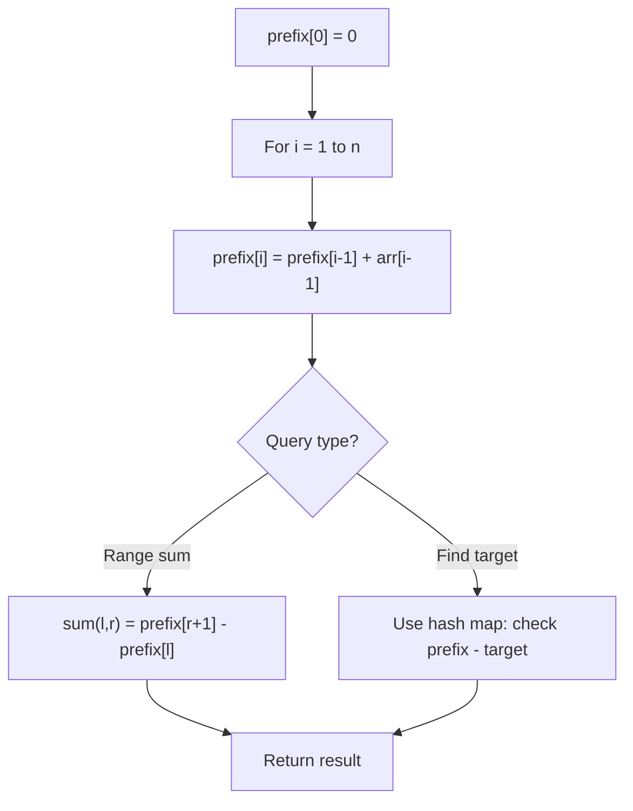

# Problem 1480: Running Sum of 1d Array

**Difficulty:** Easy  
**Tags:** Array, Prefix Sum  
**Pattern:** Prefix Sum  
**Link:** [leetcode.com/problems/running-sum-of-1d-array](https://leetcode.com/problems/running-sum-of-1d-array/)

## Description

Given an array `nums`. We define a running sum of an array as `runningSum[i] = sum(nums[0]…nums[i])`.

Return the running sum of `nums`.

 

Example 1:

```

**Input:** nums = [1,2,3,4]
**Output:** [1,3,6,10]
**Explanation:** Running sum is obtained as follows: [1, 1+2, 1+2+3, 1+2+3+4].
```

Example 2:

```

**Input:** nums = [1,1,1,1,1]
**Output:** [1,2,3,4,5]
**Explanation:** Running sum is obtained as follows: [1, 1+1, 1+1+1, 1+1+1+1, 1+1+1+1+1].
```

Example 3:

```

**Input:** nums = [3,1,2,10,1]
**Output:** [3,4,6,16,17]

```

 

**Constraints:**

	- `1 <= nums.length <= 1000`
	- `-10^6 <= nums[i] <= 10^6`

## Approach: Prefix Sum

Build a prefix sum array where prefix[i] = sum of elements 0..i-1. Any subarray sum [l..r] = prefix[r+1] - prefix[l]. Combine with hash map for O(n) subarray sum queries.

## Pseudocode

```
1. Build prefix sum array: prefix[0]=0, prefix[i]=prefix[i-1]+arr[i-1]
2. Use prefix sums to answer queries:
   - Subarray sum [l..r] = prefix[r+1] - prefix[l]
   - Or use hash map to find prefix[j]-prefix[i] == target
3. Return result
```

## Algorithm Flow



## Complexity Analysis

- **Time:** O(n)
- **Space:** O(n)

## Solution (Python3)

```python
class Solution:
    def runningSum(self, nums: List[int]) -> List[int]:
        # Prefix sum approach - O(n) time, O(n) space
        prefix = {0: -1}
        curr_sum = 0
        result = 0
        target = nums if isinstance(nums, int) else 0
        for i, val in enumerate(nums):
            curr_sum += val
            if curr_sum - target in prefix:
                result = max(result, i - prefix[curr_sum - target])
            if curr_sum not in prefix:
                prefix[curr_sum] = i
        return result
```

## Solution (C++)

```cpp
#include <algorithm>
#include <string>
#include <unordered_map>
#include <vector>
using namespace std;

class Solution {
public:
    vector<int> runningSum(vector<int>& nums) {
        // Prefix sum approach - O(n) time, O(n) space
        unordered_map<int, int> prefix;
        prefix[0] = -1;
        int curr_sum = 0, result = 0;
        int target = nums;
        for (int i = 0; i < (int)nums.size(); i++) {
            curr_sum += nums[i];
            if (prefix.count(curr_sum - target)) {
                result = max(result, i - prefix[curr_sum - target]);
            }
            if (!prefix.count(curr_sum)) {
                prefix[curr_sum] = i;
            }
        }
        return result;
    }
};
```
