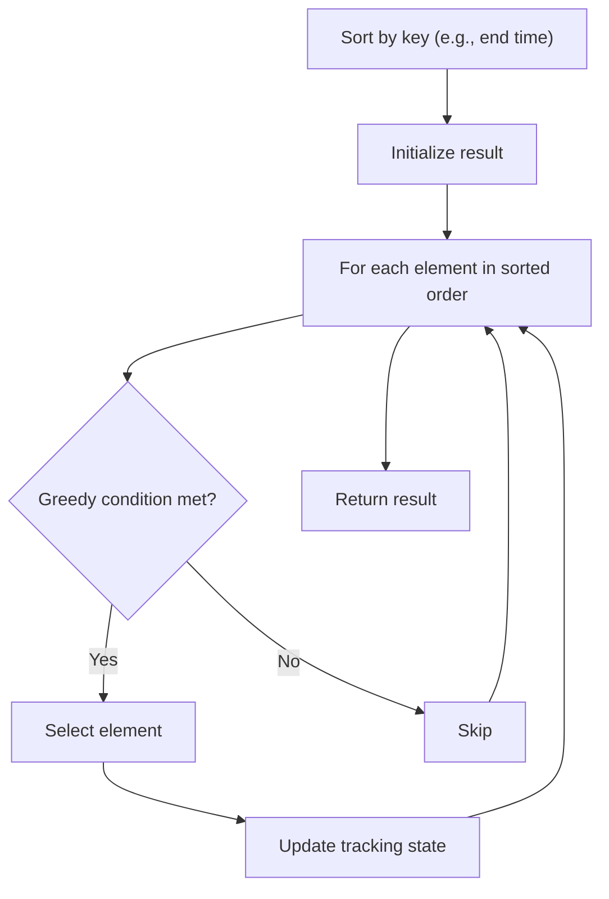

# Problem 1481: Least Number of Unique Integers after K Removals

**Difficulty:** Medium  
**Tags:** Array, Hash Table, Greedy, Sorting, Counting  
**Pattern:** Greedy with Sorting  
**Link:** [leetcode.com/problems/least-number-of-unique-integers-after-k-removals](https://leetcode.com/problems/least-number-of-unique-integers-after-k-removals/)

## Description

Given an array of integers `arr` and an integer `k`. Find the *least number of unique integers* after removing **exactly** `k` elements**.**


 

Example 1:


```

**Input: **arr = [5,5,4], k = 1
**Output: **1
**Explanation**: Remove the single 4, only 5 is left.

```

Example 2:


```

**Input: **arr = [4,3,1,1,3,3,2], k = 3
**Output: **2
**Explanation**: Remove 4, 2 and either one of the two 1s or three 3s. 1 and 3 will be left.
```


 

**Constraints:**


	- `1 <= arr.length <= 10^5`
	- `1 <= arr[i] <= 10^9`
	- `0 <= k <= arr.length`

## Approach: Greedy with Sorting

Sort the input by a key criterion, then greedily process elements in sorted order. The sorting ensures the greedy choice is always optimal.

## Pseudocode

```
1. Sort elements by key (start time, weight, etc.)
2. Initialize result, tracking variables
3. For each element in sorted order:
   a. Apply greedy selection rule
   b. Update result
4. Return result
```

## Algorithm Flow



## Complexity Analysis

- **Time:** O(n log n)
- **Space:** O(n)

## Solution (Python3)

```python
class Solution:
    def findLeastNumOfUniqueInts(self, arr: List[int], k: int) -> int:
        # Sort + greedy - O(n log n) time
        arr.sort()
        result = 0
        curr_end = 0
        for item in arr:
            if isinstance(item, (list, tuple)):
                if item[0] >= curr_end:
                    result += 1
                    curr_end = item[1]
            else:
                result += 1
        return result
```

## Solution (C++)

```cpp
#include <algorithm>
#include <string>
#include <vector>
using namespace std;

class Solution {
public:
    int findLeastNumOfUniqueInts(vector<int>& arr, int k) {
        // Sort + greedy - O(n log n) time
        sort(arr.begin(), arr.end());
        int result = 0, curr_end = 0;
        for (auto& item : arr) {
            result++;
        }
        return result;
    }
};
```
