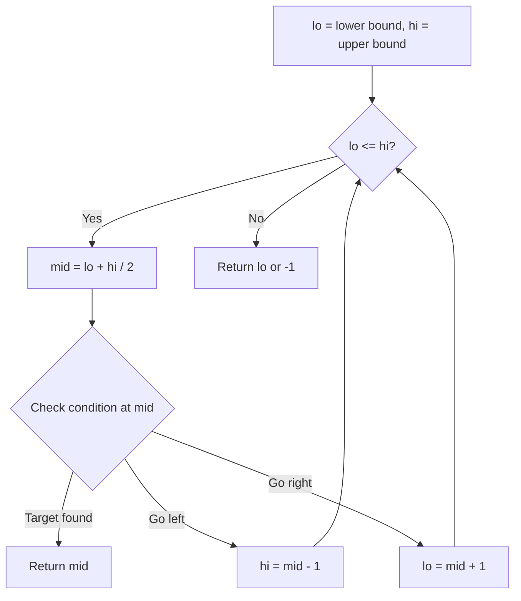
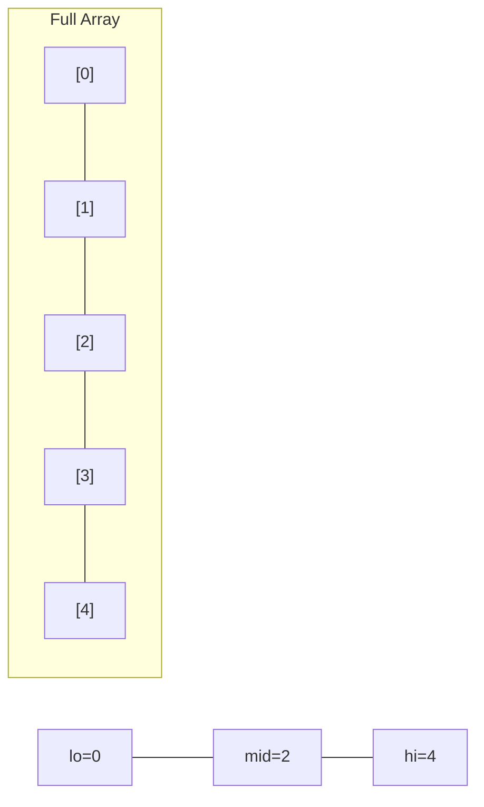
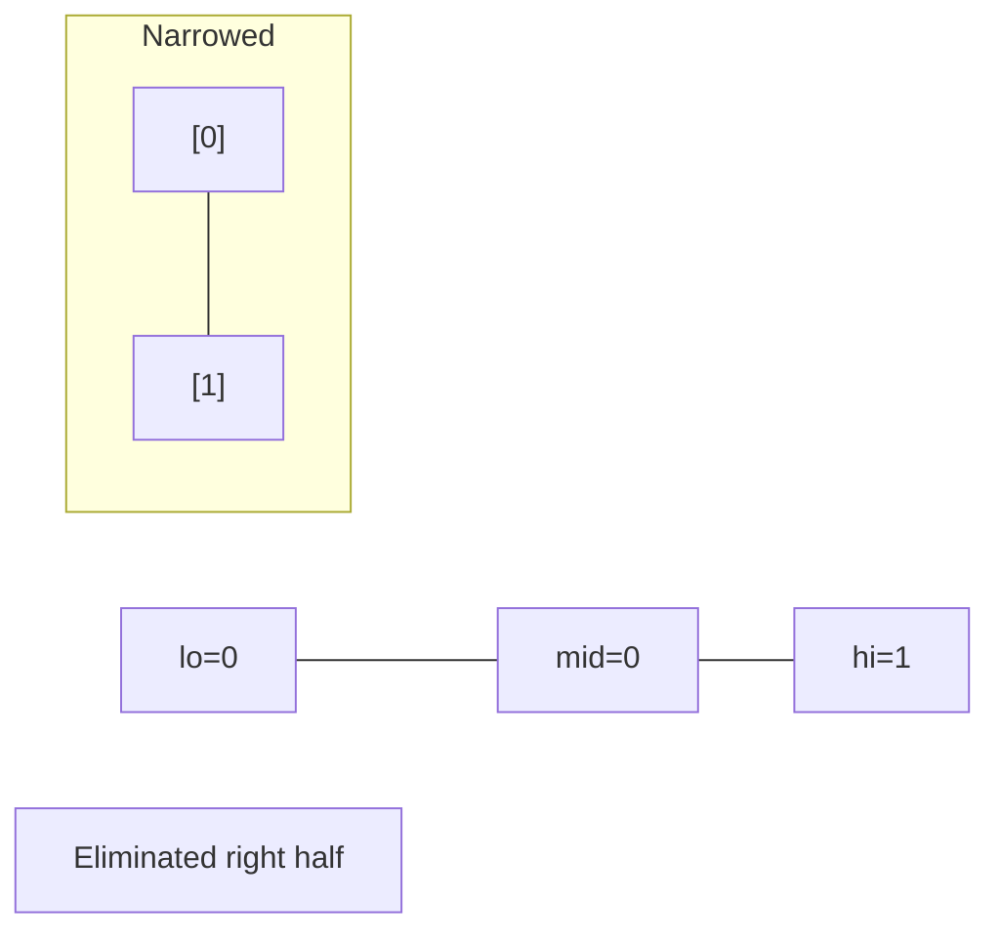
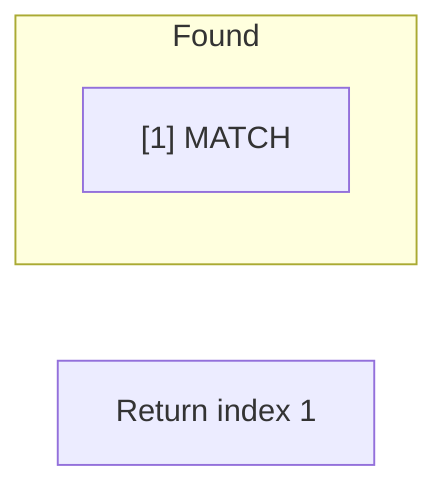

# Problem 1482: Minimum Number of Days to Make m Bouquets

**Difficulty:** Medium  
**Tags:** Array, Binary Search  
**Pattern:** Binary Search  
**Link:** [leetcode.com/problems/minimum-number-of-days-to-make-m-bouquets](https://leetcode.com/problems/minimum-number-of-days-to-make-m-bouquets/)

## Description

You are given an integer array `bloomDay`, an integer `m` and an integer `k`.

You want to make `m` bouquets. To make a bouquet, you need to use `k` **adjacent flowers** from the garden.

The garden consists of `n` flowers, the `i^th` flower will bloom in the `bloomDay[i]` and then can be used in **exactly one** bouquet.

Return *the minimum number of days you need to wait to be able to make *`m`* bouquets from the garden*. If it is impossible to make m bouquets return `-1`.

 

Example 1:

```

**Input:** bloomDay = [1,10,3,10,2], m = 3, k = 1
**Output:** 3
**Explanation:** Let us see what happened in the first three days. x means flower bloomed and _ means flower did not bloom in the garden.
We need 3 bouquets each should contain 1 flower.
After day 1: [x, _, _, _, _]   // we can only make one bouquet.
After day 2: [x, _, _, _, x]   // we can only make two bouquets.
After day 3: [x, _, x, _, x]   // we can make 3 bouquets. The answer is 3.

```

Example 2:

```

**Input:** bloomDay = [1,10,3,10,2], m = 3, k = 2
**Output:** -1
**Explanation:** We need 3 bouquets each has 2 flowers, that means we need 6 flowers. We only have 5 flowers so it is impossible to get the needed bouquets and we return -1.

```

Example 3:

```

**Input:** bloomDay = [7,7,7,7,12,7,7], m = 2, k = 3
**Output:** 12
**Explanation:** We need 2 bouquets each should have 3 flowers.
Here is the garden after the 7 and 12 days:
After day 7: [x, x, x, x, _, x, x]
We can make one bouquet of the first three flowers that bloomed. We cannot make another bouquet from the last three flowers that bloomed because they are not adjacent.
After day 12: [x, x, x, x, x, x, x]
It is obvious that we can make two bouquets in different ways.

```

 

**Constraints:**

	- `bloomDay.length == n`
	- `1 <= n <= 10^5`
	- `1 <= bloomDay[i] <= 10^9`
	- `1 <= m <= 10^6`
	- `1 <= k <= n`

## Approach: Binary Search

Use binary search to halve the search space each iteration. Define the search range [lo, hi], compute mid, and decide which half to keep based on the problem's monotonic condition.

## Pseudocode

```
1. lo = lower_bound, hi = upper_bound
2. While lo <= hi (or lo < hi):
   a. mid = (lo + hi) // 2
   b. If condition(mid) is satisfied: record answer, search left half
   c. Else: search right half
3. Return answer
```

## Algorithm Flow



## Visual State Transitions

**Binary Search Step-by-Step:**

**Frame 1: Initial search space**


**Frame 2: Compare mid, narrow search**


**Frame 3: Found target**



## Complexity Analysis

- **Time:** O(log n)
- **Space:** O(1)

## Solution (Python3)

```python
class Solution:
    def minDays(self, bloomDay: List[int], m: int, k: int) -> int:
        # Binary search - O(log n) time, O(1) space
        lo, hi = 0, len(bloomDay) - 1
        while lo <= hi:
            mid = lo + (hi - lo) // 2
            if bloomDay[mid] == m:
                return mid
            elif bloomDay[mid] < m:
                lo = mid + 1
            else:
                hi = mid - 1
        return 0
```

## Solution (C++)

```cpp
#include <string>
#include <vector>
using namespace std;

class Solution {
public:
    int minDays(vector<int>& bloomDay, int m, int k) {
        // Binary search - O(log n) time, O(1) space
        int lo = 0, hi = bloomDay.size() - 1;
        while (lo <= hi) {
            int mid = lo + (hi - lo) / 2;
            if (bloomDay[mid] == m) {
                return mid;
            } else if (bloomDay[mid] < m) {
                lo = mid + 1;
            } else {
                hi = mid - 1;
            }
        }
        return 0;
    }
};
```
