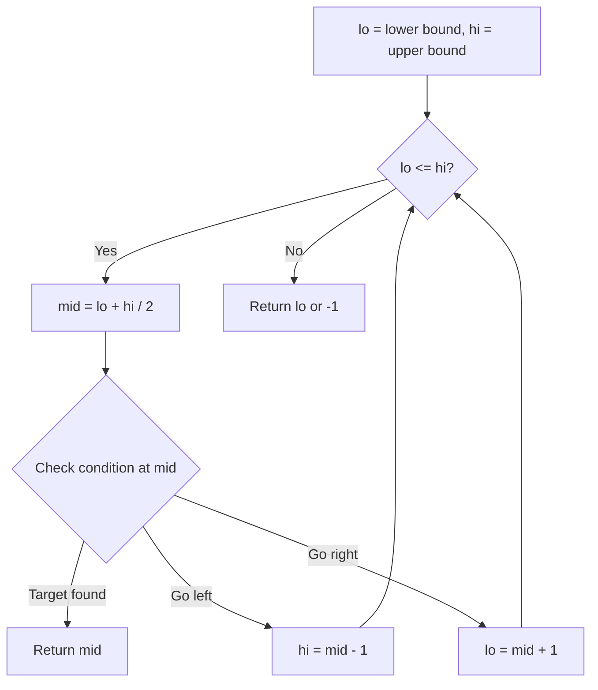
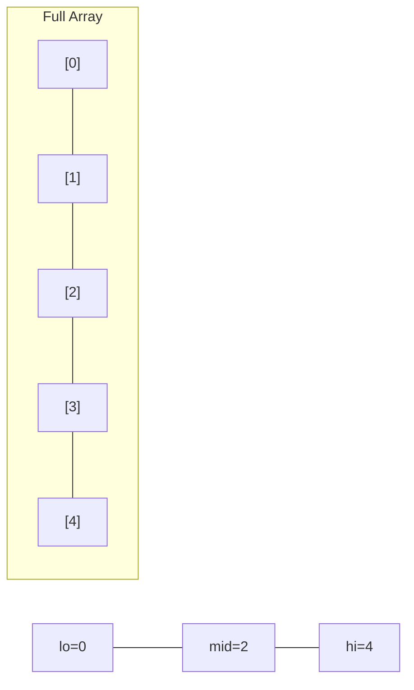
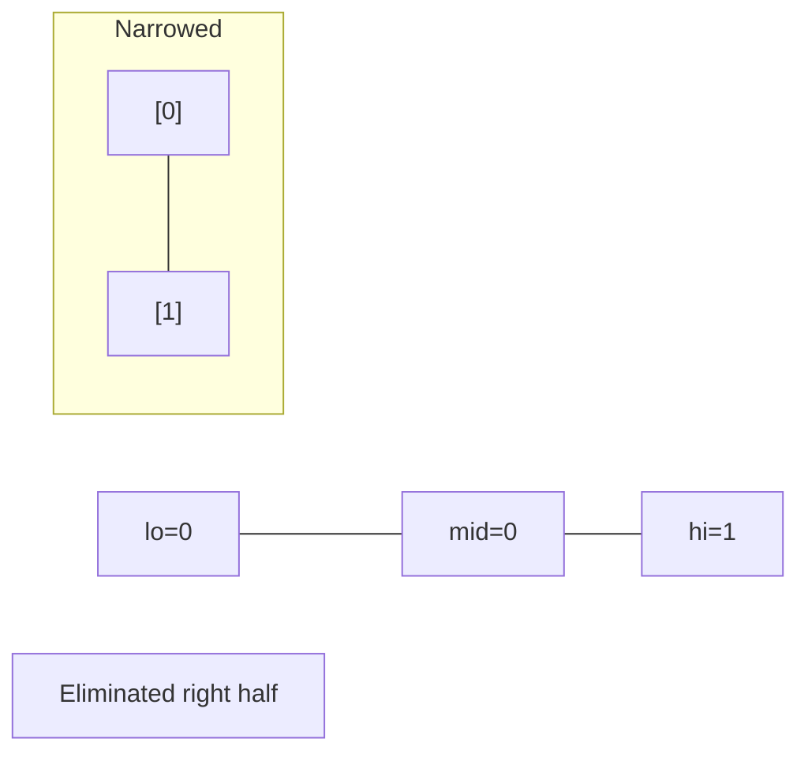
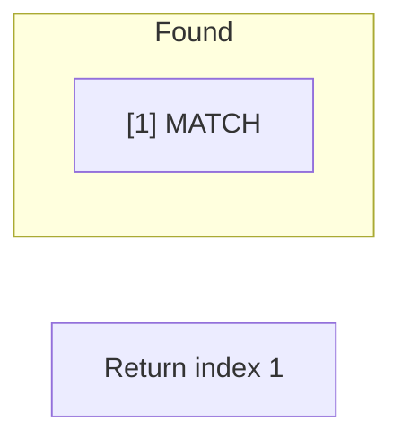

# Problem 1483: Kth Ancestor of a Tree Node

**Difficulty:** Hard  
**Tags:** Binary Search, Dynamic Programming, Bit Manipulation, Tree, Depth-First Search, Breadth-First Search, Design  
**Pattern:** Binary Search  
**Link:** [leetcode.com/problems/kth-ancestor-of-a-tree-node](https://leetcode.com/problems/kth-ancestor-of-a-tree-node/)

## Description

You are given a tree with `n` nodes numbered from `0` to `n - 1` in the form of a parent array `parent` where `parent[i]` is the parent of `i^th` node. The root of the tree is node `0`. Find the `k^th` ancestor of a given node.

The `k^th` ancestor of a tree node is the `k^th` node in the path from that node to the root node.

Implement the `TreeAncestor` class:

	- `TreeAncestor(int n, int[] parent)` Initializes the object with the number of nodes in the tree and the parent array.
	- `int getKthAncestor(int node, int k)` return the `k^th` ancestor of the given node `node`. If there is no such ancestor, return `-1`.

 

Example 1:

```

**Input**
["TreeAncestor", "getKthAncestor", "getKthAncestor", "getKthAncestor"]
[[7, [-1, 0, 0, 1, 1, 2, 2]], [3, 1], [5, 2], [6, 3]]
**Output**
[null, 1, 0, -1]

**Explanation**
TreeAncestor treeAncestor = new TreeAncestor(7, [-1, 0, 0, 1, 1, 2, 2]);
treeAncestor.getKthAncestor(3, 1); // returns 1 which is the parent of 3
treeAncestor.getKthAncestor(5, 2); // returns 0 which is the grandparent of 5
treeAncestor.getKthAncestor(6, 3); // returns -1 because there is no such ancestor
```

 

**Constraints:**

	- `1 <= k <= n <= 5 * 10^4`
	- `parent.length == n`
	- `parent[0] == -1`
	- `0 <= parent[i] < n` for all `0 < i < n`
	- `0 <= node < n`
	- There will be at most `5 * 10^4` queries.

## Approach: Binary Search

Use binary search to halve the search space each iteration. Define the search range [lo, hi], compute mid, and decide which half to keep based on the problem's monotonic condition.

## Pseudocode

```
1. lo = lower_bound, hi = upper_bound
2. While lo <= hi (or lo < hi):
   a. mid = (lo + hi) // 2
   b. If condition(mid) is satisfied: record answer, search left half
   c. Else: search right half
3. Return answer
```

## Algorithm Flow



## Visual State Transitions

**Binary Search Step-by-Step:**

**Frame 1: Initial search space**


**Frame 2: Compare mid, narrow search**


**Frame 3: Found target**



## Complexity Analysis

- **Time:** O(log n)
- **Space:** O(1)

## Solution (Python3)

```python
class TreeAncestor:
    def __init__(self, n: int, parent: List[int]):
        # Initialize data structure
        self.n = n
        self.parent = parent

    def getKthAncestor(self, node: int, k: int) -> int:
        return 0

```

## Solution (C++)

```cpp
#include <string>
#include <vector>
using namespace std;

class TreeAncestor {
public:
    TreeAncestor(int n, vector<int>& parent) {
        // Initialize
    }

    int getKthAncestor(int node, int k) {
        return 0;
    }

};
```
