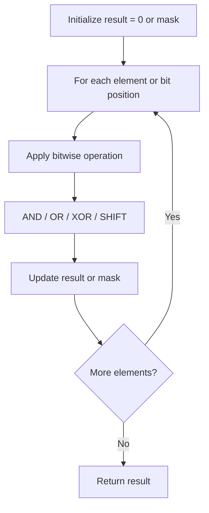

# Problem 1486: XOR Operation in an Array

**Difficulty:** Easy  
**Tags:** Math, Bit Manipulation  
**Pattern:** Bit Manipulation  
**Link:** [leetcode.com/problems/xor-operation-in-an-array](https://leetcode.com/problems/xor-operation-in-an-array/)

## Description

You are given an integer `n` and an integer `start`.

Define an array `nums` where `nums[i] = start + 2 * i` (**0-indexed**) and `n == nums.length`.

Return *the bitwise XOR of all elements of* `nums`.

 

Example 1:

```

**Input:** n = 5, start = 0
**Output:** 8
**Explanation:** Array nums is equal to [0, 2, 4, 6, 8] where (0 ^ 2 ^ 4 ^ 6 ^ 8) = 8.
Where "^" corresponds to bitwise XOR operator.

```

Example 2:

```

**Input:** n = 4, start = 3
**Output:** 8
**Explanation:** Array nums is equal to [3, 5, 7, 9] where (3 ^ 5 ^ 7 ^ 9) = 8.

```

 

**Constraints:**

	- `1 <= n <= 1000`
	- `0 <= start <= 1000`
	- `n == nums.length`

## Approach: Bit Manipulation

Operate on individual bits using bitwise operators (AND, OR, XOR, shift). Common tricks: x & (x-1) removes lowest set bit, x ^ x = 0, XOR all elements to find unique.

## Pseudocode

```
1. Apply bitwise operations:
   - XOR all elements to cancel paired bits
   - Use bitmask to track state
   - Shift and mask to extract/set individual bits
2. Return result
```

## Algorithm Flow



## Complexity Analysis

- **Time:** O(n) or O(log n)
- **Space:** O(1)

## Solution (Python3)

```python
class Solution:
    def xorOperation(self, n: int, start: int) -> int:
        # Bit manipulation - O(n) time, O(1) space
        result = 0
        for val in n:
            result ^= val
        return result
```

## Solution (C++)

```cpp
#include <string>
#include <vector>
using namespace std;

class Solution {
public:
    int xorOperation(int n, int start) {
        // Bit manipulation - O(n) time, O(1) space
        int result = 0;
        for (int val : n) {
            result ^= val;
        }
        return result;
    }
};
```
