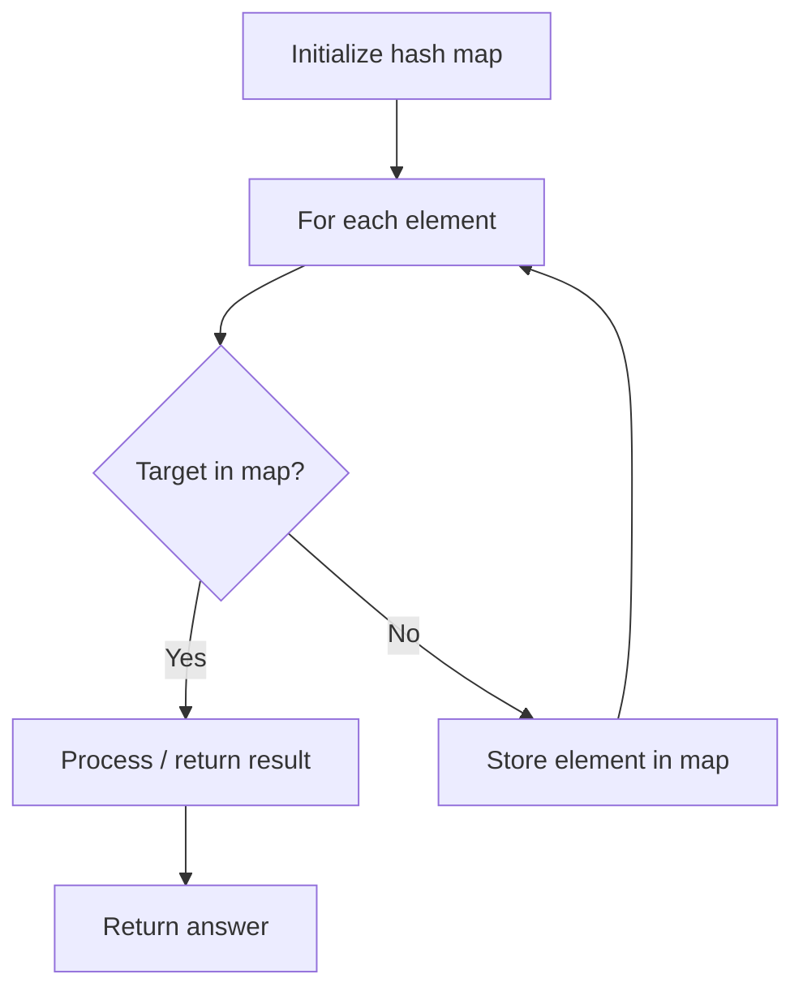

# Problem 1487: Making File Names Unique

**Difficulty:** Medium  
**Tags:** Array, Hash Table, String  
**Pattern:** Hash Map Lookup  
**Link:** [leetcode.com/problems/making-file-names-unique](https://leetcode.com/problems/making-file-names-unique/)

## Description

Given an array of strings `names` of size `n`. You will create `n` folders in your file system **such that**, at the `i^th` minute, you will create a folder with the name `names[i]`.

Since two files **cannot** have the same name, if you enter a folder name that was previously used, the system will have a suffix addition to its name in the form of `(k)`, where, `k` is the **smallest positive integer** such that the obtained name remains unique.

Return *an array of strings of length *`n` where `ans[i]` is the actual name the system will assign to the `i^th` folder when you create it.

 

Example 1:

```

**Input:** names = ["pes","fifa","gta","pes(2019)"]
**Output:** ["pes","fifa","gta","pes(2019)"]
**Explanation:** Let's see how the file system creates folder names:
"pes" --> not assigned before, remains "pes"
"fifa" --> not assigned before, remains "fifa"
"gta" --> not assigned before, remains "gta"
"pes(2019)" --> not assigned before, remains "pes(2019)"

```

Example 2:

```

**Input:** names = ["gta","gta(1)","gta","avalon"]
**Output:** ["gta","gta(1)","gta(2)","avalon"]
**Explanation:** Let's see how the file system creates folder names:
"gta" --> not assigned before, remains "gta"
"gta(1)" --> not assigned before, remains "gta(1)"
"gta" --> the name is reserved, system adds (k), since "gta(1)" is also reserved, systems put k = 2. it becomes "gta(2)"
"avalon" --> not assigned before, remains "avalon"

```

Example 3:

```

**Input:** names = ["onepiece","onepiece(1)","onepiece(2)","onepiece(3)","onepiece"]
**Output:** ["onepiece","onepiece(1)","onepiece(2)","onepiece(3)","onepiece(4)"]
**Explanation:** When the last folder is created, the smallest positive valid k is 4, and it becomes "onepiece(4)".

```

 

**Constraints:**

	- `1 <= names.length <= 5 * 10^4`
	- `1 <= names[i].length <= 20`
	- `names[i]` consists of lowercase English letters, digits, and/or round brackets.

## Approach: Hash Map Lookup

Use a hash map (dictionary) to store elements for O(1) lookup. Iterate through the input, checking membership or counting frequencies in the map.

## Pseudocode

```
1. Initialize hash map
2. Iterate through elements:
   a. Check if target/complement exists in map
   b. If found: process result
   c. Otherwise: store element in map
3. Return result
```

## Algorithm Flow



## Complexity Analysis

- **Time:** O(n)
- **Space:** O(n)

## Solution (Python3)

```python
class Solution:
    def getFolderNames(self, names: List[str]) -> List[str]:
        # Hash map approach - O(n) time, O(n) space
        seen = {}
        for i, val in enumerate(names):
            complement = names - val
            if complement in seen:
                return [seen[complement], i]
            seen[val] = i
        return []
```

## Solution (C++)

```cpp
#include <string>
#include <unordered_map>
#include <vector>
using namespace std;

class Solution {
public:
    vector<string> getFolderNames(vector<string>& names) {
        // Hash map approach - O(n) time, O(n) space
        unordered_map<int, int> seen;
        for (int i = 0; i < names.size(); i++) {
            int complement = names - names[i];
            if (seen.count(complement)) {
                return {seen[complement], i};
            }
            seen[names[i]] = i;
        }
        return {};
    }
};
```
