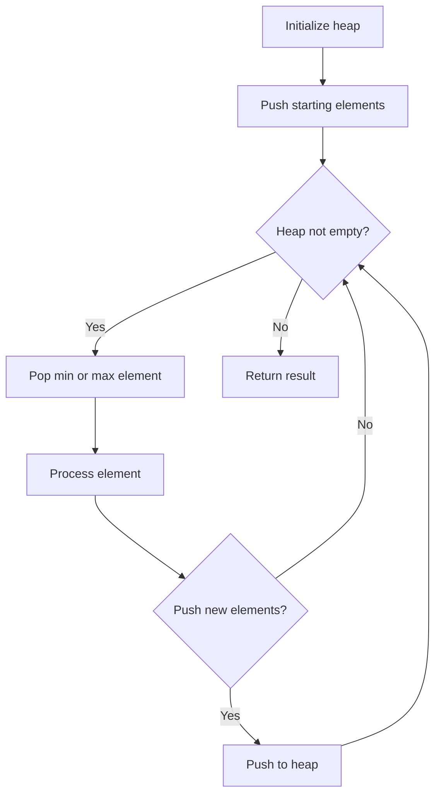
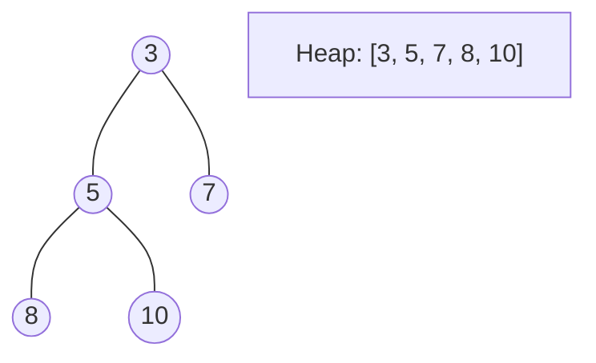
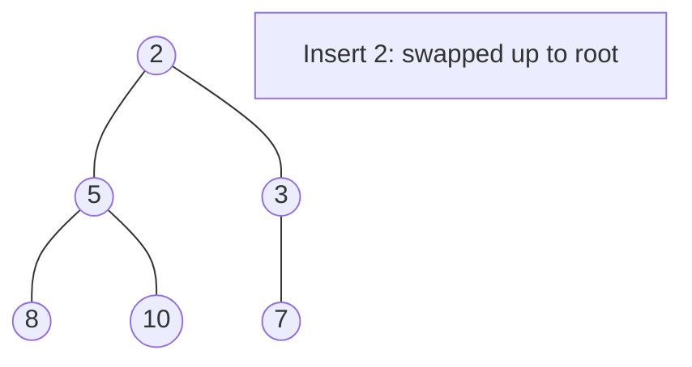
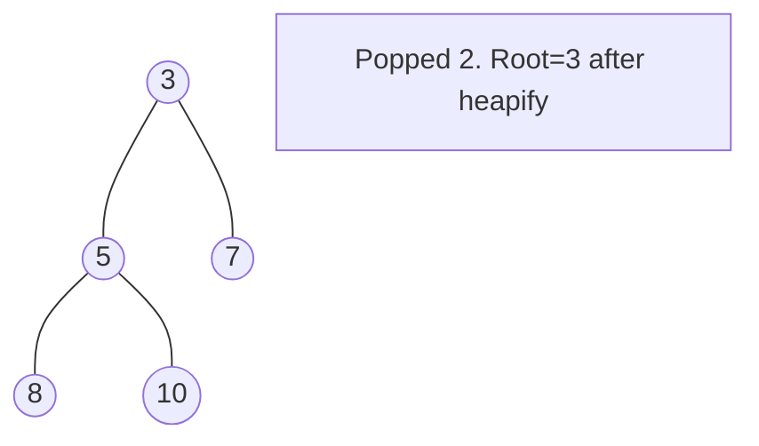

# Problem 1488: Avoid Flood in The City

**Difficulty:** Medium  
**Tags:** Array, Hash Table, Binary Search, Greedy, Heap (Priority Queue)  
**Pattern:** Heap / Priority Queue  
**Link:** [leetcode.com/problems/avoid-flood-in-the-city](https://leetcode.com/problems/avoid-flood-in-the-city/)

## Description

Your country has 10^9 lakes. Initially, all the lakes are empty, but when it rains over the `n^th` lake, the `n^th` lake becomes full of water. If it rains over a lake that is **full of water**, there will be a **flood**. Your goal is to avoid floods in any lake.

Given an integer array `rains` where:

	- `rains[i] > 0` means there will be rains over the `rains[i]` lake.
	- `rains[i] == 0` means there are no rains this day and you **must** choose **one lake** this day and **dry it**.

Return *an array `ans`* where:

	- `ans.length == rains.length`
	- `ans[i] == -1` if `rains[i] > 0`.
	- `ans[i]` is the lake you choose to dry in the `ith` day if `rains[i] == 0`.

If there are multiple valid answers return **any** of them. If it is impossible to avoid flood return **an empty array**.

Notice that if you chose to dry a full lake, it becomes empty, but if you chose to dry an empty lake, nothing changes.

 

Example 1:

```

**Input:** rains = [1,2,3,4]
**Output:** [-1,-1,-1,-1]
**Explanation:** After the first day full lakes are [1]
After the second day full lakes are [1,2]
After the third day full lakes are [1,2,3]
After the fourth day full lakes are [1,2,3,4]
There's no day to dry any lake and there is no flood in any lake.

```

Example 2:

```

**Input:** rains = [1,2,0,0,2,1]
**Output:** [-1,-1,2,1,-1,-1]
**Explanation:** After the first day full lakes are [1]
After the second day full lakes are [1,2]
After the third day, we dry lake 2. Full lakes are [1]
After the fourth day, we dry lake 1. There is no full lakes.
After the fifth day, full lakes are [2].
After the sixth day, full lakes are [1,2].
It is easy that this scenario is flood-free. [-1,-1,1,2,-1,-1] is another acceptable scenario.

```

Example 3:

```

**Input:** rains = [1,2,0,1,2]
**Output:** []
**Explanation:** After the second day, full lakes are  [1,2]. We have to dry one lake in the third day.
After that, it will rain over lakes [1,2]. It's easy to prove that no matter which lake you choose to dry in the 3rd day, the other one will flood.

```

 

**Constraints:**

	- `1 <= rains.length <= 10^5`
	- `0 <= rains[i] <= 10^9`

## Approach: Heap / Priority Queue

Use a min-heap or max-heap to efficiently access the smallest/largest element. Push elements and pop the top to process in priority order.

## Pseudocode

```
1. Initialize heap (min or max)
2. Push initial elements onto heap
3. While heap not empty and condition:
   a. Pop top element (min or max)
   b. Process element
   c. Push new elements if needed
4. Return result
```

## Algorithm Flow



## Visual State Transitions

**Heap Operations (Min-Heap):**

**Frame 1: Initial heap**


**Frame 2: Insert 2 - bubble up**


**Frame 3: Pop minimum (2) - heapify down**



## Complexity Analysis

- **Time:** O(n log n)
- **Space:** O(n)

## Solution (Python3)

```python
class Solution:
    def avoidFlood(self, rains: List[int]) -> List[int]:
        # Heap/Priority Queue - O(n log k) time
        import heapq
        if not rains:
            return []
        # Min heap (negate for max heap)
        heap = []
        for val in rains:
            heapq.heappush(heap, val)
            if len(heap) > (rains if isinstance(rains, int) else len(rains)):
                heapq.heappop(heap)
        return heap[0] if heap else []
```

## Solution (C++)

```cpp
#include <queue>
#include <string>
#include <vector>
using namespace std;

class Solution {
public:
    vector<int> avoidFlood(vector<int>& rains) {
        // Heap/Priority Queue - O(n log k) time
        priority_queue<int, vector<int>, greater<int>> pq;
        for (int val : rains) {
            pq.push(val);
            if ((int)pq.size() > rains)
                pq.pop();
        }
        return pq.empty() ? {} : pq.top();
    }
};
```
