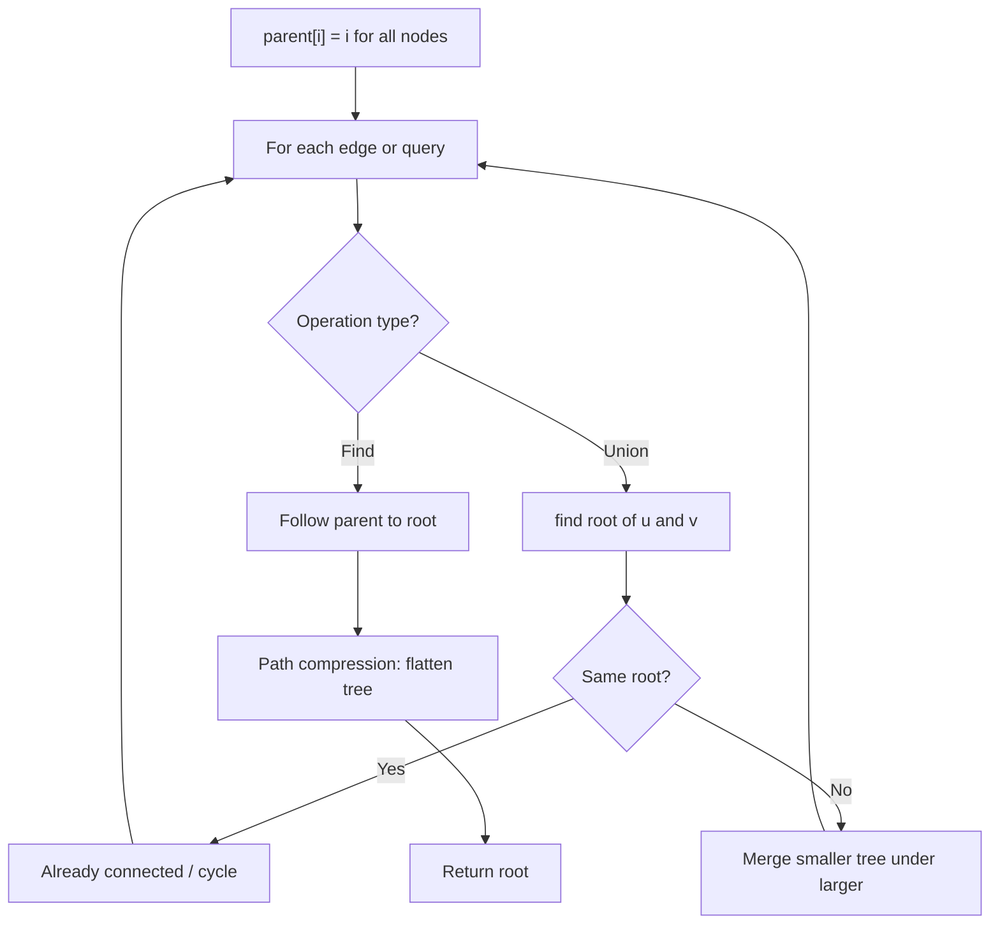
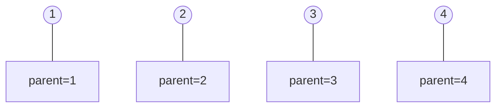
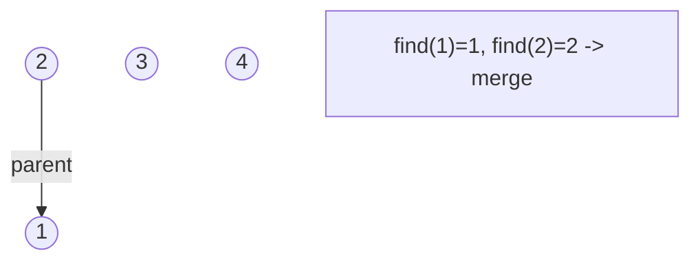
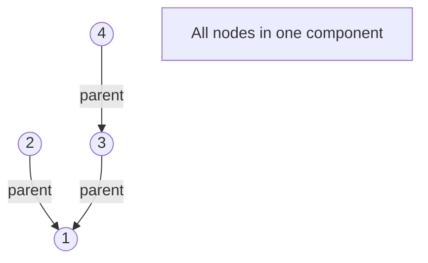
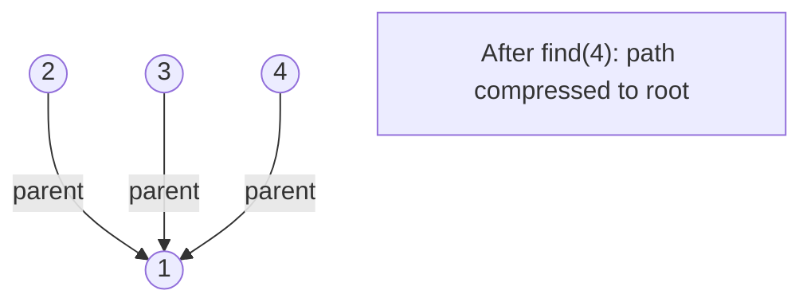

# Problem 1489: Find Critical and Pseudo-Critical Edges in Minimum Spanning Tree

**Difficulty:** Hard  
**Tags:** Union-Find, Graph Theory, Sorting, Minimum Spanning Tree, Strongly Connected Component  
**Pattern:** Union-Find / Disjoint Set  
**Link:** [leetcode.com/problems/find-critical-and-pseudo-critical-edges-in-minimum-spanning-tree](https://leetcode.com/problems/find-critical-and-pseudo-critical-edges-in-minimum-spanning-tree/)

## Description

Given a weighted undirected connected graph with `n` vertices numbered from `0` to `n - 1`, and an array `edges` where `edges[i] = [ai, bi, weighti]` represents a bidirectional and weighted edge between nodes `ai` and `bi`. A minimum spanning tree (MST) is a subset of the graph's edges that connects all vertices without cycles and with the minimum possible total edge weight.

Find *all the critical and pseudo-critical edges in the given graph's minimum spanning tree (MST)*. An MST edge whose deletion from the graph would cause the MST weight to increase is called a *critical edge*. On the other hand, a pseudo-critical edge is that which can appear in some MSTs but not all.

Note that you can return the indices of the edges in any order.

 

Example 1:

```

**Input:** n = 5, edges = [[0,1,1],[1,2,1],[2,3,2],[0,3,2],[0,4,3],[3,4,3],[1,4,6]]
**Output:** [[0,1],[2,3,4,5]]
**Explanation:** The figure above describes the graph.
The following figure shows all the possible MSTs:

Notice that the two edges 0 and 1 appear in all MSTs, therefore they are critical edges, so we return them in the first list of the output.
The edges 2, 3, 4, and 5 are only part of some MSTs, therefore they are considered pseudo-critical edges. We add them to the second list of the output.

```

Example 2:

```

**Input:** n = 4, edges = [[0,1,1],[1,2,1],[2,3,1],[0,3,1]]
**Output:** [[],[0,1,2,3]]
**Explanation:** We can observe that since all 4 edges have equal weight, choosing any 3 edges from the given 4 will yield an MST. Therefore all 4 edges are pseudo-critical.

```

 

**Constraints:**

	- `2 <= n <= 100`
	- `1 <= edges.length <= min(200, n * (n - 1) / 2)`
	- `edges[i].length == 3`
	- `0 <= ai < bi < n`
	- `1 <= weighti <= 1000`
	- All pairs `(ai, bi)` are **distinct**.

## Approach: Union-Find / Disjoint Set

Use Union-Find with path compression and union by rank to efficiently manage connected components. Find(x) returns the root of x's component; Union(x,y) merges two components.

## Pseudocode

```
1. parent[i] = i for all nodes (each is its own set)
2. find(x): follow parent pointers to root (with path compression)
3. union(x, y): merge sets of x and y by rank
4. Process edges/operations:
   a. For each edge (u, v): union(u, v)
5. Answer queries using find()
```

## Algorithm Flow



## Visual State Transitions

**Union-Find Step-by-Step:**

**Frame 1: Initial - each node is own parent**


**Frame 2: Union(1,2) - merge components**


**Frame 3: Union(3,4) then Union(2,3)**


**Frame 4: Path compression on find(4)**



## Complexity Analysis

- **Time:** O(n * alpha(n))
- **Space:** O(n)

## Solution (Python3)

```python
class Solution:
    def findCriticalAndPseudoCriticalEdges(self, n: int, edges: List[List[int]]) -> List[List[int]]:
        # Union Find (Disjoint Set Union) - O(n * alpha(n))
        parent = list(range(len(n) + 1 if isinstance(n, list) else n + 1))
        rank = [0] * len(parent)
        
        def find(x):
            if parent[x] != x:
                parent[x] = find(parent[x])
            return parent[x]
        
        def union(x, y):
            px, py = find(x), find(y)
            if px == py:
                return False
            if rank[px] < rank[py]:
                px, py = py, px
            parent[py] = px
            if rank[px] == rank[py]:
                rank[px] += 1
            return True
        
        components = len(parent)
        # Process edges/connections
        return components
```

## Solution (C++)

```cpp
#include <functional>
#include <numeric>
#include <string>
#include <vector>
using namespace std;

class Solution {
public:
    vector<vector<int>> findCriticalAndPseudoCriticalEdges(int n, vector<vector<int>>& edges) {
        // Union Find (DSU) - O(n * alpha(n))
        int n = n.size();
        vector<int> parent(n + 1), rnk(n + 1, 0);
        iota(parent.begin(), parent.end(), 0);
        function<int(int)> find = [&](int x) -> int {
            return parent[x] == x ? x : parent[x] = find(parent[x]);
        };
        auto unite = [&](int x, int y) -> bool {
            int px = find(x), py = find(y);
            if (px == py) return false;
            if (rnk[px] < rnk[py]) swap(px, py);
            parent[py] = px;
            if (rnk[px] == rnk[py]) rnk[px]++;
            return true;
        };
        int components = n;
        return components;
    }
};
```
