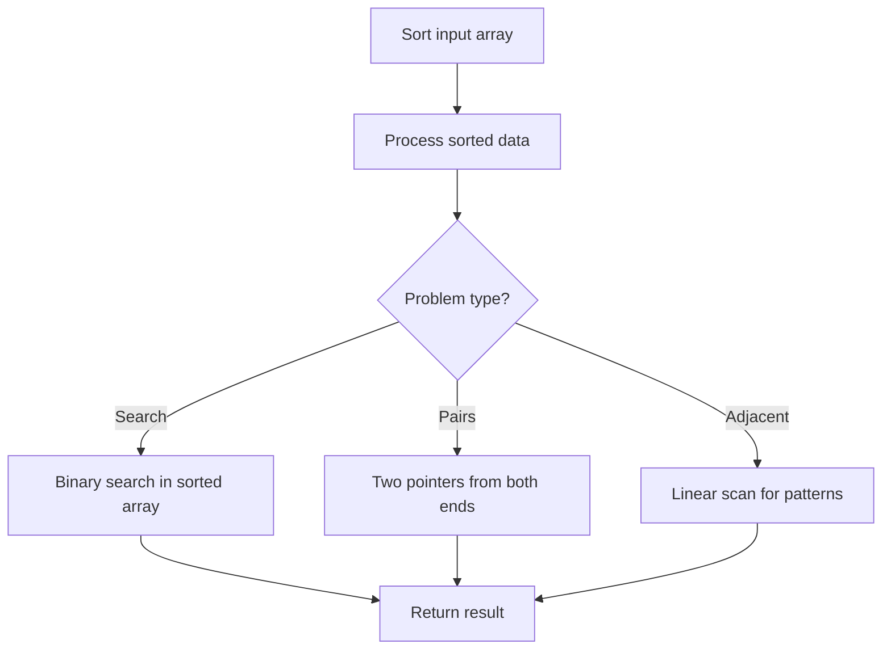

# Problem 1491: Average Salary Excluding the Minimum and Maximum Salary

**Difficulty:** Easy  
**Tags:** Array, Sorting  
**Pattern:** Sorting  
**Link:** [leetcode.com/problems/average-salary-excluding-the-minimum-and-maximum-salary](https://leetcode.com/problems/average-salary-excluding-the-minimum-and-maximum-salary/)

## Description

You are given an array of **unique** integers `salary` where `salary[i]` is the salary of the `i^th` employee.

Return *the average salary of employees excluding the minimum and maximum salary*. Answers within `10^-5` of the actual answer will be accepted.

 

Example 1:

```

**Input:** salary = [4000,3000,1000,2000]
**Output:** 2500.00000
**Explanation:** Minimum salary and maximum salary are 1000 and 4000 respectively.
Average salary excluding minimum and maximum salary is (2000+3000) / 2 = 2500

```

Example 2:

```

**Input:** salary = [1000,2000,3000]
**Output:** 2000.00000
**Explanation:** Minimum salary and maximum salary are 1000 and 3000 respectively.
Average salary excluding minimum and maximum salary is (2000) / 1 = 2000

```

 

**Constraints:**

	- `3 <= salary.length <= 100`
	- `1000 <= salary[i] <= 10^6`
	- All the integers of `salary` are **unique**.

## Approach: Sorting

Sort the data to enable efficient processing. After sorting, use techniques like binary search, two pointers, or linear scan to solve the problem.

## Pseudocode

```
1. Sort the input array
2. Process sorted data:
   - Use binary search for lookups
   - Use two pointers for pair finding
   - Scan for adjacent patterns
3. Return result
```

## Algorithm Flow



## Complexity Analysis

- **Time:** O(n log n)
- **Space:** O(n)

## Solution (Python3)

```python
class Solution:
    def average(self, salary: List[int]) -> float:
        # Sort-based approach - O(n log n) time
        salary.sort(key=lambda x: x[0] if isinstance(x, (list, tuple)) else x)
        result = [salary[0]]
        for i in range(1, len(salary)):
            curr = salary[i]
            if isinstance(curr, (list, tuple)) and isinstance(result[-1], (list, tuple)):
                if curr[0] <= result[-1][1]:
                    result[-1] = [result[-1][0], max(result[-1][1], curr[1])]
                else:
                    result.append(curr)
            else:
                result.append(curr)
        return result
```

## Solution (C++)

```cpp
#include <algorithm>
#include <string>
#include <vector>
using namespace std;

class Solution {
public:
    double average(vector<int>& salary) {
        // Sort-based approach - O(n log n) time
        sort(salary.begin(), salary.end());
        vector<vector<int>> result;
        result.push_back(salary[0]);
        for (int i = 1; i < (int)salary.size(); i++) {
            if (salary[i][0] <= result.back()[1]) {
                result.back()[1] = max(result.back()[1], salary[i][1]);
            } else {
                result.push_back(salary[i]);
            }
        }
        return result;
    }
};
```
