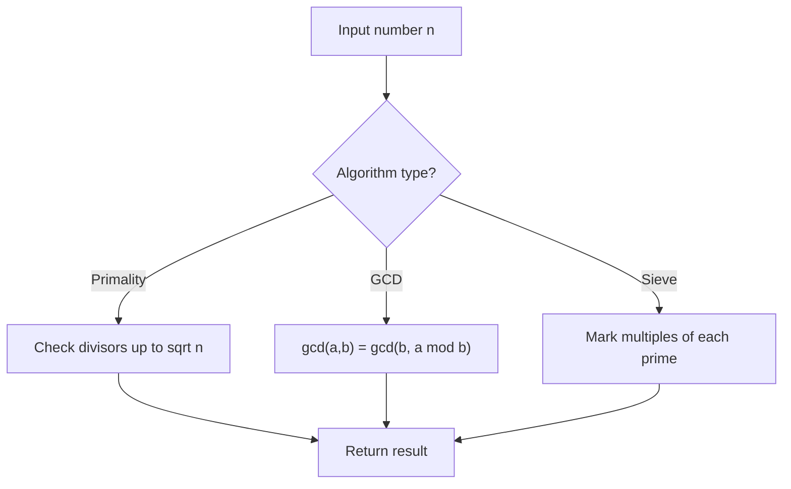

# Problem 1492: The kth Factor of n

**Difficulty:** Medium  
**Tags:** Math, Number Theory  
**Pattern:** Number Theory  
**Link:** [leetcode.com/problems/the-kth-factor-of-n](https://leetcode.com/problems/the-kth-factor-of-n/)

## Description

You are given two positive integers `n` and `k`. A factor of an integer `n` is defined as an integer `i` where `n % i == 0`.

Consider a list of all factors of `n` sorted in **ascending order**, return *the *`k^th`* factor* in this list or return `-1` if `n` has less than `k` factors.

 

Example 1:

```

**Input:** n = 12, k = 3
**Output:** 3
**Explanation:** Factors list is [1, 2, 3, 4, 6, 12], the 3rd factor is 3.

```

Example 2:

```

**Input:** n = 7, k = 2
**Output:** 7
**Explanation:** Factors list is [1, 7], the 2nd factor is 7.

```

Example 3:

```

**Input:** n = 4, k = 4
**Output:** -1
**Explanation:** Factors list is [1, 2, 4], there is only 3 factors. We should return -1.

```

 

**Constraints:**

	- `1 <= k <= n <= 1000`

 

**Follow up:**

Could you solve this problem in less than O(n) complexity?

## Approach: Number Theory

Apply number theory: prime checking, factorization, GCD, modular exponentiation, sieve of Eratosthenes, or Euler's totient.

## Pseudocode

```
1. Apply number-theoretic algorithm:
   - Sieve for primes up to n
   - GCD via Euclidean algorithm
   - Modular exponentiation
2. Process results
3. Return answer
```

## Algorithm Flow



## Complexity Analysis

- **Time:** O(sqrt(n)) or O(n log log n)
- **Space:** O(n)

## Solution (Python3)

```python
class Solution:
    def kthFactor(self, n: int, k: int) -> int:
        # Number theory approach
        def gcd(a, b):
            while b:
                a, b = b, a % b
            return a
        
        result = n[0] if isinstance(n, list) else n
        if isinstance(n, list):
            for val in n[1:]:
                result = gcd(result, val)
        return result
```

## Solution (C++)

```cpp
#include <string>
#include <vector>
using namespace std;

class Solution {
public:
    int kthFactor(int n, int k) {
        // Number theory approach
        auto gcd_func = [](int a, int b) -> int {
            while (b) { int t = b; b = a % b; a = t; }
            return a;
        };
        int result = n[0];
        for (int i = 1; i < (int)n.size(); i++) {
            result = gcd_func(result, n[i]);
        }
        return result;
    }
};
```
