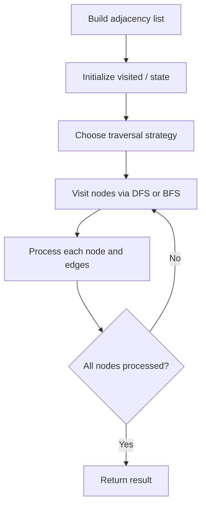

# Problem 1494: Parallel Courses II

**Difficulty:** Hard  
**Tags:** Dynamic Programming, Bit Manipulation, Graph Theory, Bitmask  
**Pattern:** Graph Algorithm  
**Link:** [leetcode.com/problems/parallel-courses-ii](https://leetcode.com/problems/parallel-courses-ii/)

## Description

You are given an integer `n`, which indicates that there are `n` courses labeled from `1` to `n`. You are also given an array `relations` where `relations[i] = [prevCoursei, nextCoursei]`, representing a prerequisite relationship between course `prevCoursei` and course `nextCoursei`: course `prevCoursei` has to be taken before course `nextCoursei`. Also, you are given the integer `k`.

In one semester, you can take **at most** `k` courses as long as you have taken all the prerequisites in the **previous** semesters for the courses you are taking.

Return *the **minimum** number of semesters needed to take all courses*. The testcases will be generated such that it is possible to take every course.

 

Example 1:

```

**Input:** n = 4, relations = [[2,1],[3,1],[1,4]], k = 2
**Output:** 3
**Explanation:** The figure above represents the given graph.
In the first semester, you can take courses 2 and 3.
In the second semester, you can take course 1.
In the third semester, you can take course 4.

```

Example 2:

```

**Input:** n = 5, relations = [[2,1],[3,1],[4,1],[1,5]], k = 2
**Output:** 4
**Explanation:** The figure above represents the given graph.
In the first semester, you can only take courses 2 and 3 since you cannot take more than two per semester.
In the second semester, you can take course 4.
In the third semester, you can take course 1.
In the fourth semester, you can take course 5.

```

 

**Constraints:**

	- `1 <= n <= 15`
	- `1 <= k <= n`
	- `0 <= relations.length <= n * (n-1) / 2`
	- `relations[i].length == 2`
	- `1 <= prevCoursei, nextCoursei <= n`
	- `prevCoursei != nextCoursei`
	- All the pairs `[prevCoursei, nextCoursei]` are **unique**.
	- The given graph is a directed acyclic graph.

## Approach: Graph Algorithm

Build an adjacency list/matrix from the input. Apply graph traversal (DFS/BFS), shortest path, or connectivity algorithm as needed.

## Pseudocode

```
1. Build adjacency list from edges
2. Initialize visited/distance arrays
3. Apply traversal algorithm:
   - DFS/BFS for reachability
   - Dijkstra/Bellman-Ford for shortest path
   - Union-Find for connectivity
4. Return result
```

## Algorithm Flow



## Complexity Analysis

- **Time:** O(V + E)
- **Space:** O(V + E)

## Solution (Python3)

```python
class Solution:
    def minNumberOfSemesters(self, n: int, relations: List[List[int]], k: int) -> int:
        # Graph traversal - O(V+E) time
        from collections import defaultdict
        graph = defaultdict(list)
        # Build adjacency list from input
        n = len(n) if isinstance(n, list) else n
        visited = [False] * n
        result = 0
        
        def dfs(node):
            visited[node] = True
            for neighbor in graph[node]:
                if not visited[neighbor]:
                    dfs(neighbor)
        
        for i in range(n):
            if not visited[i]:
                dfs(i)
                result += 1
        return result
```

## Solution (C++)

```cpp
#include <functional>
#include <string>
#include <vector>
using namespace std;

class Solution {
public:
    int minNumberOfSemesters(int n, vector<vector<int>>& relations, int k) {
        // Graph traversal - O(V+E) time
        int n = n.size();
        vector<vector<int>> graph(n);
        vector<bool> visited(n, false);
        int result = 0;
        function<void(int)> dfs = [&](int node) {
            visited[node] = true;
            for (int neighbor : graph[node]) {
                if (!visited[neighbor]) dfs(neighbor);
            }
        };
        for (int i = 0; i < n; i++) {
            if (!visited[i]) {
                dfs(i);
                result++;
            }
        }
        return result;
    }
};
```
