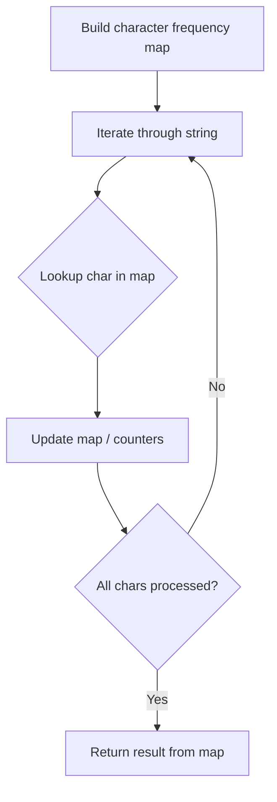

# Problem 1496: Path Crossing

**Difficulty:** Easy  
**Tags:** Hash Table, String  
**Pattern:** Hash Map String Processing  
**Link:** [leetcode.com/problems/path-crossing](https://leetcode.com/problems/path-crossing/)

## Description

Given a string `path`, where `path[i] = 'N'`, `'S'`, `'E'` or `'W'`, each representing moving one unit north, south, east, or west, respectively. You start at the origin `(0, 0)` on a 2D plane and walk on the path specified by `path`.

Return `true` *if the path crosses itself at any point, that is, if at any time you are on a location you have previously visited*. Return `false` otherwise.

 

Example 1:

```

**Input:** path = "NES"
**Output:** false 
**Explanation:** Notice that the path doesn't cross any point more than once.

```

Example 2:

```

**Input:** path = "NESWW"
**Output:** true
**Explanation:** Notice that the path visits the origin twice.
```

 

**Constraints:**

	- `1 <= path.length <= 10^4`
	- `path[i]` is either `'N'`, `'S'`, `'E'`, or `'W'`.

## Approach: Hash Map String Processing

Use a hash map to count character frequencies or map characters/strings for O(1) lookups. Process the string in one or two passes.

## Pseudocode

```
1. Build frequency map / char-to-index map
2. Iterate through string:
   a. Look up character in map
   b. Update counts or mappings
3. Return result based on map state
```

## Algorithm Flow



## Complexity Analysis

- **Time:** O(n)
- **Space:** O(n)

## Solution (Python3)

```python
class Solution:
    def isPathCrossing(self, path: str) -> bool:
        # Hash map for string/character frequency - O(n) time
        freq = {}
        for ch in path:
            freq[ch] = freq.get(ch, 0) + 1
        # Process frequency map
        for ch, cnt in freq.items():
            if cnt == 1:
                return path.index(ch)
        return False
```

## Solution (C++)

```cpp
#include <string>
#include <unordered_map>
#include <vector>
using namespace std;

class Solution {
public:
    bool isPathCrossing(string& path) {
        // Hash map for string/character frequency - O(n) time
        unordered_map<char, int> freq;
        for (char ch : path) {
            freq[ch]++;
        }
        // Process frequency map
        for (int i = 0; i < path.size(); i++) {
            if (freq[path[i]] == 1) return i;
        }
        return false;
    }
};
```
