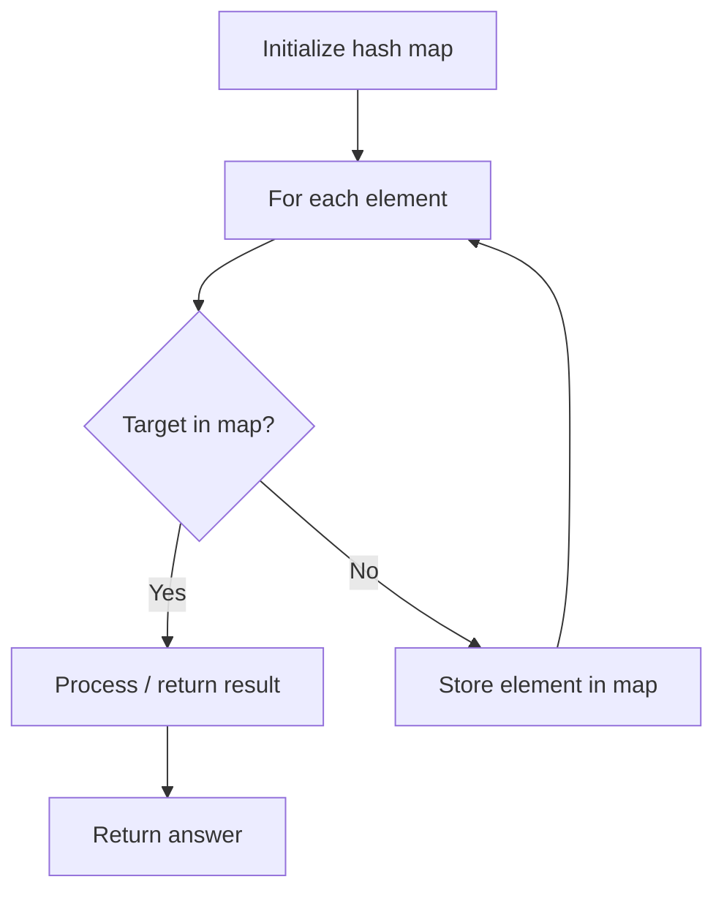

# Problem 1497: Check If Array Pairs Are Divisible by k

**Difficulty:** Medium  
**Tags:** Array, Hash Table, Counting  
**Pattern:** Hash Map Lookup  
**Link:** [leetcode.com/problems/check-if-array-pairs-are-divisible-by-k](https://leetcode.com/problems/check-if-array-pairs-are-divisible-by-k/)

## Description

Given an array of integers `arr` of even length `n` and an integer `k`.

We want to divide the array into exactly `n / 2` pairs such that the sum of each pair is divisible by `k`.

Return `true`* If you can find a way to do that or *`false`* otherwise*.

 

Example 1:

```

**Input:** arr = [1,2,3,4,5,10,6,7,8,9], k = 5
**Output:** true
**Explanation:** Pairs are (1,9),(2,8),(3,7),(4,6) and (5,10).

```

Example 2:

```

**Input:** arr = [1,2,3,4,5,6], k = 7
**Output:** true
**Explanation:** Pairs are (1,6),(2,5) and(3,4).

```

Example 3:

```

**Input:** arr = [1,2,3,4,5,6], k = 10
**Output:** false
**Explanation:** You can try all possible pairs to see that there is no way to divide arr into 3 pairs each with sum divisible by 10.

```

 

**Constraints:**

	- `arr.length == n`
	- `1 <= n <= 10^5`
	- `n` is even.
	- `-10^9 <= arr[i] <= 10^9`
	- `1 <= k <= 10^5`

## Approach: Hash Map Lookup

Use a hash map (dictionary) to store elements for O(1) lookup. Iterate through the input, checking membership or counting frequencies in the map.

## Pseudocode

```
1. Initialize hash map
2. Iterate through elements:
   a. Check if target/complement exists in map
   b. If found: process result
   c. Otherwise: store element in map
3. Return result
```

## Algorithm Flow



## Complexity Analysis

- **Time:** O(n)
- **Space:** O(n)

## Solution (Python3)

```python
class Solution:
    def canArrange(self, arr: List[int], k: int) -> bool:
        # Hash map approach - O(n) time, O(n) space
        seen = {}
        for i, val in enumerate(arr):
            complement = k - val
            if complement in seen:
                return [seen[complement], i]
            seen[val] = i
        return False
```

## Solution (C++)

```cpp
#include <string>
#include <unordered_map>
#include <vector>
using namespace std;

class Solution {
public:
    bool canArrange(vector<int>& arr, int k) {
        // Hash map approach - O(n) time, O(n) space
        unordered_map<int, int> seen;
        for (int i = 0; i < arr.size(); i++) {
            int complement = k - arr[i];
            if (seen.count(complement)) {
                return {seen[complement], i};
            }
            seen[arr[i]] = i;
        }
        return false;
    }
};
```
