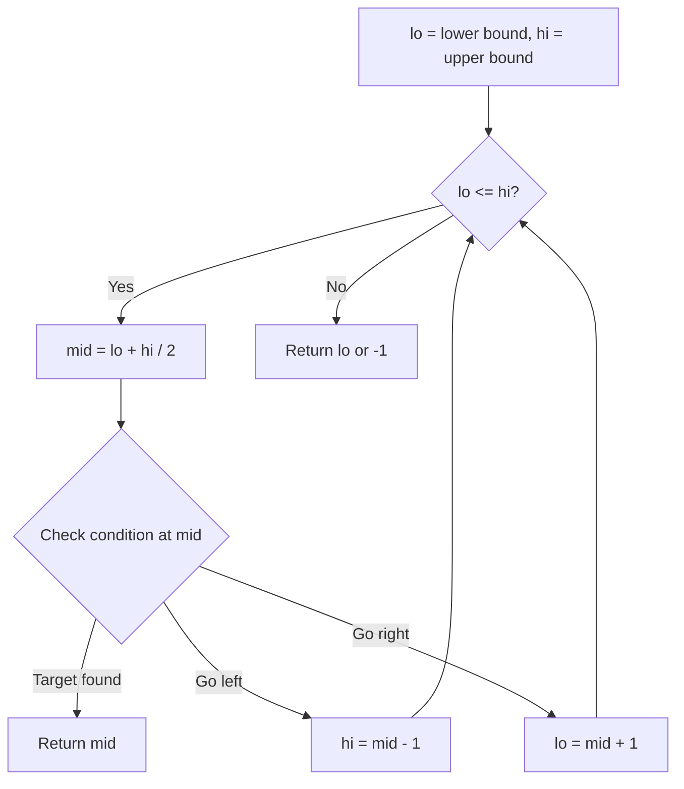
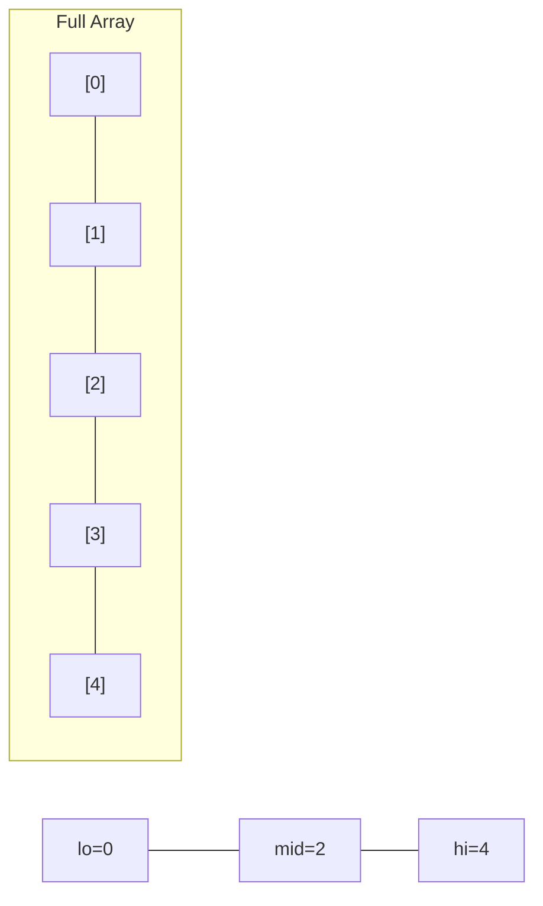
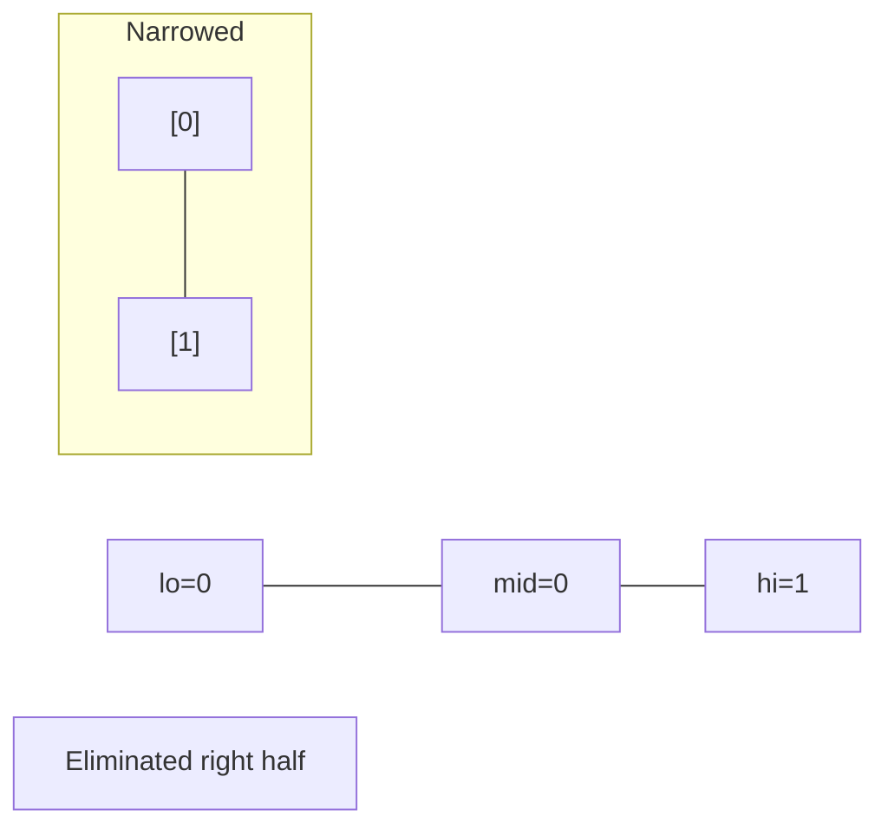
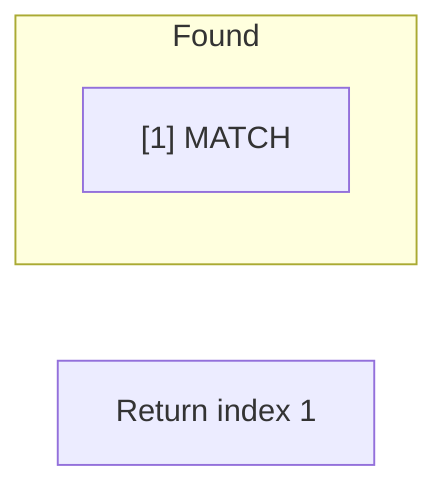

# Problem 1498: Number of Subsequences That Satisfy the Given Sum Condition

**Difficulty:** Medium  
**Tags:** Array, Two Pointers, Binary Search, Sorting  
**Pattern:** Binary Search  
**Link:** [leetcode.com/problems/number-of-subsequences-that-satisfy-the-given-sum-condition](https://leetcode.com/problems/number-of-subsequences-that-satisfy-the-given-sum-condition/)

## Description

You are given an array of integers `nums` and an integer `target`.

Return *the number of **non-empty** subsequences of *`nums`* such that the sum of the minimum and maximum element on it is less or equal to *`target`. Since the answer may be too large, return it **modulo** `10^9 + 7`.

 

Example 1:

```

**Input:** nums = [3,5,6,7], target = 9
**Output:** 4
**Explanation:** There are 4 subsequences that satisfy the condition.
[3] -> Min value + max value <= target (3 + 3 <= 9)
[3,5] -> (3 + 5 <= 9)
[3,5,6] -> (3 + 6 <= 9)
[3,6] -> (3 + 6 <= 9)

```

Example 2:

```

**Input:** nums = [3,3,6,8], target = 10
**Output:** 6
**Explanation:** There are 6 subsequences that satisfy the condition. (nums can have repeated numbers).
[3] , [3] , [3,3], [3,6] , [3,6] , [3,3,6]

```

Example 3:

```

**Input:** nums = [2,3,3,4,6,7], target = 12
**Output:** 61
**Explanation:** There are 63 non-empty subsequences, two of them do not satisfy the condition ([6,7], [7]).
Number of valid subsequences (63 - 2 = 61).

```

 

**Constraints:**

	- `1 <= nums.length <= 10^5`
	- `1 <= nums[i] <= 10^6`
	- `1 <= target <= 10^6`

## Approach: Binary Search

Use binary search to halve the search space each iteration. Define the search range [lo, hi], compute mid, and decide which half to keep based on the problem's monotonic condition.

## Pseudocode

```
1. lo = lower_bound, hi = upper_bound
2. While lo <= hi (or lo < hi):
   a. mid = (lo + hi) // 2
   b. If condition(mid) is satisfied: record answer, search left half
   c. Else: search right half
3. Return answer
```

## Algorithm Flow



## Visual State Transitions

**Binary Search Step-by-Step:**

**Frame 1: Initial search space**


**Frame 2: Compare mid, narrow search**


**Frame 3: Found target**



## Complexity Analysis

- **Time:** O(log n)
- **Space:** O(1)

## Solution (Python3)

```python
class Solution:
    def numSubseq(self, nums: List[int], target: int) -> int:
        # Binary search - O(log n) time, O(1) space
        lo, hi = 0, len(nums) - 1
        while lo <= hi:
            mid = lo + (hi - lo) // 2
            if nums[mid] == target:
                return mid
            elif nums[mid] < target:
                lo = mid + 1
            else:
                hi = mid - 1
        return 0
```

## Solution (C++)

```cpp
#include <string>
#include <vector>
using namespace std;

class Solution {
public:
    int numSubseq(vector<int>& nums, int target) {
        // Binary search - O(log n) time, O(1) space
        int lo = 0, hi = nums.size() - 1;
        while (lo <= hi) {
            int mid = lo + (hi - lo) / 2;
            if (nums[mid] == target) {
                return mid;
            } else if (nums[mid] < target) {
                lo = mid + 1;
            } else {
                hi = mid - 1;
            }
        }
        return 0;
    }
};
```
