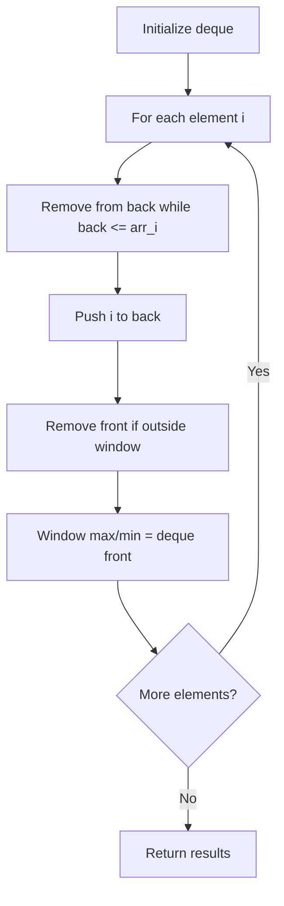

# Problem 1499: Max Value of Equation

**Difficulty:** Hard  
**Tags:** Array, Queue, Sliding Window, Heap (Priority Queue), Monotonic Queue  
**Pattern:** Monotonic Queue / Deque  
**Link:** [leetcode.com/problems/max-value-of-equation](https://leetcode.com/problems/max-value-of-equation/)

## Description

You are given an array `points` containing the coordinates of points on a 2D plane, sorted by the x-values, where `points[i] = [xi, yi]` such that `xi < xj` for all `1 <= i < j <= points.length`. You are also given an integer `k`.

Return *the maximum value of the equation *`yi + yj + |xi - xj|` where `|xi - xj| <= k` and `1 <= i < j <= points.length`.

It is guaranteed that there exists at least one pair of points that satisfy the constraint `|xi - xj| <= k`.

 

Example 1:

```

**Input:** points = [[1,3],[2,0],[5,10],[6,-10]], k = 1
**Output:** 4
**Explanation:** The first two points satisfy the condition |xi - xj| <= 1 and if we calculate the equation we get 3 + 0 + |1 - 2| = 4. Third and fourth points also satisfy the condition and give a value of 10 + -10 + |5 - 6| = 1.
No other pairs satisfy the condition, so we return the max of 4 and 1.

```

Example 2:

```

**Input:** points = [[0,0],[3,0],[9,2]], k = 3
**Output:** 3
**Explanation: **Only the first two points have an absolute difference of 3 or less in the x-values, and give the value of 0 + 0 + |0 - 3| = 3.

```

 

**Constraints:**

	- `2 <= points.length <= 10^5`
	- `points[i].length == 2`
	- `-10^8 <= xi, yi <= 10^8`
	- `0 <= k <= 2 * 10^8`
	- `xi < xj` for all `1 <= i < j <= points.length`
	- `xi` form a strictly increasing sequence.

## Approach: Monotonic Queue / Deque

Use a deque to maintain a monotonic window of elements. Remove from the back to maintain order, remove from the front when elements leave the window.

## Pseudocode

```
1. Initialize deque
2. For each element:
   a. Remove from back while deque back <= current
   b. Add current to back
   c. Remove from front if outside window
   d. Front of deque is the window max/min
3. Return results
```

## Algorithm Flow



## Complexity Analysis

- **Time:** O(n)
- **Space:** O(k)

## Solution (Python3)

```python
class Solution:
    def findMaxValueOfEquation(self, points: List[List[int]], k: int) -> int:
        # Monotonic deque - O(n) time
        from collections import deque
        dq = deque()  # store indices
        result = []
        k = k if isinstance(k, int) else 1
        for i in range(len(points)):
            while dq and dq[0] < i - k + 1:
                dq.popleft()
            while dq and points[dq[-1]] < points[i]:
                dq.pop()
            dq.append(i)
            if i >= k - 1:
                result.append(points[dq[0]])
        return result
```

## Solution (C++)

```cpp
#include <deque>
#include <string>
#include <vector>
using namespace std;

class Solution {
public:
    int findMaxValueOfEquation(vector<vector<int>>& points, int k) {
        // Monotonic deque - O(n) time
        deque<int> dq;
        vector<int> result;
        int k = k;
        for (int i = 0; i < (int)points.size(); i++) {
            while (!dq.empty() && dq.front() < i - k + 1)
                dq.pop_front();
            while (!dq.empty() && points[dq.back()] < points[i])
                dq.pop_back();
            dq.push_back(i);
            if (i >= k - 1)
                result.push_back(points[dq.front()]);
        }
        return result;
    }
};
```
