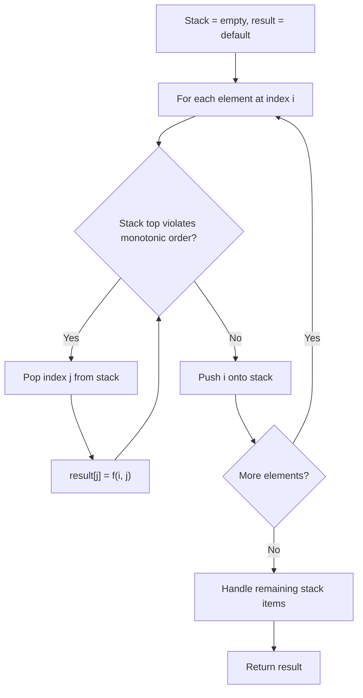
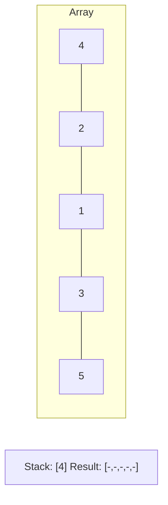
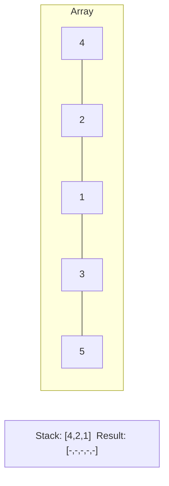
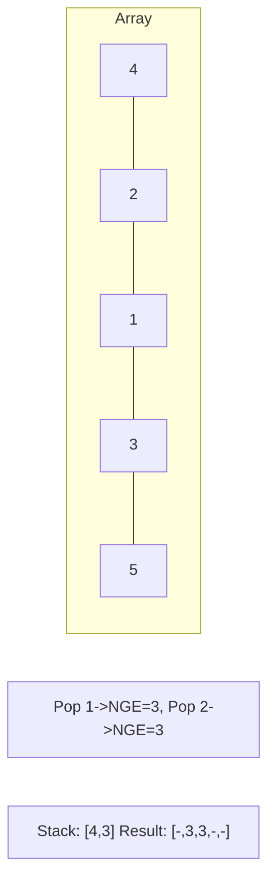
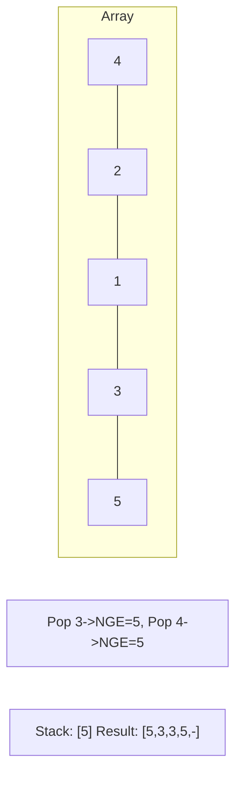

# Problem 1504: Count Submatrices With All Ones

**Difficulty:** Medium  
**Tags:** Array, Dynamic Programming, Stack, Matrix, Monotonic Stack  
**Pattern:** Monotonic Stack  
**Link:** [leetcode.com/problems/count-submatrices-with-all-ones](https://leetcode.com/problems/count-submatrices-with-all-ones/)

## Description

Given an `m x n` binary matrix `mat`, *return the number of **submatrices** that have all ones*.

 

Example 1:

```

**Input:** mat = [[1,0,1],[1,1,0],[1,1,0]]
**Output:** 13
**Explanation:** 
There are 6 rectangles of side 1x1.
There are 2 rectangles of side 1x2.
There are 3 rectangles of side 2x1.
There is 1 rectangle of side 2x2. 
There is 1 rectangle of side 3x1.
Total number of rectangles = 6 + 2 + 3 + 1 + 1 = 13.

```

Example 2:

```

**Input:** mat = [[0,1,1,0],[0,1,1,1],[1,1,1,0]]
**Output:** 24
**Explanation:** 
There are 8 rectangles of side 1x1.
There are 5 rectangles of side 1x2.
There are 2 rectangles of side 1x3. 
There are 4 rectangles of side 2x1.
There are 2 rectangles of side 2x2. 
There are 2 rectangles of side 3x1. 
There is 1 rectangle of side 3x2. 
Total number of rectangles = 8 + 5 + 2 + 4 + 2 + 2 + 1 = 24.

```

 

**Constraints:**

	- `1 <= m, n <= 150`
	- `mat[i][j]` is either `0` or `1`.

## Approach: Monotonic Stack

Maintain a stack where elements are always in monotonic order (increasing or decreasing). When a new element violates the monotonic property, pop elements and compute results (e.g., next greater/smaller element, spans, areas).

## Pseudocode

```
1. Initialize empty stack, result array
2. For each element (index i):
   a. While stack not empty and arr[i] breaks monotonic order:
      - Pop index j from stack
      - result[j] = compute(i, j)
   b. Push i onto stack
3. Handle remaining elements in stack
4. Return result
```

## Algorithm Flow



## Visual State Transitions

**Monotonic Stack (Next Greater Element):**

**Frame 1: Process first elements**


**Frame 2: Push smaller elements**


**Frame 3: Element 3 pops 1 and 2**


**Frame 4: Element 5 pops all**



## Complexity Analysis

- **Time:** O(n)
- **Space:** O(n)

## Solution (Python3)

```python
class Solution:
    def numSubmat(self, mat: List[List[int]]) -> int:
        # Monotonic stack - O(n) time, O(n) space
        n = len(mat)
        result = [0] * n
        stack = []  # indices
        for i in range(n):
            while stack and mat[i] > mat[stack[-1]]:
                idx = stack.pop()
                result[idx] = i - idx
            stack.append(i)
        return result
```

## Solution (C++)

```cpp
#include <stack>
#include <string>
#include <vector>
using namespace std;

class Solution {
public:
    int numSubmat(vector<vector<int>>& mat) {
        // Monotonic stack - O(n) time, O(n) space
        int n = mat.size();
        vector<int> result(n, 0);
        stack<int> st;
        for (int i = 0; i < n; i++) {
            while (!st.empty() && mat[i] > mat[st.top()]) {
                int idx = st.top(); st.pop();
                result[idx] = i - idx;
            }
            st.push(i);
        }
        return result;
    }
};
```
