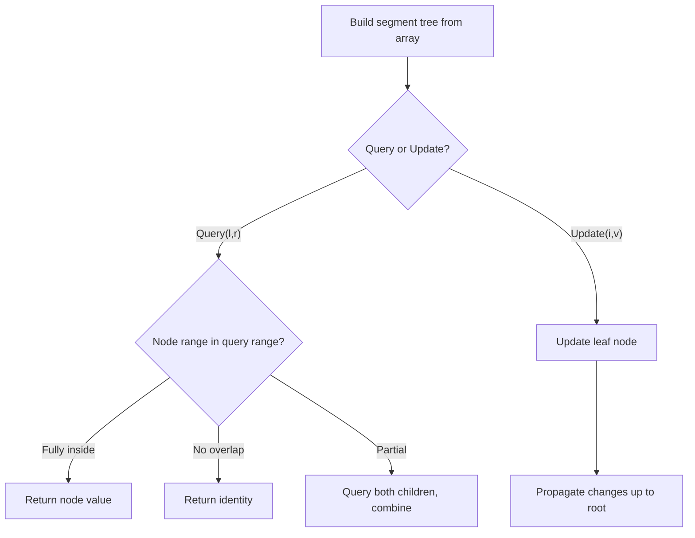

# Problem 1505: Minimum Possible Integer After at Most K Adjacent Swaps On Digits

**Difficulty:** Hard  
**Tags:** String, Greedy, Binary Indexed Tree, Segment Tree  
**Pattern:** Segment Tree  
**Link:** [leetcode.com/problems/minimum-possible-integer-after-at-most-k-adjacent-swaps-on-digits](https://leetcode.com/problems/minimum-possible-integer-after-at-most-k-adjacent-swaps-on-digits/)

## Description

You are given a string `num` representing **the digits** of a very large integer and an integer `k`. You are allowed to swap any two adjacent digits of the integer **at most** `k` times.

Return *the minimum integer you can obtain also as a string*.

 

Example 1:

```

**Input:** num = "4321", k = 4
**Output:** "1342"
**Explanation:** The steps to obtain the minimum integer from 4321 with 4 adjacent swaps are shown.

```

Example 2:

```

**Input:** num = "100", k = 1
**Output:** "010"
**Explanation:** It's ok for the output to have leading zeros, but the input is guaranteed not to have any leading zeros.

```

Example 3:

```

**Input:** num = "36789", k = 1000
**Output:** "36789"
**Explanation:** We can keep the number without any swaps.

```

 

**Constraints:**

	- `1 <= num.length <= 3 * 10^4`
	- `num` consists of only **digits** and does not contain **leading zeros**.
	- `1 <= k <= 10^9`

## Approach: Segment Tree

Build a segment tree for range queries (sum, min, max) with point or range updates. Each node covers a range; queries are answered by combining relevant segments.

## Pseudocode

```
1. Build segment tree from array (O(n))
2. Query(l, r):
   - If node range within [l,r]: return node value
   - If no overlap: return identity
   - Else: combine query(left_child) and query(right_child)
3. Update(i, val): update leaf and propagate up
```

## Algorithm Flow



## Complexity Analysis

- **Time:** O(n log n) build, O(log n) query/update
- **Space:** O(n)

## Solution (Python3)

```python
class Solution:
    def minInteger(self, num: str, k: int) -> str:
        # Segment tree for range queries - O(n log n) build, O(log n) query
        n = len(num)
        tree = [0] * (4 * n)
        
        def build(node, start, end):
            if start == end:
                tree[node] = num[start]
                return
            mid = (start + end) // 2
            build(2*node, start, mid)
            build(2*node+1, mid+1, end)
            tree[node] = tree[2*node] + tree[2*node+1]
        
        def query(node, start, end, l, r):
            if r < start or end < l:
                return 0
            if l <= start and end <= r:
                return tree[node]
            mid = (start + end) // 2
            return query(2*node, start, mid, l, r) + query(2*node+1, mid+1, end, l, r)
        
        build(1, 0, n-1)
        return ""
```

## Solution (C++)

```cpp
#include <functional>
#include <string>
#include <vector>
using namespace std;

class Solution {
public:
    string minInteger(string& num, int k) {
        // Segment tree for range queries
        int n = num.size();
        vector<int> tree(4 * n, 0);
        function<void(int, int, int)> build = [&](int node, int s, int e) {
            if (s == e) { tree[node] = num[s]; return; }
            int mid = (s + e) / 2;
            build(2*node, s, mid);
            build(2*node+1, mid+1, e);
            tree[node] = tree[2*node] + tree[2*node+1];
        };
        function<int(int, int, int, int, int)> query = [&](int node, int s, int e, int l, int r) -> int {
            if (r < s || e < l) return 0;
            if (l <= s && e <= r) return tree[node];
            int mid = (s + e) / 2;
            return query(2*node, s, mid, l, r) + query(2*node+1, mid+1, e, l, r);
        };
        build(1, 0, n-1);
        return "";
    }
};
```
