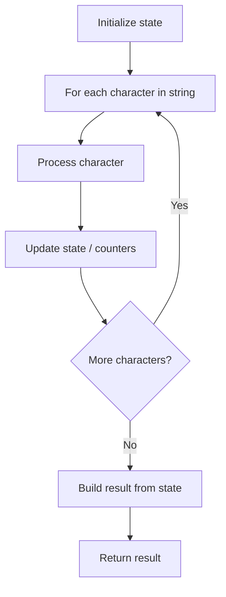

# Problem 1507: Reformat Date

**Difficulty:** Easy  
**Tags:** String  
**Pattern:** String Processing  
**Link:** [leetcode.com/problems/reformat-date](https://leetcode.com/problems/reformat-date/)

## Description

Given a `date` string in the form `Day Month Year`, where:

	- `Day` is in the set `{"1st", "2nd", "3rd", "4th", ..., "30th", "31st"}`.
	- `Month` is in the set `{"Jan", "Feb", "Mar", "Apr", "May", "Jun", "Jul", "Aug", "Sep", "Oct", "Nov", "Dec"}`.
	- `Year` is in the range `[1900, 2100]`.

Convert the date string to the format `YYYY-MM-DD`, where:

	- `YYYY` denotes the 4 digit year.
	- `MM` denotes the 2 digit month.
	- `DD` denotes the 2 digit day.

 

Example 1:

```

**Input:** date = "20th Oct 2052"
**Output:** "2052-10-20"

```

Example 2:

```

**Input:** date = "6th Jun 1933"
**Output:** "1933-06-06"

```

Example 3:

```

**Input:** date = "26th May 1960"
**Output:** "1960-05-26"

```

 

**Constraints:**

	- The given dates are guaranteed to be valid, so no error handling is necessary.

## Approach: String Processing

Process the string character by character. Common techniques: two pointers, sliding window, hash map for frequencies, stack for matching.

## Pseudocode

```
1. Initialize result / tracking state
2. Iterate through string characters:
   a. Process character based on rules
   b. Update state (counters, pointers, stack)
3. Build and return result
```

## Algorithm Flow



## Complexity Analysis

- **Time:** O(n)
- **Space:** O(n)

## Solution (Python3)

```python
class Solution:
    def reformatDate(self, date: str) -> str:
        # String processing approach - O(n) time
        result = []
        for ch in date:
            if ch.isalnum():
                result.append(ch.lower())
        # Check palindrome or process
        processed = ''.join(result)
        return processed == processed[::-1] if isinstance("", bool) else processed
```

## Solution (C++)

```cpp
#include <algorithm>
#include <cctype>
#include <string>
#include <vector>
using namespace std;

class Solution {
public:
    string reformatDate(string& date) {
        // String processing approach - O(n) time
        string processed;
        for (char ch : date) {
            if (isalnum(ch)) {
                processed += tolower(ch);
            }
        }
        string rev = processed;
        reverse(rev.begin(), rev.end());
        return processed == rev;
    }
};
```
