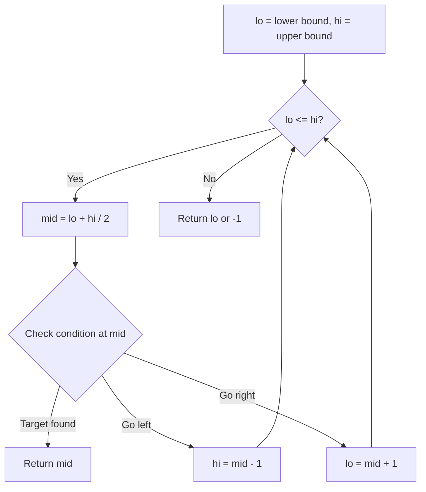
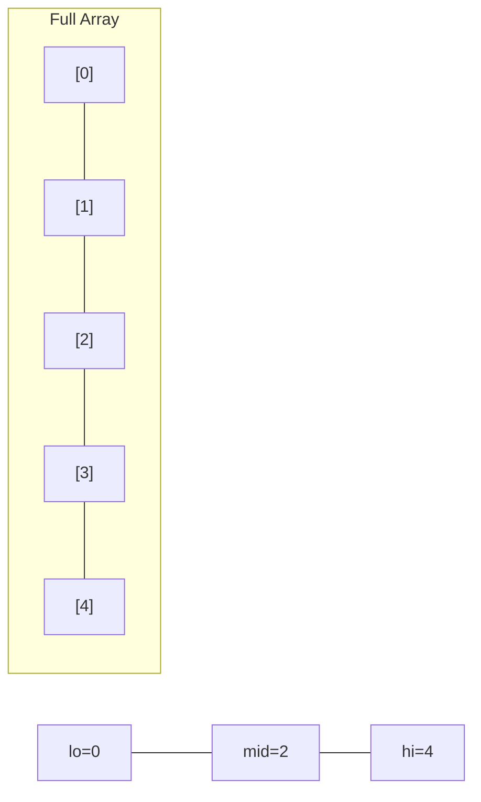
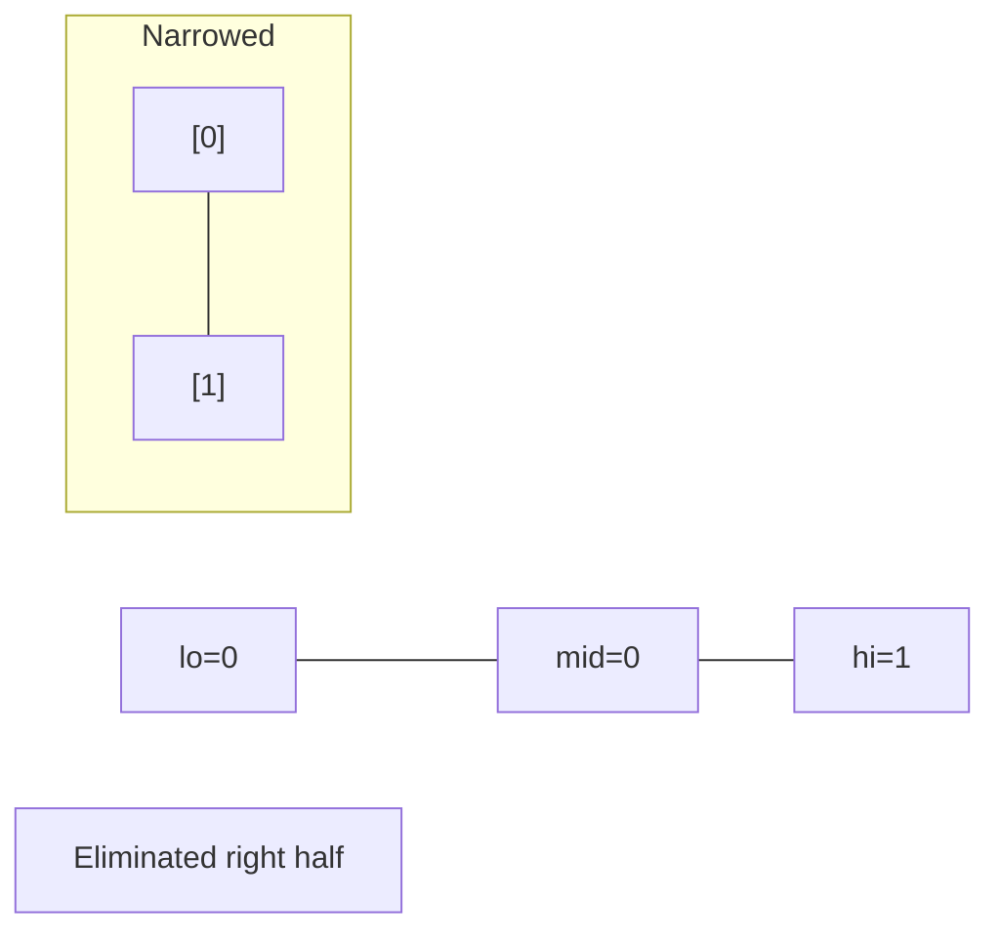
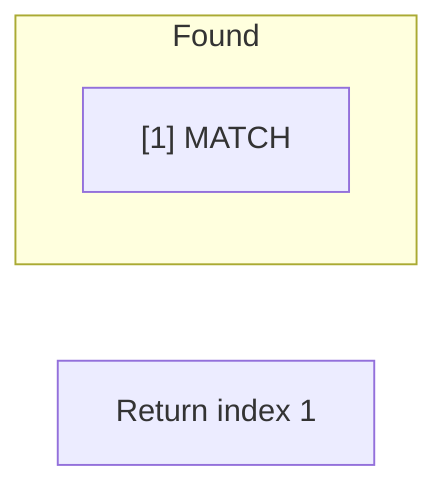

# Problem 1508: Range Sum of Sorted Subarray Sums

**Difficulty:** Medium  
**Tags:** Array, Two Pointers, Binary Search, Sorting, Prefix Sum  
**Pattern:** Binary Search  
**Link:** [leetcode.com/problems/range-sum-of-sorted-subarray-sums](https://leetcode.com/problems/range-sum-of-sorted-subarray-sums/)

## Description

You are given the array `nums` consisting of `n` positive integers. You computed the sum of all non-empty continuous subarrays from the array and then sorted them in non-decreasing order, creating a new array of `n * (n + 1) / 2` numbers.

*Return the sum of the numbers from index *`left`* to index *`right` (**indexed from 1**)*, inclusive, in the new array. *Since the answer can be a huge number return it modulo `10^9 + 7`.

 

Example 1:

```

**Input:** nums = [1,2,3,4], n = 4, left = 1, right = 5
**Output:** 13 
**Explanation:** All subarray sums are 1, 3, 6, 10, 2, 5, 9, 3, 7, 4. After sorting them in non-decreasing order we have the new array [1, 2, 3, 3, 4, 5, 6, 7, 9, 10]. The sum of the numbers from index le = 1 to ri = 5 is 1 + 2 + 3 + 3 + 4 = 13. 

```

Example 2:

```

**Input:** nums = [1,2,3,4], n = 4, left = 3, right = 4
**Output:** 6
**Explanation:** The given array is the same as example 1. We have the new array [1, 2, 3, 3, 4, 5, 6, 7, 9, 10]. The sum of the numbers from index le = 3 to ri = 4 is 3 + 3 = 6.

```

Example 3:

```

**Input:** nums = [1,2,3,4], n = 4, left = 1, right = 10
**Output:** 50

```

 

**Constraints:**

	- `n == nums.length`
	- `1 <= nums.length <= 1000`
	- `1 <= nums[i] <= 100`
	- `1 <= left <= right <= n * (n + 1) / 2`

## Approach: Binary Search

Use binary search to halve the search space each iteration. Define the search range [lo, hi], compute mid, and decide which half to keep based on the problem's monotonic condition.

## Pseudocode

```
1. lo = lower_bound, hi = upper_bound
2. While lo <= hi (or lo < hi):
   a. mid = (lo + hi) // 2
   b. If condition(mid) is satisfied: record answer, search left half
   c. Else: search right half
3. Return answer
```

## Algorithm Flow



## Visual State Transitions

**Binary Search Step-by-Step:**

**Frame 1: Initial search space**


**Frame 2: Compare mid, narrow search**


**Frame 3: Found target**



## Complexity Analysis

- **Time:** O(log n)
- **Space:** O(1)

## Solution (Python3)

```python
class Solution:
    def rangeSum(self, nums: List[int], n: int, left: int, right: int) -> int:
        # Binary search - O(log n) time, O(1) space
        lo, hi = 0, len(nums) - 1
        while lo <= hi:
            mid = lo + (hi - lo) // 2
            if nums[mid] == n:
                return mid
            elif nums[mid] < n:
                lo = mid + 1
            else:
                hi = mid - 1
        return 0
```

## Solution (C++)

```cpp
#include <string>
#include <vector>
using namespace std;

class Solution {
public:
    int rangeSum(vector<int>& nums, int n, int left, int right) {
        // Binary search - O(log n) time, O(1) space
        int lo = 0, hi = nums.size() - 1;
        while (lo <= hi) {
            int mid = lo + (hi - lo) / 2;
            if (nums[mid] == n) {
                return mid;
            } else if (nums[mid] < n) {
                lo = mid + 1;
            } else {
                hi = mid - 1;
            }
        }
        return 0;
    }
};
```
