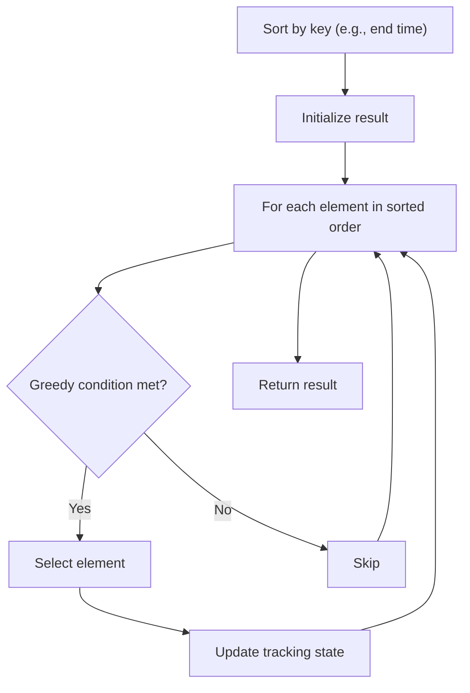

# Problem 1509: Minimum Difference Between Largest and Smallest Value in Three Moves

**Difficulty:** Medium  
**Tags:** Array, Greedy, Sorting  
**Pattern:** Greedy with Sorting  
**Link:** [leetcode.com/problems/minimum-difference-between-largest-and-smallest-value-in-three-moves](https://leetcode.com/problems/minimum-difference-between-largest-and-smallest-value-in-three-moves/)

## Description

You are given an integer array `nums`.

In one move, you can choose one element of `nums` and change it to **any value**.

Return *the minimum difference between the largest and smallest value of `nums` **after performing at most three moves***.

 

Example 1:

```

**Input:** nums = [5,3,2,4]
**Output:** 0
**Explanation:** We can make at most 3 moves.
In the first move, change 2 to 3. nums becomes [5,3,3,4].
In the second move, change 4 to 3. nums becomes [5,3,3,3].
In the third move, change 5 to 3. nums becomes [3,3,3,3].
After performing 3 moves, the difference between the minimum and maximum is 3 - 3 = 0.

```

Example 2:

```

**Input:** nums = [1,5,0,10,14]
**Output:** 1
**Explanation:** We can make at most 3 moves.
In the first move, change 5 to 0. nums becomes [1,0,0,10,14].
In the second move, change 10 to 0. nums becomes [1,0,0,0,14].
In the third move, change 14 to 1. nums becomes [1,0,0,0,1].
After performing 3 moves, the difference between the minimum and maximum is 1 - 0 = 1.
It can be shown that there is no way to make the difference 0 in 3 moves.
```

Example 3:

```

**Input:** nums = [3,100,20]
**Output:** 0
**Explanation:** We can make at most 3 moves.
In the first move, change 100 to 7. nums becomes [3,7,20].
In the second move, change 20 to 7. nums becomes [3,7,7].
In the third move, change 3 to 7. nums becomes [7,7,7].
After performing 3 moves, the difference between the minimum and maximum is 7 - 7 = 0.

```

 

**Constraints:**

	- `1 <= nums.length <= 10^5`
	- `-10^9 <= nums[i] <= 10^9`

## Approach: Greedy with Sorting

Sort the input by a key criterion, then greedily process elements in sorted order. The sorting ensures the greedy choice is always optimal.

## Pseudocode

```
1. Sort elements by key (start time, weight, etc.)
2. Initialize result, tracking variables
3. For each element in sorted order:
   a. Apply greedy selection rule
   b. Update result
4. Return result
```

## Algorithm Flow



## Complexity Analysis

- **Time:** O(n log n)
- **Space:** O(n)

## Solution (Python3)

```python
class Solution:
    def minDifference(self, nums: List[int]) -> int:
        # Sort + greedy - O(n log n) time
        nums.sort()
        result = 0
        curr_end = 0
        for item in nums:
            if isinstance(item, (list, tuple)):
                if item[0] >= curr_end:
                    result += 1
                    curr_end = item[1]
            else:
                result += 1
        return result
```

## Solution (C++)

```cpp
#include <algorithm>
#include <string>
#include <vector>
using namespace std;

class Solution {
public:
    int minDifference(vector<int>& nums) {
        // Sort + greedy - O(n log n) time
        sort(nums.begin(), nums.end());
        int result = 0, curr_end = 0;
        for (auto& item : nums) {
            result++;
        }
        return result;
    }
};
```
