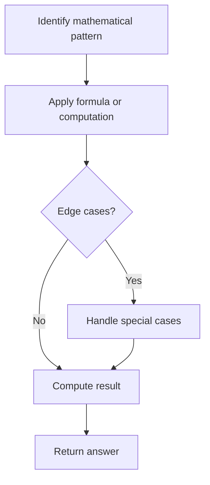

# Problem 1513: Number of Substrings With Only 1s

**Difficulty:** Medium  
**Tags:** Math, String  
**Pattern:** Math  
**Link:** [leetcode.com/problems/number-of-substrings-with-only-1s](https://leetcode.com/problems/number-of-substrings-with-only-1s/)

## Description

Given a binary string `s`, return *the number of substrings with all characters* `1`*'s*. Since the answer may be too large, return it modulo `10^9 + 7`.

 

Example 1:

```

**Input:** s = "0110111"
**Output:** 9
**Explanation:** There are 9 substring in total with only 1's characters.
"1" -> 5 times.
"11" -> 3 times.
"111" -> 1 time.
```

Example 2:

```

**Input:** s = "101"
**Output:** 2
**Explanation:** Substring "1" is shown 2 times in s.

```

Example 3:

```

**Input:** s = "111111"
**Output:** 21
**Explanation:** Each substring contains only 1's characters.

```

 

**Constraints:**

	- `1 <= s.length <= 10^5`
	- `s[i]` is either `'0'` or `'1'`.

## Approach: Math

Apply mathematical properties, formulas, or number-theoretic concepts. Look for patterns, modular arithmetic, or closed-form solutions.

## Pseudocode

```
1. Identify the mathematical pattern or formula
2. Apply computation:
   - Modular arithmetic for large numbers
   - GCD/LCM for divisibility
   - Sieve for primes
3. Handle edge cases
4. Return result
```

## Algorithm Flow



## Complexity Analysis

- **Time:** O(n) or O(sqrt(n))
- **Space:** O(1)

## Solution (Python3)

```python
class Solution:
    def numSub(self, s: str) -> int:
        # Mathematical approach
        result = 0
        x = s
        while x != 0:
            result = result * 10 + x % 10
            x //= 10 if isinstance(x, int) else 1
        return result
```

## Solution (C++)

```cpp
#include <string>
#include <vector>
using namespace std;

class Solution {
public:
    int numSub(string& s) {
        // Mathematical approach
        long long result = 0;
        int x = s;
        while (x != 0) {
            result = result * 10 + x % 10;
            x /= 10;
        }
        return (int)result;
    }
};
```
